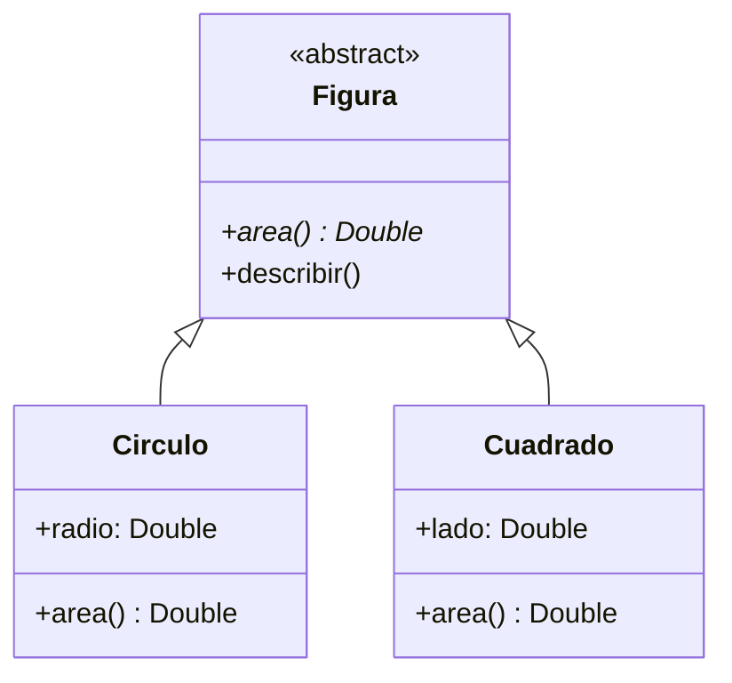
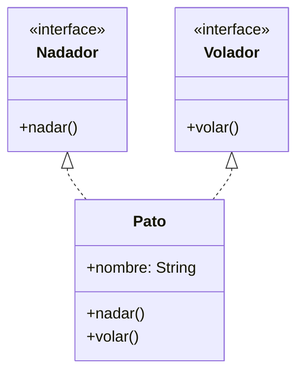

# Capítulo 17: Herencia, interfaces y clases abstractas

- [Introducción](#introducción)
- [Herencia](#herencia)
- [Sobrescribir métodos: `override`](#sobrescribir-métodos-override)
- [Polimorfismo](#polimorfismo)
- [Clases abstractas](#clases-abstractas)
- [Interfaces](#interfaces)
- [¿Clase abstracta o interfaz?](#clase-abstracta-o-interfaz)
- [Resumen](#resumen)

---

## Introducción

En el capítulo anterior aprendiste a crear clases. Pero, en un programa real, las clases rara vez viven aisladas: suelen estar **relacionadas** entre sí. Un `Estudiante` es una `Persona` con algunas cosas más; un `Círculo` y un `Cuadrado` son dos tipos de `Figura`.

Este capítulo desarrolla dos de los cuatro pilares de la POO que presentamos antes: la **herencia**, que permite que unas clases reutilicen y extiendan a otras, y el **polimorfismo**, que permite tratar de forma uniforme a objetos de distintos tipos relacionados. Para ello conocerás también dos herramientas clave: las **clases abstractas** y las **interfaces**.

## Herencia

Imagina que ya tienes tu clase `Persona` y ahora necesitas modelar un `Estudiante`. Un estudiante tiene nombre y edad (como cualquier persona) y, además, una universidad. Podrías copiar todo el código de `Persona` en `Estudiante`, pero eso repetiría lógica (recuerda el principio DRY) y sería difícil de mantener.

La **herencia** resuelve esto: permite que una clase (la **hija** o **subclase**) reutilice las propiedades y los métodos de otra (la **madre**, **base** o **superclase**) y le añada lo suyo.

En Kotlin hay un detalle importante: por defecto, las clases están **cerradas** a la herencia. Para permitir que otras hereden de ella, la clase base debe marcarse con la palabra clave `open`:

```kotlin
open class Persona(val nombre: String, val edad: Int) {
    fun saludar() {
        println("Hola, soy $nombre")
    }
}
```

Ahora `Estudiante` puede heredar de `Persona` usando dos puntos `:`, pasando al constructor de la madre los datos que esta necesita:

```kotlin
class Estudiante(nombre: String, edad: Int, val universidad: String) : Persona(nombre, edad)
```

Fíjate en que `nombre` y `edad`, en el constructor de `Estudiante`, no llevan `val`: no son propiedades nuevas, sino parámetros que se pasan al constructor de `Persona`, que es quien las declara como propiedades.

Un objeto `Estudiante` tiene acceso a todo lo de `Persona`, más lo suyo propio:

```kotlin
val estudiante = Estudiante("Ana", 20, "Universidad Central")
estudiante.saludar()            // Hola, soy Ana  (heredado de Persona)
println(estudiante.universidad) // Universidad Central  (propio de Estudiante)
```

> [!NOTE]
> En Java, las clases se pueden heredar por defecto. Kotlin invierte esa decisión: una clase es `final` (cerrada) salvo que la marques como `open`. Es intencional: favorece un diseño más seguro y predecible, en la línea de los principios que vimos en el anexo.

## Sobrescribir métodos: `override`

A veces, la clase hija necesita que un método heredado se comporte de forma **distinta**. Por ejemplo, que un `Estudiante` salude mencionando su universidad. Para eso se **sobrescribe** el método.

Igual que con la herencia de clases, hay que dar permiso explícito: el método de la clase base debe marcarse `open`, y en la hija se usa la palabra clave `override`:

```kotlin
open class Persona(val nombre: String, val edad: Int) {
    open fun saludar() {
        println("Hola, soy $nombre")
    }
}

class Estudiante(nombre: String, edad: Int, val universidad: String) : Persona(nombre, edad) {
    override fun saludar() {
        println("Hola, soy $nombre y estudio en $universidad")
    }
}
```

```kotlin
val estudiante = Estudiante("Ana", 20, "Universidad Central")
estudiante.saludar() // Hola, soy Ana y estudio en Universidad Central
```

Si además quieres reutilizar el comportamiento de la madre dentro del método sobrescrito, puedes invocarlo con `super`:

```kotlin
override fun saludar() {
    super.saludar() // ejecuta el saludar() de Persona
    println("y estudio en $universidad")
}
```

## Polimorfismo

Aquí aparece el segundo pilar de este capítulo. Como un `Estudiante` **es** una `Persona`, puedes tratarlo como tal: una variable de tipo `Persona` puede contener un `Estudiante`.

```kotlin
val persona: Persona = Estudiante("Ana", 20, "Universidad Central")
persona.saludar() // Hola, soy Ana y estudio en Universidad Central
```

Fíjate en algo importante: aunque la variable es de tipo `Persona`, al llamar a `saludar()` se ejecuta la versión de `Estudiante`, la del objeto **real**. A esto se le llama **polimorfismo**: la misma llamada (`saludar()`) produce comportamientos distintos según el tipo real del objeto.

El polimorfismo brilla cuando trabajas con colecciones de objetos relacionados. Puedes guardar personas y estudiantes en una misma lista de `Persona` y tratarlos por igual; cada uno responderá a su manera:

```kotlin
val personas: List<Persona> = listOf(
    Persona("Diego", 40),
    Estudiante("Ana", 20, "Universidad Central")
)

for (p in personas) {
    p.saludar()
}
```

**Salida:**

```plaintext
Hola, soy Diego
Hola, soy Ana y estudio en Universidad Central
```

Tu código puede trabajar con `Persona` en general, sin preocuparse por el tipo concreto, y aun así cada objeto se comporta correctamente.

> [!NOTE]
> Para que el polimorfismo funcione bien, cada subclase debe poder **sustituir** a su clase base sin romper las expectativas. Esa es justamente la idea del principio de sustitución de Liskov (LSP) que vimos en el anexo de principios de diseño.

## Clases abstractas

A veces, una clase base representa un concepto **general** que no tiene sentido instanciar por sí solo. Por ejemplo, "figura" es una idea abstracta: en la práctica tienes círculos o cuadrados, pero nunca una "figura" a secas. Además, quieres **obligar** a cada figura a saber calcular su área, aunque cada una lo haga distinto.

Para eso están las **clases abstractas**. Una clase abstracta:

- se declara con `abstract` y **no se puede instanciar** directamente;
- puede tener **miembros abstractos** (métodos sin cuerpo, que las subclases están obligadas a implementar) y también miembros normales (con cuerpo).

```kotlin
abstract class Figura {
    abstract fun area(): Double // sin cuerpo: cada figura debe implementarlo

    fun describir() {           // con cuerpo: común a todas
        println("Soy una figura con área ${area()}")
    }
}
```

Las subclases implementan los miembros abstractos con `override`:

```kotlin
class Circulo(val radio: Double) : Figura() {
    override fun area() = 3.1416 * radio * radio
}

class Cuadrado(val lado: Double) : Figura() {
    override fun area() = lado * lado
}
```

En notación UML, esta jerarquía se representa así (la flecha con punta hueca indica herencia, y `<<abstract>>` marca la clase abstracta):



Ahora puedes tratar a todas las figuras de manera uniforme:

```kotlin
val figuras: List<Figura> = listOf(Circulo(2.0), Cuadrado(3.0))
for (figura in figuras) {
    figura.describir()
}
```

Intentar crear `Figura()` directamente daría un error, porque es abstracta. Y fíjate en que `describir()` puede usar `area()` aunque `Figura` no sepa cómo se calcula: confía en que cada subclase lo implementará. Aquí ves la abstracción y el polimorfismo trabajando juntos.

## Interfaces

Las clases abstractas sirven cuando hay una relación clara de "es un tipo de" y quieres compartir algo de implementación. Pero a veces solo quieres definir un **contrato**: un conjunto de capacidades que distintas clases pueden tener, aunque no compartan una clase base común.

Para eso están las **interfaces**. Una interfaz declara **qué** métodos debe tener una clase, sin decir necesariamente **cómo**. Se define con `interface`:

```kotlin
interface Nadador {
    fun nadar()
}
```

Una clase la **implementa** con la misma sintaxis de los dos puntos, y debe proporcionar el cuerpo de sus métodos con `override`:

```kotlin
class Pez(val nombre: String) : Nadador {
    override fun nadar() {
        println("$nombre nada en el agua")
    }
}
```

La gran diferencia con la herencia de clases es que una clase puede **implementar varias interfaces** a la vez (mientras que solo puede heredar de una clase). Esto permite combinar capacidades:

```kotlin
interface Volador {
    fun volar()
}

class Pato(val nombre: String) : Nadador, Volador {
    override fun nadar() = println("$nombre nada")
    override fun volar() = println("$nombre vuela")
}
```

Un `Pato` es, a la vez, `Nadador` y `Volador`. En UML, esta relación (llamada *realización*) se dibuja con una flecha de línea discontinua:



Las interfaces también pueden incluir métodos con una **implementación por defecto**, que las clases pueden usar tal cual o sobrescribir:

```kotlin
interface Nadador {
    fun nadar()
    fun descansar() { // implementación por defecto
        println("Descansando en la orilla")
    }
}
```

> [!NOTE]
> Como viste en el anexo, es preferible tener varias interfaces pequeñas y específicas (`Nadador`, `Volador`) que una interfaz gigante: ese es el principio de segregación de interfaces (ISP).

## ¿Clase abstracta o interfaz?

Ambas permiten definir tipos que otras clases concretan, así que ¿cuándo usar cada una?

- Usa una **clase abstracta** cuando varias clases comparten una **base común** con algo de implementación y estado (propiedades), y tiene sentido una relación estricta de "es un tipo de". Una clase solo puede heredar de **una** clase (abstracta o no).
- Usa una **interfaz** cuando quieres definir **capacidades** que muchas clases (incluso sin relación entre sí) pueden tener. Una clase puede implementar **varias** interfaces.

Una regla práctica: si piensas en términos de "**es un**" (un círculo *es una* figura), suele encajar una clase; si piensas en términos de "**es capaz de**" (un pato *es capaz de* nadar), suele encajar una interfaz.

## Resumen

En este capítulo desarrollaste los pilares de la herencia y el polimorfismo:

- La **herencia** permite que una subclase reutilice y extienda a una superclase. En Kotlin, la clase base debe marcarse `open` (por defecto, las clases están cerradas).
- Con `override` (sobre un miembro `open`), una subclase **sobrescribe** el comportamiento heredado; `super` invoca la versión de la madre.
- El **polimorfismo** permite tratar objetos de distintas subclases a través de su tipo base; cada uno responde según su tipo real.
- Una **clase abstracta** (`abstract`) no se instancia y puede tener miembros abstractos (que las subclases deben implementar) y concretos.
- Una **interfaz** define un contrato de capacidades; una clase puede implementar **varias** interfaces, y estas pueden incluir métodos por defecto.
- Usa una clase abstracta para "es un" con base compartida; una interfaz para "es capaz de".

En el próximo capítulo verás las **`data class`**, una forma concisa de crear clases pensadas para guardar datos, que usaremos mucho en la aplicación.

---

<!-- markdownlint-disable MD033 -->
<table style="width: 100%; border-collapse: collapse;">
    <tr>
        <td style="text-align: left;">
            <a href="/chapter16.md">← Anterior</a>
        </td>
        <td style="text-align: center;">
            <a href="/README.md">Ir al índice</a>
        </td>
        <td style="text-align: right;">
            <a href="/chapter18.md">Siguiente →</a>
        </td>
    </tr>
</table>
<!-- markdownlint-enable MD033 -->
