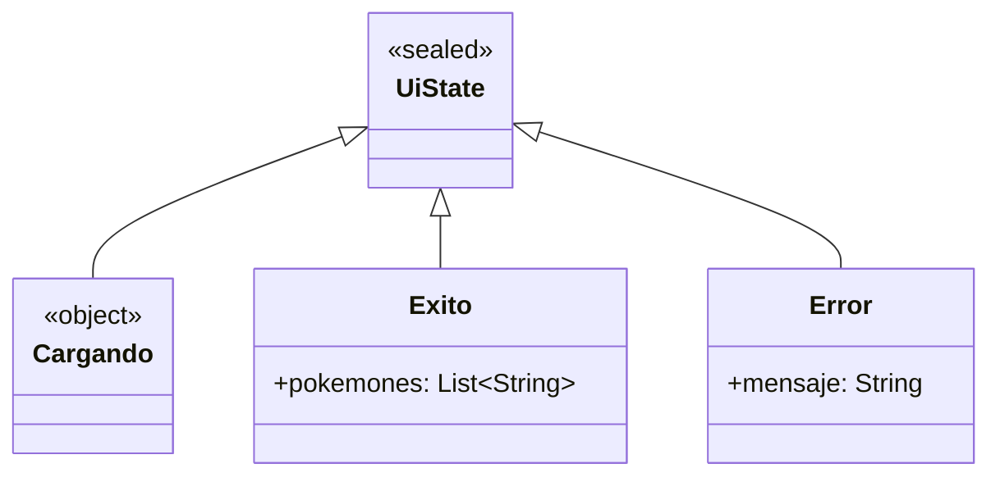

# Capítulo 20: `enum` y `sealed class`

- [Introducción](#introducción)
- [`enum class`](#enum-class)
- [`enum` con `when`](#enum-con-when)
- [`enum` con propiedades](#enum-con-propiedades)
- [Cuando un enum no basta: `sealed class`](#cuando-un-enum-no-basta-sealed-class)
- [`sealed class` con `when`](#sealed-class-con-when)
- [La conexión con la aplicación: estados de la interfaz](#la-conexión-con-la-aplicación-estados-de-la-interfaz)
- [¿enum o sealed class?](#enum-o-sealed-class)
- [Resumen](#resumen)

---

## Introducción

En los capítulos anteriores modelaste cosas con clases. Pero hay situaciones en las que un valor solo puede ser **una de un conjunto fijo de opciones**: los días de la semana, los puntos cardinales, el color de un semáforo, el estado de una descarga.

Representar esas opciones con simples textos o números es frágil: es fácil escribir `"rojo"` en un lugar y `"Rojo"` en otro, y nada te avisa del error. Kotlin ofrece herramientas hechas a medida para estos casos: los **`enum`**, para un conjunto fijo de valores con nombre, y las **`sealed class`**, para cuando cada opción puede llevar además sus propios datos.

Este capítulo es especialmente importante para la aplicación: usaremos una `sealed class` para representar los **estados de la interfaz** (cargando, éxito, error), que serán la base de la arquitectura que veremos más adelante.

## `enum class`

Un **`enum`** (de *enumeration*, "enumeración") define un tipo con un conjunto **fijo y limitado** de valores con nombre. Por ejemplo, los colores de un semáforo:

```kotlin
enum class Color {
    ROJO,
    AMARILLO,
    VERDE
}
```

Cada valor (`ROJO`, `AMARILLO`, `VERDE`) es una constante del tipo `Color`, y accedes a él a través del nombre del enum:

```kotlin
val color = Color.ROJO
println(color) // ROJO
```

La ventaja es la **seguridad**: una variable de tipo `Color` solo puede tomar uno de esos tres valores. No hay forma de asignarle un `"rojo"` mal escrito; el compilador no lo permitiría.

## `enum` con `when`

Los enums encajan perfectamente con el `when` que viste en el capítulo de control de flujo. De hecho, cuando cubres **todos** los valores del enum, no necesitas la rama `else`, porque Kotlin sabe que no hay más opciones posibles:

```kotlin
fun accion(color: Color) = when (color) {
    Color.ROJO -> "Detente"
    Color.AMARILLO -> "Precaución"
    Color.VERDE -> "Avanza"
}

println(accion(Color.VERDE)) // Avanza
```

Esto es muy útil: si algún día agregas un cuarto valor al enum, el compilador te avisará de que este `when` ya no cubre todos los casos, y tendrás que actualizarlo. El lenguaje te protege de los olvidos.

## `enum` con propiedades

Los valores de un enum también pueden llevar **datos** asociados. Para eso, el enum recibe un constructor, y cada valor le pasa sus argumentos:

```kotlin
enum class Prioridad(val nivel: Int) {
    BAJA(1),
    MEDIA(2),
    ALTA(3)
}
```

Ahora cada valor tiene una propiedad `nivel`:

```kotlin
println(Prioridad.ALTA.nivel) // 3
```

## Cuando un enum no basta: `sealed class`

Los enums son ideales cuando cada opción tiene la **misma forma**: un nombre y, quizás, unas propiedades uniformes. Pero a veces cada opción necesita llevar **datos distintos**.

Piensa en el resultado de una operación de red: puede ser un **éxito** (que trae los datos obtenidos) o un **error** (que trae un mensaje). Son dos casos con estructuras diferentes: uno lleva datos, el otro un mensaje. Un enum no encaja bien aquí.

Para esto está la **`sealed class`** ("clase sellada"): define una jerarquía **cerrada** de subclases, todas conocidas de antemano. Cada subclase puede ser distinta (una `data class`, un `object`) y llevar sus propios datos:

```kotlin
sealed class Resultado {
    data class Exito(val datos: String) : Resultado()
    data class Error(val mensaje: String) : Resultado()
}
```

"Sellada" significa que Kotlin conoce **todas** sus subclases posibles (deben declararse junto a ella). Eso es lo que la hace tan potente con el `when`.

## `sealed class` con `when`

Al usar una `sealed class` en un `when`, aprovechas dos cosas. Primero, el operador `is`, que comprueba de qué subtipo es el objeto. Segundo, el *smart cast*: dentro de cada rama, Kotlin ya sabe el tipo concreto y te deja acceder a sus datos:

```kotlin
fun manejar(resultado: Resultado) = when (resultado) {
    is Resultado.Exito -> "Datos recibidos: ${resultado.datos}"
    is Resultado.Error -> "Ocurrió un error: ${resultado.mensaje}"
}
```

```kotlin
println(manejar(Resultado.Exito("Hola")))    // Datos recibidos: Hola
println(manejar(Resultado.Error("Sin red"))) // Ocurrió un error: Sin red
```

Fíjate en que, igual que con los enums, **no hace falta `else`**: como la clase está sellada, Kotlin sabe que solo existen `Exito` y `Error`, así que el `when` ya es exhaustivo.

> [!NOTE]
> El operador `is` comprueba si un objeto es de un tipo determinado (si vienes de Java, es como `instanceof`). Dentro de la rama `is Resultado.Exito`, Kotlin aplica *smart cast*: ya sabe que `resultado` es un `Exito`, y por eso puedes leer `resultado.datos` directamente, sin ninguna conversión.

## La conexión con la aplicación: estados de la interfaz

Este patrón es exactamente el que usaremos en la aplicación. Cuando la app pida datos a la PokeAPI, su pantalla podrá estar en uno de tres estados: **cargando**, **con datos** (éxito) o **con error**. Lo modelaremos con una `sealed class`:

```kotlin
sealed class UiState {
    object Cargando : UiState()
    data class Exito(val pokemones: List<String>) : UiState()
    data class Error(val mensaje: String) : UiState()
}
```

Fíjate en que `Cargando` es un `object` (no necesita datos: solo representa "estoy cargando"), mientras que `Exito` y `Error` son `data class`, porque sí llevan información. En UML, esa jerarquía sellada se ve así:



Luego, la interfaz decidirá qué mostrar según el estado, con un `when` exhaustivo:

```kotlin
fun render(estado: UiState) = when (estado) {
    is UiState.Cargando -> "Mostrando indicador de carga..."
    is UiState.Exito    -> "Mostrando ${estado.pokemones.size} Pokémon"
    is UiState.Error    -> "Mostrando mensaje: ${estado.mensaje}"
}
```

Este es el corazón de cómo una app moderna maneja la incertidumbre de los datos, y lo retomaremos al construir la arquitectura MVVM.

## ¿enum o sealed class?

Ambos representan un conjunto fijo de opciones, así que ¿cuál usar?

- Usa un **`enum`** cuando las opciones sean valores simples y con la **misma forma**: un conjunto de constantes con nombre (colores, direcciones, niveles).
- Usa una **`sealed class`** cuando cada opción necesite llevar **sus propios datos** o tener una estructura distinta (un resultado con datos o con error, los estados de una pantalla).

En pocas palabras: si cada caso es solo "una etiqueta", un `enum` basta; si cada caso "carga algo distinto", usa una `sealed class`.

## Resumen

En este capítulo aprendiste a modelar conjuntos fijos de opciones:

- Un **`enum class`** define un conjunto fijo de valores con nombre; da seguridad frente a valores inválidos y funciona muy bien con `when` (exhaustivo, sin `else`). Sus valores pueden tener propiedades.
- Una **`sealed class`** define una jerarquía cerrada de subclases conocidas de antemano; cada una puede ser distinta y llevar sus propios datos.
- Con `when` y el operador `is`, manejas una `sealed class` de forma exhaustiva y con *smart cast* (accedes a los datos de cada caso sin conversiones).
- Usa `enum` para opciones con la misma forma y `sealed class` para opciones que cargan datos distintos.
- Este patrón es la base para modelar los **estados de la interfaz** (cargando, éxito, error) en la aplicación.

Con esto casi cierras la parte de POO. En el próximo capítulo verás tres herramientas que hacen tu código más expresivo y reutilizable: los **genéricos**, las **funciones de extensión** y las **lambdas** (que ya usaste con las colecciones y que ahora estudiarás a fondo).

---

<!-- markdownlint-disable MD033 -->
<table style="width: 100%; border-collapse: collapse;">
    <tr>
        <td style="text-align: left;">
            <a href="/chapter19.md">← Anterior</a>
        </td>
        <td style="text-align: center;">
            <a href="/README.md">Ir al índice</a>
        </td>
        <td style="text-align: right;">
            <a href="/chapter21.md">Siguiente →</a>
        </td>
    </tr>
</table>
<!-- markdownlint-enable MD033 -->
