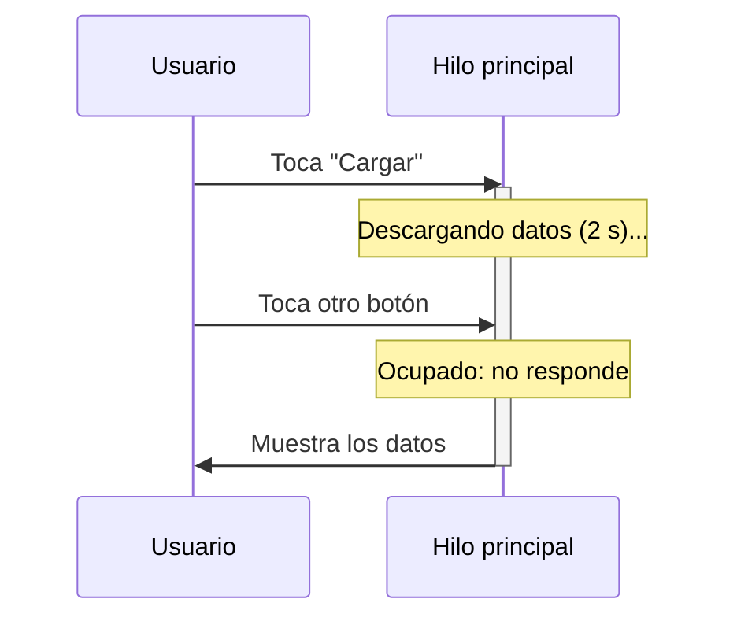
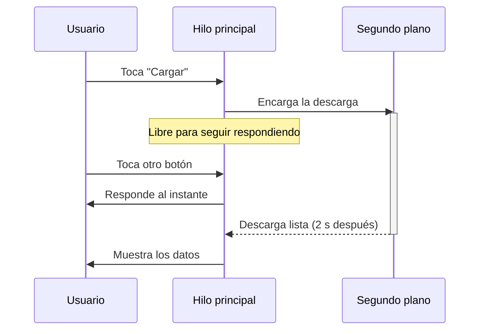

# Capítulo 22: ¿Por qué asincronía? El hilo principal

- [Introducción](#introducción)
- [¿Qué es un hilo?](#qué-es-un-hilo)
- [El hilo principal](#el-hilo-principal)
- [El problema: bloquear el hilo principal](#el-problema-bloquear-el-hilo-principal)
- [La solución: la asincronía](#la-solución-la-asincronía)
- [El desafío: coordinar el trabajo en segundo plano](#el-desafío-coordinar-el-trabajo-en-segundo-plano)
- [Resumen](#resumen)

---

## Introducción

Con el capítulo anterior completaste el lenguaje Kotlin. A partir de aquí, el curso empieza a mirar hacia **Android**. Pero antes de escribir una sola pantalla, necesitas entender un desafío que enfrenta **toda** aplicación: algunas tareas **toman tiempo**.

Descargar datos de internet, leer una base de datos o procesar un archivo grande no son operaciones instantáneas: pueden tardar segundos. Y si no las manejas bien, tu aplicación se **congela** y frustra al usuario.

En este capítulo entenderás por qué ocurre eso, conocerás el concepto de **hilo** y, en especial, el **hilo principal**, y verás por qué necesitamos la **asincronía**. Es un capítulo más conceptual que de código, pero sienta las bases de las *coroutines*, la herramienta con la que —en los próximos capítulos— nuestra aplicación pedirá los datos de los Pokémon a la PokeAPI sin congelarse.

## ¿Qué es un hilo?

Todos los programas que has escrito hasta ahora ejecutaban sus instrucciones **una tras otra**, de arriba abajo. A esa secuencia de ejecución se le llama **hilo** (en inglés, *thread*).

Puedes imaginar un hilo como un **trabajador** que sigue una lista de tareas, una por una: termina la primera, pasa a la segunda, y así sucesivamente. Hasta ahora, todos tus programas tenían **un solo** trabajador.

Un programa puede tener **varios hilos** ejecutándose a la vez (varios trabajadores en paralelo). Esto se llama **concurrencia**, y es justo lo que necesitaremos para no congelar la aplicación.

## El hilo principal

En una aplicación con interfaz gráfica, como las de Android, hay un hilo muy especial: el **hilo principal** (o *hilo de la interfaz*, *UI thread*).

Este hilo tiene una responsabilidad crítica: **dibujar la interfaz** y **responder a las interacciones** del usuario (los toques, el desplazamiento, los botones). Para que la app se sienta fluida, redibuja la pantalla decenas de veces por segundo.

La regla de oro es simple: **el hilo principal debe mantenerse libre**. Si se ocupa en otra cosa, deja de dibujar y de responder, y la app se siente trabada.

## El problema: bloquear el hilo principal

¿Qué pasa si ejecutas una tarea lenta —por ejemplo, descargar datos, que puede tardar dos segundos— en el hilo principal?

Durante esos dos segundos, el hilo principal está **ocupado** con la descarga y no puede hacer su trabajo: no redibuja la pantalla ni responde a los toques. La aplicación se **congela**. Si el bloqueo dura demasiado, Android incluso muestra un aviso de que la app "no responde" (*Application Not Responding*, o ANR) y ofrece cerrarla.

Una analogía: imagina una tienda con **un solo cajero** que, además de cobrar, tiene que saludar a cada cliente. Si ese cajero se detiene a hacer un inventario largo (una tarea lenta), toda la fila se detiene: nadie avanza hasta que termine. El hilo principal es ese cajero, y no queremos que se ponga a hacer inventarios.

Visto en el tiempo, así se comporta el hilo principal cuando lo bloqueamos con una tarea lenta:

## La solución: la asincronía

La solución es no hacer el trabajo lento en el hilo principal. En su lugar, se realiza **en segundo plano** (en otro hilo) y, cuando termina, se vuelve al hilo principal para **actualizar la interfaz** con el resultado.

A esta forma de trabajar se le llama **asincronía**: iniciar una tarea y **seguir adelante** sin quedarse esperando a que termine, para luego reaccionar cuando esté lista.

Volviendo a la tienda: en lugar de hacer el inventario él mismo, el cajero se lo encarga a un **reponedor** (otro hilo) y sigue atendiendo la fila con normalidad. Cuando el reponedor termina, le avisa. Nadie se queda esperando: el trabajo lento ocurre "por detrás", sin frenar la atención.

Con la asincronía, en cambio, la secuencia se ve así:

## El desafío: coordinar el trabajo en segundo plano

La idea suena simple, pero coordinar ese trabajo en segundo plano ha sido, históricamente, complicado.

El enfoque tradicional eran los *callbacks*: le pasabas a la tarea lenta una función para que la ejecutara "cuando terminara". Funciona, pero cuando una tarea depende de otra, que a su vez depende de otra, terminas con funciones anidadas dentro de funciones, un código difícil de leer y mantener que se ganó el apodo de *callback hell* ("el infierno de los callbacks"). Además, gestionar hilos a mano es delicado: es fácil provocar errores, o incluso hacer que la app se caiga si intentas tocar la interfaz desde el hilo equivocado.

Aquí es donde entran las **coroutines** de Kotlin, el tema de los próximos capítulos. Son la solución moderna y elegante de Kotlin para escribir código asíncrono que se lee casi como el código secuencial de siempre, sin caer en el infierno de los callbacks. Con ellas, pedir los datos de la PokeAPI sin congelar la app será sorprendentemente sencillo.

## Resumen

En este capítulo, más conceptual, entendiste por qué necesitamos la asincronía:

- Un **hilo** (*thread*) es una secuencia de ejecución; hasta ahora tus programas usaban uno solo.
- En una app con interfaz, el **hilo principal** dibuja la pantalla y responde al usuario, y debe mantenerse **libre**.
- Ejecutar una tarea **lenta** (como una descarga) en el hilo principal lo **bloquea**: la app se congela y puede aparecer el aviso de "no responde" (ANR).
- La **asincronía** resuelve esto haciendo el trabajo lento **en segundo plano** y actualizando la interfaz al terminar.
- Los enfoques tradicionales (*callbacks*) eran engorrosos; las **coroutines** de Kotlin son la solución moderna, y son el tema de los próximos capítulos.

En el próximo capítulo empezarás a escribir código asíncrono de verdad con las coroutines: `suspend`, `launch`, `async` y los conceptos que las rodean.

---

<!-- markdownlint-disable MD033 -->
<table style="width: 100%; border-collapse: collapse;">
    <tr>
        <td style="text-align: left;">
            <a href="/chapter21.md">← Anterior</a>
        </td>
        <td style="text-align: center;">
            <a href="/README.md">Ir al índice</a>
        </td>
        <td style="text-align: right;">
            <a href="/chapter23.md">Siguiente →</a>
        </td>
    </tr>
</table>
<!-- markdownlint-enable MD033 -->
