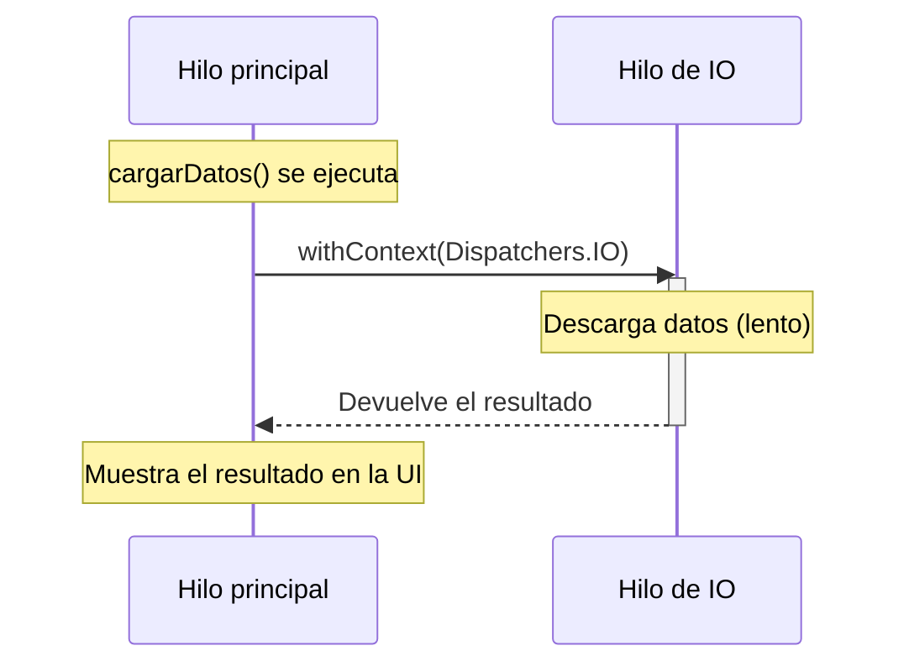

# Capítulo 23: `suspend`, `launch`, `async`, scopes y dispatchers

- [Introducción](#introducción)
- [¿Qué es una coroutine?](#qué-es-una-coroutine)
- [Funciones `suspend`](#funciones-suspend)
- [`launch`: lanzar una coroutine](#launch-lanzar-una-coroutine)
- [`async` y `await`: obtener un resultado](#async-y-await-obtener-un-resultado)
- [CoroutineScope: dónde viven las coroutines](#coroutinescope-dónde-viven-las-coroutines)
- [Dispatchers: en qué hilo se ejecutan](#dispatchers-en-qué-hilo-se-ejecutan)
- [Resumen](#resumen)

---

## Introducción

En el capítulo anterior entendiste el problema: no podemos bloquear el hilo principal con tareas lentas, y los enfoques tradicionales para evitarlo eran engorrosos. Ahora conocerás la solución de Kotlin: las **coroutines**.

Las coroutines te permiten escribir código asíncrono que se lee de arriba abajo, casi como el código secuencial de siempre, pero sin congelar la aplicación. En este capítulo verás qué es una coroutine, las funciones `suspend`, cómo lanzarlas con `launch` y `async`, dónde viven (los *scopes*) y cómo elegir en qué hilo se ejecutan (los *dispatchers*).

> [!NOTE]
> Las coroutines vienen de una biblioteca oficial de Kotlin llamada `kotlinx.coroutines`. En un proyecto Android ya viene incluida; en los ejemplos usaremos `import kotlinx.coroutines.*`.

## ¿Qué es una coroutine?

Una **coroutine** es una tarea que puede ejecutarse de forma concurrente (a la vez que otras) y que, a diferencia de un hilo, puede **suspenderse** (pausarse) y **reanudarse** más tarde **sin bloquear** el hilo en el que corre.

Esa es su magia. Cuando una coroutine llega a una operación lenta (una descarga), en lugar de quedarse esperando y bloquear el hilo, se **suspende** y libera el hilo para que haga otras cosas. Cuando la operación termina, la coroutine se **reanuda** donde quedó.

Suele decirse que las coroutines son "hilos ligeros": puedes lanzar miles de ellas sobre unos pocos hilos reales, porque casi no consumen recursos. Piénsalo como un cocinero que, mientras algo está en el horno, no se queda mirándolo: aprovecha para picar verduras y vuelve al horno cuando suena el temporizador. La coroutine hace lo mismo con el hilo: no lo desperdicia esperando.

## Funciones `suspend`

Una función que puede **suspenderse** se marca con la palabra clave `suspend`. Dentro de ella puedes llamar a otras funciones suspend, como `delay`, que "espera" una cantidad de tiempo **sin bloquear** el hilo (es la versión coroutine de una pausa):

```kotlin
suspend fun descargar(): String {
    delay(2000) // simula una descarga de 2 segundos, sin bloquear el hilo
    return "datos descargados"
}
```

La diferencia con una pausa normal es clave: mientras `delay` "espera", el hilo queda libre para atender otras coroutines.

Una función `suspend` solo puede llamarse desde otra función `suspend` o desde dentro de una coroutine; no puedes llamarla directamente desde una función normal como `main`. Por eso necesitamos una forma de **iniciar** una coroutine.

## `launch`: lanzar una coroutine

Para iniciar una coroutine se usa un **constructor de coroutines**. El más común es `launch`, que lanza una coroutine y **sigue adelante** sin esperar su resultado (lo que se llama "dispara y olvida").

`launch` necesita ejecutarse dentro de un *scope* (lo veremos en detalle más abajo). Para poder probar los ejemplos en un programa normal, usaremos `runBlocking`, que crea un scope y sirve de puente entre el mundo normal y el de las coroutines:

```kotlin
import kotlinx.coroutines.*

fun main() = runBlocking {
    println("Inicio")

    launch {
        delay(1000)
        println("Tarea terminada")
    }

    println("Fin de main")
}
```

**Salida:**

```plaintext
Inicio
Fin de main
Tarea terminada
```

Fíjate en el orden: "Fin de main" aparece **antes** que "Tarea terminada". Esto demuestra que `launch` no bloquea: lanza la coroutine (que se suspende durante el `delay`) y continúa de inmediato con el resto del código. Un segundo después, la coroutine se reanuda e imprime su mensaje.

> [!NOTE]
> `runBlocking` sí bloquea el hilo hasta que terminan sus coroutines, por lo que se usa sobre todo para pruebas y para el `main`, no en el código real de una app. En Android usaremos *scopes* que no bloquean, como verás más adelante.

## `async` y `await`: obtener un resultado

`launch` no devuelve un resultado. Cuando sí necesitas el valor que produce una coroutine, usas `async`, que devuelve un objeto `Deferred` ("diferido": una promesa de un valor futuro). Para obtener el valor, llamas a `await()`, que espera (suspendiéndose) hasta que esté listo:

```kotlin
fun main() = runBlocking {
    val tarea = async { descargar() }
    val resultado = tarea.await()
    println(resultado) // datos descargados
}
```

La gran ventaja de `async` es que puedes lanzar **varias tareas en paralelo** y esperar sus resultados. Por ejemplo, dos descargas a la vez:

```kotlin
fun main() = runBlocking {
    val tarea1 = async { descargar() }
    val tarea2 = async { descargar() }

    println(tarea1.await())
    println(tarea2.await())
}
```

Como ambas descargas empiezan casi al mismo tiempo, el total tarda alrededor de **2 segundos** (lo que dura una), no 4. Si las hubieras hecho una tras otra, habrían tardado el doble.

## CoroutineScope: dónde viven las coroutines

Toda coroutine vive dentro de un **scope** (ámbito), que **controla su ciclo de vida**. Un scope agrupa las coroutines que lanzas en él, y si el scope se cancela, **todas** sus coroutines se cancelan con él.

Esto es muy importante: evita que queden coroutines "huérfanas" ejecutándose cuando ya no se necesitan (por ejemplo, una descarga que sigue en marcha después de que el usuario cerró la pantalla). A este manejo ordenado se le llama **concurrencia estructurada**.

En Android no crearás los scopes a mano: usarás scopes que ya vienen atados al ciclo de vida de los componentes. El más habitual es `viewModelScope`, que cancela automáticamente sus coroutines cuando su pantalla desaparece. Lo veremos al construir la arquitectura MVVM. Por ahora, quédate con la idea: **cada coroutine pertenece a un scope, y el scope se encarga de limpiarla cuando corresponde**.

## Dispatchers: en qué hilo se ejecutan

Falta la pieza que conecta todo con el capítulo anterior: ¿en qué **hilo** corre una coroutine? De eso se encarga el **dispatcher** ("despachador"). Kotlin ofrece tres principales:

- **`Dispatchers.Main`**: el hilo principal. Se usa para actualizar la interfaz.
- **`Dispatchers.IO`**: pensado para operaciones de entrada/salida lentas (red, disco, base de datos). Aquí harás las descargas.
- **`Dispatchers.Default`**: para trabajo intensivo de CPU (cálculos pesados).

Para ejecutar un bloque de código en un dispatcher concreto, usas `withContext`, que **cambia de hilo** durante ese bloque y vuelve al original al terminar:

```kotlin
suspend fun cargarDatos() {
    // Estamos en el hilo principal
    val datos = withContext(Dispatchers.IO) {
        descargar() // esto corre en un hilo de IO, sin bloquear el principal
    }
    // De vuelta en el hilo principal, con el resultado ya listo
    println("Recibidos: $datos")
}
```

Este es exactamente el patrón que resuelve el problema del capítulo anterior: la descarga ocurre en un hilo de IO (sin congelar la app) y, cuando termina, el código vuelve al hilo principal para mostrar el resultado. Visto en el tiempo:



Y lo mejor es que el código se lee de arriba abajo, sin callbacks anidados: primero descarga, luego muestra. Esa es la gran promesa de las coroutines cumplida.

## Resumen

En este capítulo empezaste a escribir código asíncrono con coroutines:

- Una **coroutine** es una tarea que puede **suspenderse y reanudarse** sin bloquear el hilo; son tan ligeras que puedes lanzar miles.
- Una función `suspend` puede pausarse; dentro de ella puedes llamar a otras suspend, como `delay` (una espera que no bloquea).
- **`launch`** lanza una coroutine sin esperar su resultado ("dispara y olvida"); **`async`** + **`await`** lanzan una coroutine y obtienen su valor, ideal para ejecutar tareas en paralelo.
- Toda coroutine vive en un **scope**, que controla su ciclo de vida y cancela sus coroutines cuando ya no se necesitan (concurrencia estructurada). En Android usarás scopes como `viewModelScope`.
- Un **dispatcher** decide en qué hilo corre la coroutine: `Main` para la interfaz, `IO` para red y disco, `Default` para cálculos. Con `withContext` cambias de hilo para un bloque.

En el próximo capítulo verás `Flow`, `StateFlow` y `SharedFlow`: la forma de trabajar con **secuencias de valores asíncronos** que van llegando con el tiempo, la base para que la interfaz reaccione automáticamente a los cambios de datos.

---

<!-- markdownlint-disable MD033 -->
<table style="width: 100%; border-collapse: collapse;">
    <tr>
        <td style="text-align: left;">
            <a href="/chapter22.md">← Anterior</a>
        </td>
        <td style="text-align: center;">
            <a href="/README.md">Ir al índice</a>
        </td>
        <td style="text-align: right;">
            <a href="/chapter24.md">Siguiente →</a>
        </td>
    </tr>
</table>
<!-- markdownlint-enable MD033 -->
