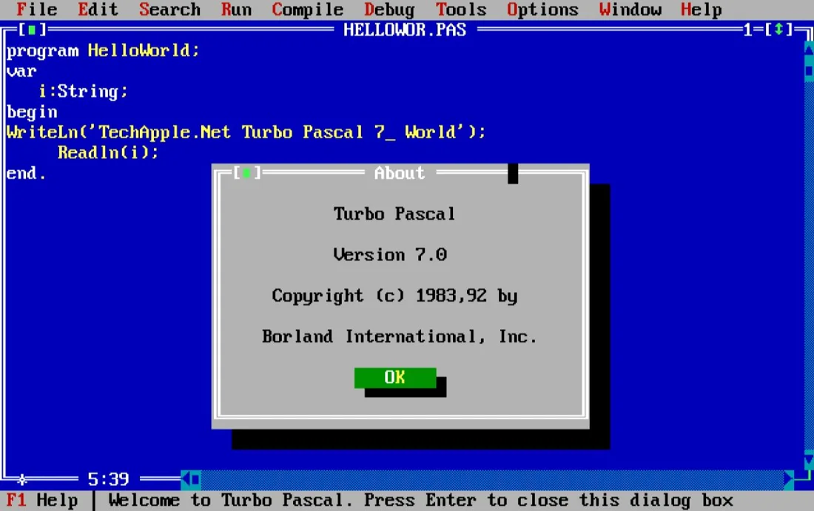
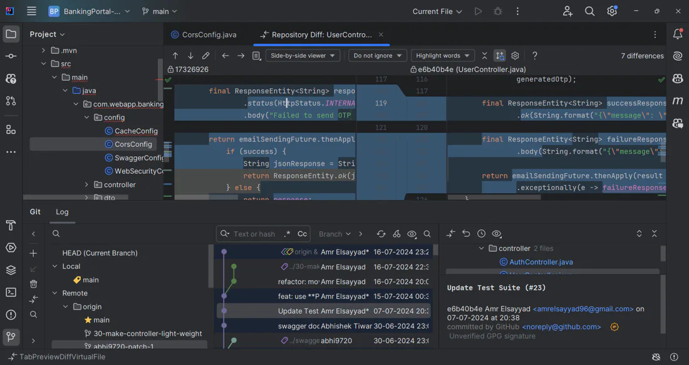
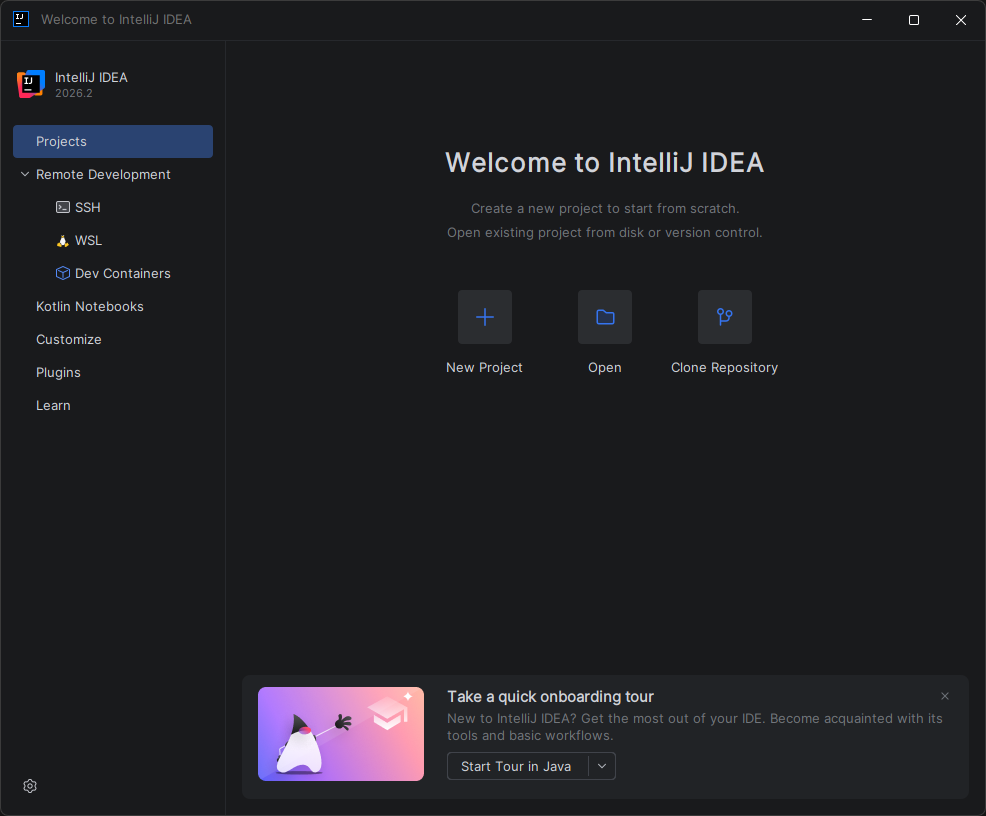
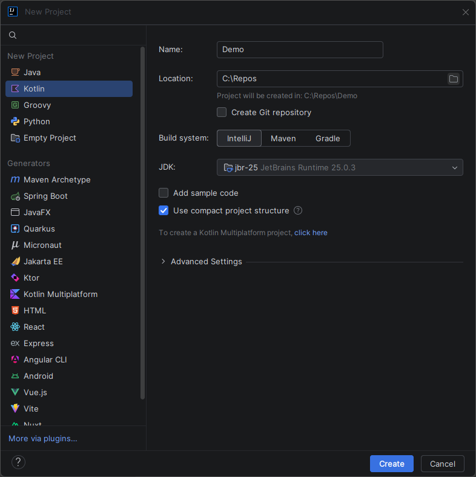
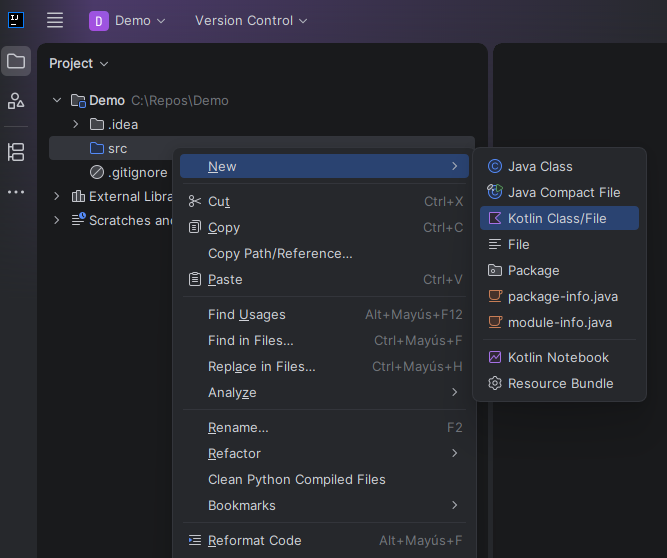
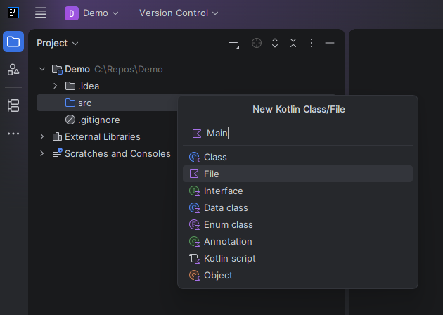
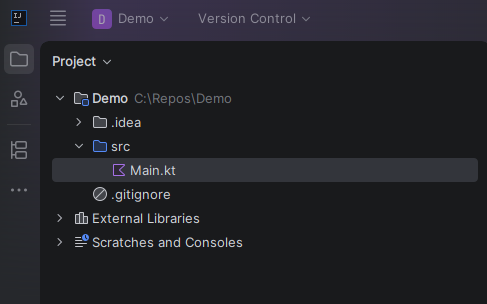
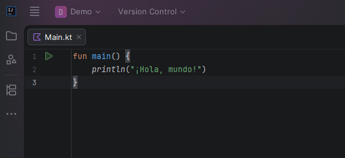

# Capítulo 1: El Entorno de Desarrollo Integrado (IDE)

## Introducción

Escribir un solo programa implica toda una serie de tareas: escribes el código, localizas y corriges los errores que inevitablemente surgen, y luego hay que compilar, ejecutar y documentar el código. Y adivina qué: todo esto hay que hacerlo una y otra vez. Con programas pequeños como **Hola Mundo**, puedes realizar estas tareas utilizando un sencillo editor de texto para escribir el código fuente y un conjunto de herramientas para compilar y ejecutar los programas. Algunos editores de texto pueden incluso resaltar la sintaxis, lo que simplifica el proceso de escritura, pero esto puede no ser suficiente para trabajar en algo más grande y complejo.

Como desarrollador profesional, necesitas una herramienta especializada para navegar por tus programas de varios archivos, modificarlos, compilarlos, ejecutarlos y depurarlos, mostrar los errores de sintaxis, etcétera. Un **Entorno de Desarrollo Integrado** (en inglés **Integrated Development Environment**, y sus siglas **IDE**) es precisamente eso: ofrece un único programa en el que los desarrolladores pueden realizar todas estas tareas habituales.

En este capítulo conocerás qué es un IDE, cómo ha evolucionado a lo largo de la historia y cuáles son los componentes que lo convierten en una herramienta indispensable para el desarrollo de software moderno. Además, aprenderás a utilizar **IntelliJ IDEA**, el entorno de desarrollo recomendado para aprender **Kotlin**, donde crearás tu primer proyecto y escribirás tus primeras líneas de código.

El objetivo de este capítulo es que prepares correctamente tu entorno de trabajo para programar en Kotlin, de modo que puedas concentrarte en aprender el lenguaje sin preocuparte por la configuración.

> [!NOTE]
> Más adelante, en la **Parte VI**, instalaremos **Android Studio** (el IDE oficial para Android) y crearemos nuestro primer proyecto móvil. Por ahora nos enfocamos en Kotlin puro, así que basta con IntelliJ IDEA.

## Breve reseña histórica

La mayoría de los IDE modernos son gráficos, aunque los primeros se utilizaban en una época en la que nadie soñaba con los gráficos. Se basaban en una interfaz de texto y solo se podían manejar mediante teclas de función y atajos de teclado para activar diversas funciones. Este era, por ejemplo, el caso de Turbo Pascal, creado por Borland:



Los primeros IDE se diseñaron para funcionar a través de una consola o terminal, que ya eran una novedad en sí mismas. De hecho, antes de eso, los programas se creaban generalmente en papel y se introducían en la máquina mediante soportes de papel preparados previamente, como tarjetas perforadas o cintas perforadas.

He aquí algunos ejemplos históricos concretos. **Dartmouth BASIC** fue el primer lenguaje diseñado para ejecutarse en una consola o terminal. Este antiguo IDE se controlaba mediante comandos, sin utilizar ni siquiera menús ni teclas de acceso rápido. Sin embargo, permitía editar el código fuente, gestionar archivos, compilar, depurar y ejecutar programas de una manera fundamentalmente similar a la de los IDE modernos.

Luego llegó el momento de **Maestro I**. Se trataba de un producto de **Softlab Munich** que fue el primer entorno de desarrollo integrado del mundo para software. ¿Te puedes creer que ocupara una posición de liderazgo en su nicho durante casi veinte años? Hoy en día, sin embargo, Maestro ya forma parte de la historia.

Como ves, la humanidad no llegó de inmediato a los IDE multifuncionales.

## ¿Qué es un IDE moderno?

Los IDE se crearon para maximizar la productividad de los programadores mediante componentes estrechamente integrados con interfaces de usuario sencillas. Esto permite al desarrollador realizar menos pasos para cambiar entre diferentes modos, a diferencia de lo que ocurre con los programas de desarrollo independientes. Sin embargo, los IDE gráficos modernos son paquetes de software complejos. Eso significa que solo se puede lograr la aceleración necesaria del proceso de trabajo tras haber recibido algo de formación. De todos modos, tampoco hay grandes dificultades en este sentido: muchos IDE son bastante interactivos y las interfaces de los distintos fabricantes suelen ser muy similares, por lo que no resulta demasiado difícil cambiar de un IDE a otro.

Existen muchos IDE para diferentes lenguajes de programación. Algunos solo admiten un único lenguaje, mientras que otros admiten varios o pueden ampliarse con complementos. Por ejemplo, los IDE que admiten varios lenguajes son **IntelliJ IDEA**, **Eclipse**, **NetBeans**, **Android Studio** y **Visual Studio Code**. Los IDE para un lenguaje de programación específico son **Delphi**, **Dev-C++**, **IDLE for Python** y **PyCharm**.

A modo de ejemplo, así es como se ve el IDE IntelliJ IDEA:



Todos estos entornos pueden ejecutarse en Windows, macOS o GNU/Linux.

## Componentes del IDE

En general, el entorno de desarrollo incluye:

- Un **editor de texto**, diseñado para trabajar con archivos de texto de forma interactiva. Permite visualizar el contenido de los archivos y realizar diversas acciones, como insertar, borrar y copiar texto, realizar búsquedas contextuales, sustituir texto, ordenar cadenas y mucho más. A menudo incluyen funcionalidades adicionales, como el resaltado de sintaxis.
- Un **traductor (compilador y/o intérprete)**, que traduce un texto escrito en un lenguaje de programación a código máquina y lo hace bien inmediatamente antes de iniciar el programa (compilación) o línea por línea (interpretación).
- **Herramientas de automatización de la compilación**, que preparan el código y lo ensamblan todo.
- Un **depurador**, que ayuda a buscar errores en el código y los notifica.

En resumen, el uso de un IDE te convierte en un desarrollador más productivo, ya que ofrece componentes estrechamente integrados con una interfaz de usuario coherente. Además, automatiza algunas tareas rutinarias e incluso te ofrece consejos y comentarios. Todo ello se debe a que el objetivo del entorno integrado es combinar diversas utilidades en un único producto. Este enfoque permite a los desarrolladores centrarse en resolver sus problemas principales, mientras que el IDE se encarga de las operaciones comunes y estándar.

## IntelliJ IDEA

IntelliJ IDEA es el IDE líder para Java y Kotlin de JetBrains (la misma empresa que creó Kotlin).

> [!NOTE]
> Si vienes de programar en **Java** con IntelliJ IDEA o Eclipse, estás en terreno conocido: Android Studio, que usaremos más adelante, está construido **sobre IntelliJ IDEA**, así que casi todo lo que aprendas aquí te servirá luego para el desarrollo Android.

En el sector, destaca por:

- **Un editor con reconocimiento de contexto**, que te ofrece sugerencias de autocompletado a medida que escribes, propone soluciones para errores y advertencias, y te permite encontrar cualquier cosa, desde clases hasta ventanas de herramientas.
- **Su profundo conocimiento del código**, que garantiza que el IDE pueda detectar errores al instante y ofrecer sugerencias relevantes en cada contexto.
- **Una experiencia lista para usar**, lo que significa que puedes empezar a programar desde el primer inicio, sin necesidad de instalar complementos.
- **Herramientas para el desarrollo colaborativo y a distancia**.

IntelliJ IDEA es gratuito tanto para uso comercial como no comercial. Sin embargo, algunas funciones solo están disponibles con la suscripción **Ultimate**.

- La versión gratuita (Community) ofrece todas las funciones necesarias para cubrir las necesidades esenciales de la mayoría de los desarrollos en Java y Kotlin. **Es más que suficiente para este curso.**
- La suscripción **Ultimate** ofrece soporte avanzado para diversos marcos y tecnologías de backend y frontend, además de herramientas de perfilado, de bases de datos y un cliente HTTP.

Para obtener más información sobre este IDE, visita la [página web oficial](https://www.jetbrains.com/idea/features).

### Crea tu primer proyecto

Veamos más detenidamente cómo funciona IntelliJ IDEA. Sigue los pasos que se indican a continuación para crear tu primera aplicación.

1. Instala IntelliJ IDEA en tu computador y ábrelo.

2. Si no hay ningún proyecto abierto actualmente, haz clic en *New Project* en la sección *Projects* de la pantalla de bienvenida. De lo contrario, selecciona *File* → *New* → *Project*.

   

3. En el asistente *New Project*, selecciona *New Project* en la lista de la izquierda.

4. Asigna un nombre al proyecto (por ejemplo, *Demo*) y cambia la ubicación predeterminada si es necesario.

5. Si quieres habilitar el control de versiones, marca la opción *Create Git repository*. Si no lo haces, igual puedes inicializar el repositorio más adelante.

6. Selecciona *Kotlin* en *Language* e *IntelliJ* en *Build system*.

   

7. Para desarrollar aplicaciones Kotlin en IntelliJ IDEA, necesitas el JetBrains Runtime (JBR). Tu IDE rellenará automáticamente el campo del JBR. No obstante, puedes modificarlo, añadir el JBR necesario desde tu computador o descargar uno.

8. IntelliJ IDEA crea el proyecto. Cuando este proceso haya finalizado, la estructura de tu nuevo proyecto se mostrará en la ventana de herramientas *Project*. Hay dos nodos de nivel superior:

- **Demo:** representa el módulo de tu proyecto. El directorio `.idea` y el archivo `Demo.iml` almacenan los datos de configuración de tu proyecto y del módulo, respectivamente. El directorio `src` está destinado a tu código fuente.
- **External Libraries:** representa todos los recursos **externos** necesarios para tu trabajo de desarrollo. Allí se ubican los archivos estándar del lenguaje. También puedes añadir otros recursos manualmente.

### Escribe tu primer código

Ahora vamos a escribir un fragmento sencillo de código **Kotlin** para el proyecto "Demo".

1. En la ventana de herramientas *Project*, haz clic con el botón derecho del ratón en el directorio `src`, selecciona *New* y, luego, *Kotlin Class/File*.

   

2. Selecciona la opción *File*. En el campo `Name`, escribe `Main` y pulsa *Intro*. Se creará un archivo llamado `Main.kt` (la extensión `.kt` identifica a los archivos de Kotlin).

   

3. A continuación, en el archivo `Main.kt`, escribamos la función `main` y llamemos a `println()`. Puedes empezar a escribir los símbolos y el IDE te sugerirá posibles variantes de código. Esta función se denomina *autocompletado de código*: IntelliJ IDEA analiza el contexto y sugiere las opciones a las que se puede acceder desde la posición actual del cursor.

   

4. Escribe la declaración de la función `main()`:

   ```kotlin
   fun main() {
       println("¡Hola, mundo!")
   }
   ```

   

5. Para ejecutar el programa, haz clic en el ícono de *play* (▶️) que aparece en el margen izquierdo, junto a la función `main`, y selecciona *Run 'MainKt'*. Verás el resultado en la ventana *Run*, en la parte inferior del IDE.

¡Felicitaciones! Ya escribiste y ejecutaste tu primera aplicación en Kotlin con IntelliJ IDEA. No te preocupes si todavía no entiendes cada parte del código: lo desglosaremos en detalle en los próximos capítulos.

## Un atajo sin instalar nada: Kotlin Playground

Si quieres probar Kotlin de inmediato, sin instalar ningún IDE, puedes usar el **[Kotlin Playground](https://play.kotlinlang.org)**, un editor en línea que compila y ejecuta código Kotlin directamente en tu navegador.

Es ideal para experimentar con los primeros ejemplos de este curso o para probar una idea rápida. Eso sí, para proyectos reales (y para todo lo relacionado con Android) necesitarás un IDE de escritorio como IntelliJ IDEA o, más adelante, Android Studio.

## ¿Y Android Studio?

Como el objetivo final de este curso es desarrollar aplicaciones móviles, seguramente te preguntes por qué no instalamos Android Studio desde ya.

La razón es pedagógica: **primero conviene dominar el lenguaje Kotlin** con una herramienta liviana y directa, y recién después entrar al mundo de Android, que agrega muchos conceptos nuevos (Gradle, el `AndroidManifest`, el ciclo de vida de una `Activity`, la interfaz con Compose, etcétera). Mezclar todo desde el inicio suele abrumar.

Por eso, la instalación de Android Studio, la creación de tu primer proyecto Android y el recorrido por su interfaz los veremos en la **Parte VI (Capítulo 25)**. Cuando lleguemos ahí, todo lo que aprendiste en IntelliJ IDEA te resultará familiar, porque Android Studio se basa en el mismo motor.

## Resumen

En este capítulo preparaste tu entorno para programar en Kotlin:

- Un **IDE** integra en un solo programa el editor, el compilador, las herramientas de compilación y el depurador.
- **IntelliJ IDEA** es el IDE recomendado para aprender Kotlin; su edición Community, gratuita, es más que suficiente para el curso.
- Creaste tu primer proyecto y ejecutaste un "¡Hola, mundo!".
- Para experimentos rápidos sin instalar nada, tienes el **Kotlin Playground**.
- **Android Studio** (el IDE oficial de Android) lo instalaremos más adelante, en la Parte VI, cuando empecemos a desarrollar la aplicación.
