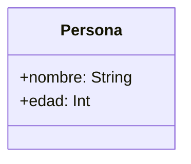
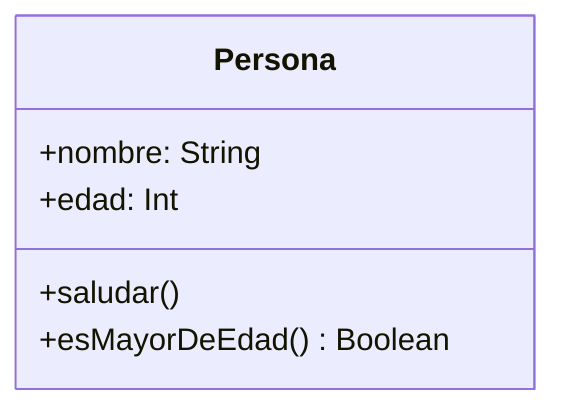

# Capítulo 16: Clases, propiedades y constructores

## Introducción

Hasta ahora, cuando querías representar algo con varios datos —una persona con su nombre, su edad y su correo—, tenías que usar variables sueltas:

```kotlin
val nombre = "Ana"
val edad = 30
val correo = "ana@ejemplo.com"
```

Funciona para una persona, pero ¿y si tienes muchas? ¿Y cómo agrupas, junto a esos datos, las acciones que se pueden hacer con ellos? Aquí empieza la **programación orientada a objetos (POO)**.

La herramienta central de la POO es la **clase**. En este capítulo aprenderás a crear tus propias clases, a darles datos mediante **propiedades**, a construir objetos con **constructores** y a añadirles comportamiento con funciones. Es un paso fundamental: a partir de aquí modelarás las cosas de tu programa como objetos. Pero antes, veamos brevemente en qué consiste este estilo de programación.

> [!NOTE]
> Si vienes de Java, ya conoces la POO. En este capítulo verás cómo Kotlin expresa las mismas ideas de forma mucho más concisa.

## ¿Qué es la programación orientada a objetos?

La **programación orientada a objetos** (POO) es un *paradigma*: una forma de organizar y estructurar el código. En lugar de entender un programa como una simple lista de instrucciones y funciones sueltas, la POO lo organiza en torno a **objetos**.

Un objeto representa una "cosa" del problema que estás resolviendo —una persona, un producto, un pedido— y reúne en un solo lugar dos aspectos: sus **datos** (qué información contiene) y su **comportamiento** (qué puede hacer).

Antes de la POO predominaba la **programación estructurada** (o procedural), en la que los datos y las funciones que los manipulaban vivían por separado. A medida que los programas crecían, esa separación se volvía difícil de mantener. La POO surgió para ordenar ese crecimiento, agrupando cada conjunto de datos con las operaciones que le corresponden. Sus ideas nacieron con lenguajes como **Simula** (en los años 60) y se popularizaron con **Smalltalk** durante las décadas de 1970 y 1980; hoy están presentes en la mayoría de los lenguajes modernos, incluidos Java y Kotlin.

## Los pilares de la POO

La POO se apoya en cuatro conceptos fundamentales, conocidos como sus **cuatro pilares**. Los presentamos aquí en su idea general; los iremos desarrollando en profundidad a lo largo de esta parte del curso.

- **Abstracción.** Representar en el código solo los aspectos **esenciales** de algo, ocultando los detalles que no importan. Por ejemplo, para modelar una persona quizás baste con su nombre y su edad, sin incluir cada detalle de su vida. Una clase es, en el fondo, una abstracción: tú decides qué datos y qué comportamiento son relevantes.
- **Encapsulación.** **Agrupar** los datos y el comportamiento en una misma unidad (el objeto) y **controlar el acceso** a su interior, exponiendo solo lo necesario. Así, cada objeto protege sus propios datos y decide cómo pueden usarse.
- **Herencia.** Permitir que una clase **reutilice y extienda** las características de otra. Por ejemplo, una clase `Estudiante` podría heredar de `Persona` todo lo común y añadir lo suyo. La veremos en el próximo capítulo.
- **Polimorfismo.** Permitir que objetos de distintas clases respondan a una misma operación **cada uno a su manera**. También lo desarrollaremos en el próximo capítulo.

En este capítulo nos concentramos en la base sobre la que se apoyan todos estos pilares: las **clases** y los **objetos**.

> [!NOTE]
> Escribir buen código orientado a objetos no consiste solo en usar clases, sino en organizarlas bien. Para eso existen principios de diseño como **SOLID**, que revisamos en el [anexo de principios de diseño](appendix-design-principle.md). Te será útil volver a él a medida que avances en esta parte del curso.

## ¿Qué es una clase?

Una **clase** es una **plantilla** (o molde) para crear objetos. Describe qué **datos** tendrá cada objeto y qué **puede hacer**. Un **objeto** es una instancia concreta creada a partir de esa plantilla.

Una analogía habitual: la clase es como el **plano** de una casa, y los objetos son las **casas** construidas a partir de ese plano. Con un solo plano puedes construir muchas casas, cada una con sus propias características (una pintada de azul, otra de verde), pero todas comparten la misma estructura.

Para representar una clase de forma visual se usa a menudo un **diagrama UML** (*Unified Modeling Language*), una notación estándar en el diseño de software. Una clase se dibuja como un rectángulo con su nombre en la parte superior y sus **propiedades** debajo; más adelante le añadiremos también sus **métodos**. Por ejemplo, una clase `Persona` con un nombre y una edad se representaría así:



El signo `+` indica que ese elemento es accesible desde fuera de la clase. A lo largo del capítulo iremos construyendo esta clase en código.

## Definir una clase y crear objetos

Para definir una clase, usas la palabra clave `class` seguida de su nombre. Por convención, los nombres de clase empiezan con **mayúscula**:

```kotlin
class Persona
```

Esta clase, por ahora, no hace nada, pero ya podemos crear **objetos** (instancias) a partir de ella. Para eso, escribes el nombre de la clase seguido de paréntesis:

```kotlin
val persona = Persona()
```

> [!NOTE]
> Si vienes de Java, fíjate en un detalle: en Kotlin **no** se usa la palabra `new` para crear objetos. Basta con `Persona()`.

Ahora `persona` es un objeto de tipo `Persona`. El siguiente paso es darle datos.

## Propiedades

Los datos que guarda un objeto se llaman **propiedades**. Se declaran dentro del cuerpo de la clase, como variables (`val` o `var`):

```kotlin
class Persona {
    var nombre = "Sin nombre"
    var edad = 0
}
```

Accedes a las propiedades de un objeto con un punto `.` seguido del nombre de la propiedad:

```kotlin
val persona = Persona()
persona.nombre = "Ana"
persona.edad = 30

println(persona.nombre) // Ana
println(persona.edad)   // 30
```

Igual que con las variables, una propiedad `val` es de solo lectura (no se puede reasignar) y una `var` se puede modificar.

> [!NOTE]
> En Java, sueles declarar los campos como privados y escribir métodos *getter* y *setter* para acceder a ellos. En Kotlin, esos accesos se generan automáticamente: cuando escribes `persona.nombre`, por dentro Kotlin usa el getter o el setter correspondiente, sin que tengas que escribirlos.

## El constructor primario

El ejemplo anterior tiene un inconveniente: creamos una `Persona` sin datos y se los asignamos después, uno por uno. Sería mejor exigir que toda persona tenga un nombre y una edad **desde el momento en que se crea**. Para eso están los **constructores**.

Un **constructor** es lo que se ejecuta al crear un objeto y define qué datos necesita. En Kotlin, la forma más habitual es el **constructor primario**, que se escribe en la propia cabecera de la clase, entre paréntesis, junto al nombre:

```kotlin
class Persona(val nombre: String, val edad: Int)
```

Con esto, cada `Persona` requiere un nombre y una edad al crearse, y esos valores quedan guardados como propiedades:

```kotlin
val persona = Persona("Ana", 30)
println(persona.nombre) // Ana
println(persona.edad)   // 30
```

Fíjate en el poder de esa única línea: al escribir `val nombre: String` dentro del constructor, Kotlin **declara la propiedad y la inicializa** a la vez. Si usas `var` en lugar de `val`, la propiedad podrá modificarse después.

> [!NOTE]
> Esta concisión es una de las señas de identidad de Kotlin. En Java, la misma clase requeriría declarar los campos, escribir un constructor que reciba los parámetros y asignarlos uno a uno. En Kotlin, todo eso cabe en `class Persona(val nombre: String, val edad: Int)`.

## Valores por defecto en el constructor

Al igual que en las funciones, los parámetros del constructor pueden tener **valores por defecto**:

```kotlin
class Persona(val nombre: String, val edad: Int = 0)
```

Así, puedes crear una persona indicando solo el nombre; la edad tomará el valor por defecto:

```kotlin
val persona1 = Persona("Ana", 30) // nombre y edad
val persona2 = Persona("Diego")   // solo nombre; edad = 0
```

También puedes usar **argumentos con nombre** al crear el objeto, tal como viste con las funciones:

```kotlin
val persona = Persona(nombre = "Ana", edad = 30)
```

## El bloque `init`

A veces necesitas ejecutar código **en el momento de crear el objeto**: por ejemplo, validar los datos o mostrar un mensaje. Para eso está el bloque `init`, que se ejecuta cada vez que se construye un objeto:

```kotlin
class Persona(val nombre: String, val edad: Int) {
    init {
        if (edad < 0) {
            throw IllegalArgumentException("La edad no puede ser negativa")
        }
        println("Se creó una persona llamada $nombre")
    }
}
```

```kotlin
val persona = Persona("Ana", 30) // imprime: Se creó una persona llamada Ana
```

Aquí el `init` valida que la edad no sea negativa (lanzando una excepción si lo es, como viste en el capítulo de excepciones) y muestra un mensaje. Todo eso ocurre justo al crear el objeto.

## Funciones miembro (métodos)

Una clase no solo guarda datos: también puede tener **comportamiento**, en forma de funciones definidas dentro de ella. A estas funciones se les llama **funciones miembro** o **métodos**, y pueden usar directamente las propiedades del objeto:

```kotlin
class Persona(val nombre: String, val edad: Int) {
    fun saludar() {
        println("Hola, soy $nombre y tengo $edad años")
    }

    fun esMayorDeEdad(): Boolean {
        return edad >= 18
    }
}
```

Los invocas sobre un objeto, con la notación de punto:

```kotlin
val persona = Persona("Ana", 30)
persona.saludar()                // Hola, soy Ana y tengo 30 años
println(persona.esMayorDeEdad()) // true
```

Fíjate en que `saludar` y `esMayorDeEdad` usan `nombre` y `edad` sin recibirlos como parámetros: al ser métodos de la clase, tienen acceso directo a las propiedades del objeto. Así se cumple la idea central de la POO: **agrupar los datos y el comportamiento que opera sobre ellos** en una misma unidad.

Con sus datos y su comportamiento, la clase `Persona` completa se representa así en UML (ahora con sus métodos en la parte inferior):



## Mutabilidad: qué controla `val`

Una pregunta natural al declarar propiedades y objetos con `val` es: ¿eso los vuelve inmutables? Como viste al trabajar con colecciones, `val` **impide reasignar**, pero no necesariamente **congela el contenido**. Con las clases, esto se manifiesta en dos niveles.

**A nivel de propiedad.** Una propiedad `val` no se puede reasignar; una `var`, sí. Fíjate en que aquí declaramos `edad` como `var`:

```kotlin
class Persona(val nombre: String, var edad: Int)

val persona = Persona("Ana", 30)
persona.edad = 31        // correcto: edad es var
persona.nombre = "Elena" // error: nombre es val, no se puede reasignar
```

**A nivel de objeto.** Cuando guardas un objeto en una variable `val`, no puedes **reasignar** esa variable por otro objeto, pero sí puedes modificar el estado interno del objeto (sus propiedades `var`):

```kotlin
val persona = Persona("Ana", 30)
persona.edad = 31              // correcto: cambiamos el interior del objeto
persona = Persona("Diego", 25) // error: no podemos reasignar la variable val
```

En otras palabras: `val` controla si puedes **cambiar la variable por otra**, no si puedes **modificar el objeto por dentro**. Para que un objeto sea realmente **inmutable**, todas sus propiedades deben ser `val` (y, a su vez, contener valores inmutables).

Es el mismo principio que viste con las colecciones: un `val` con una `MutableList` no se puede reasignar, pero su contenido sí puede cambiar.

## Resumen

En este capítulo diste tus primeros pasos en la programación orientada a objetos:

- La **POO** es un paradigma que organiza el código en torno a **objetos**, que combinan datos y comportamiento. Se apoya en cuatro pilares: **abstracción**, **encapsulación**, **herencia** y **polimorfismo**.
- Una **clase** es una plantilla para crear objetos; un **objeto** es una instancia concreta de una clase. Un **diagrama UML** representa una clase con su nombre, sus propiedades y sus métodos.
- En Kotlin, los objetos se crean con `NombreClase(...)`, **sin** la palabra `new`.
- Las **propiedades** guardan los datos del objeto y se acceden con la notación de punto (`objeto.propiedad`).
- El **constructor primario**, en la cabecera de la clase, declara e inicializa las propiedades de forma muy concisa: `class Persona(val nombre: String, val edad: Int)`.
- Los parámetros del constructor admiten **valores por defecto**, y el bloque **`init`** ejecuta código al crear el objeto (por ejemplo, para validar).
- Las **funciones miembro** (métodos) definen el comportamiento y tienen acceso directo a las propiedades.
- Una propiedad o variable `val` no se puede **reasignar**, pero el objeto al que apunta sí puede cambiar por dentro (sus propiedades `var`). Para que un objeto sea inmutable, todas sus propiedades deben ser `val`.

En el próximo capítulo verás cómo las clases pueden **relacionarse entre sí** mediante la herencia, las interfaces y las clases abstractas.
