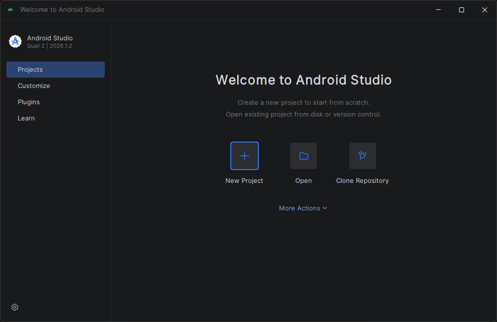
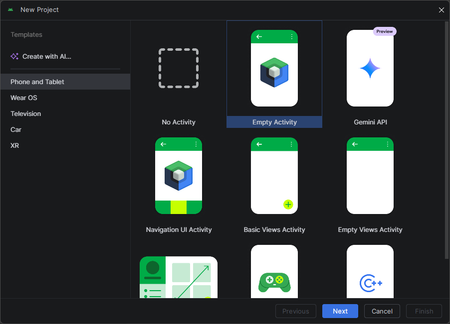
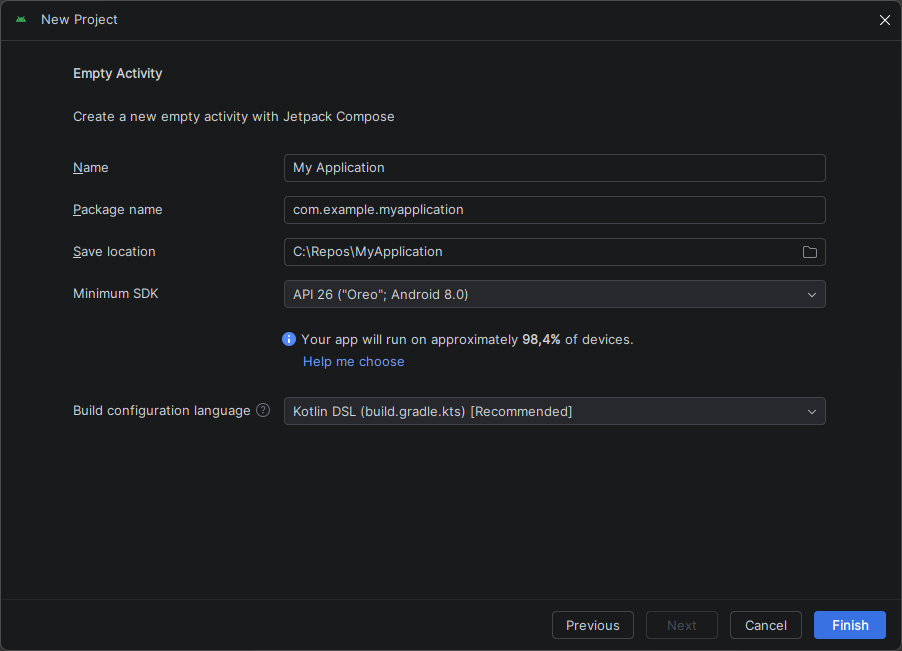
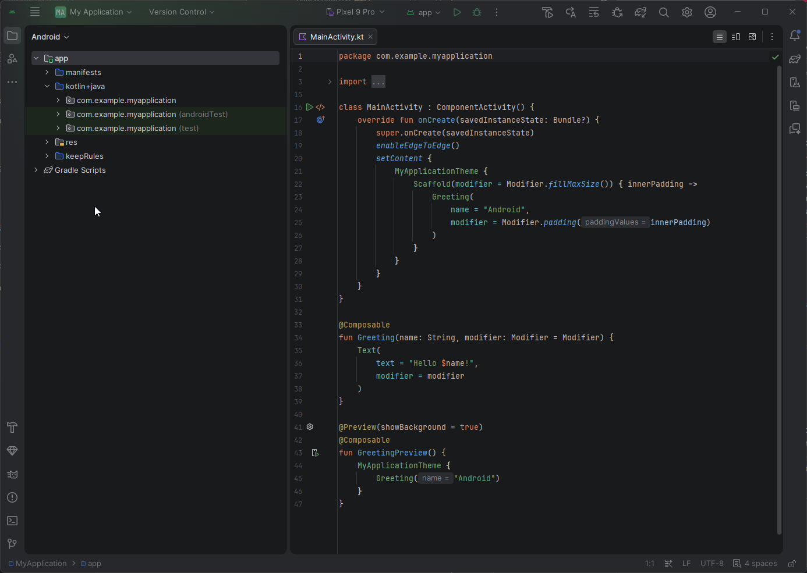
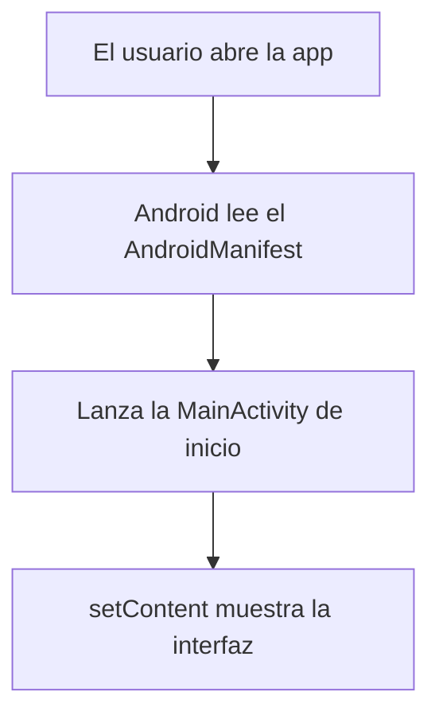

# Capítulo 25: Android Studio y anatomía de un proyecto Android

## Introducción

¡Llegó el gran momento! Con toda la base de Kotlin dominada, en esta parte del curso empezamos a construir aplicaciones Android de verdad. Pero un proyecto Android es bastante más que un archivo `.kt` con una función `main`: tiene una estructura propia, herramientas de construcción y archivos de configuración que conviene entender antes de escribir código.

En este capítulo instalarás **Android Studio**, crearás tu primer proyecto y recorrerás su **anatomía**: qué archivos lo componen, para qué sirve cada uno y cómo encajan entre sí. No escribiremos aún la interfaz (eso empieza en el próximo capítulo); el objetivo aquí es que sepas orientarte dentro de un proyecto Android.

## Android Studio, el IDE oficial de Android

En el primer capítulo usaste **IntelliJ IDEA** para aprender Kotlin, y mencionamos que Android Studio llegaría más adelante. Ese momento es ahora.

**Android Studio** es el entorno de desarrollo (IDE) **oficial** para Android, creado por Google y **construido sobre IntelliJ IDEA**. Por eso te resultará familiar: el editor, el autocompletado y la navegación funcionan igual que ya conoces. La diferencia es que Android Studio incluye, además, todo lo necesario para el desarrollo móvil: el **SDK de Android** (las bibliotecas del sistema), un **emulador** para probar apps sin un teléfono físico, y las herramientas de compilación.

## Instalar Android Studio

Instalar Android Studio es sencillo:

1. Descarga el instalador desde el sitio oficial: [developer.android.com/studio](https://developer.android.com/studio).
2. Ejecuta el instalador y sigue el asistente.
3. La primera vez que lo abras, un **asistente de configuración** descargará automáticamente el SDK de Android y los componentes necesarios. Esto puede tardar, según tu conexión.

Cuando el asistente termine, verás la pantalla de bienvenida de Android Studio, lista para crear un proyecto.

## Crear tu primer proyecto

Desde la pantalla de bienvenida de Android Studio, haz clic en **New Project**.



Android Studio te mostrará una lista de **plantillas** (proyectos de ejemplo que sirven de punto de partida). En la pestaña **Phone and Tablet**, selecciona **Empty Activity**: crea un proyecto sencillo, de una sola pantalla, ya preparado para usar **Jetpack Compose** (el sistema moderno de interfaces que usaremos en todo el curso). Luego pulsa **Next**.



En la siguiente pantalla configuras el proyecto:

- **Name**: el nombre de tu app (por ejemplo, `MiPrimeraApp`).
- **Package name**: un identificador único, normalmente en forma de dominio invertido (por ejemplo, `com.ejemplo.miprimeraapp`).
- **Minimum SDK**: la versión mínima de Android que soportará tu app; la API 24 o superior es una elección razonable hoy en día (Android Studio te indica qué porcentaje de dispositivos cubre).
- **Build configuration language**: déjalo en **Kotlin DSL (`build.gradle.kts`)**, la opción recomendada.

El **lenguaje** de programación ya viene fijado en Kotlin, porque Compose solo funciona con Kotlin.



Al pulsar **Finish**, Android Studio generará el proyecto y **Gradle** (la herramienta de construcción, que veremos más abajo) sincronizará todo por primera vez. Al terminar, se abrirá el archivo `MainActivity.kt` y podrás ejecutar una app que muestra un simple "Hello Android!".

> [!NOTE]
> Android Studio se actualiza con frecuencia, así que los nombres de menús o botones pueden variar ligeramente respecto a lo descrito aquí. La idea general, en cambio, se mantiene entre versiones.

## Anatomía de un proyecto Android

Al crear el proyecto, Android Studio genera muchos archivos. Vistos desde el panel de proyecto (en la vista **Android**), los más importantes son estos:

```text
MiPrimeraApp/
├── app/
│   ├── manifests/
│   │   └── AndroidManifest.xml      ← la "cédula de identidad" de la app
│   ├── kotlin+java/
│   │   └── com.ejemplo.miprimeraapp/
│   │       └── MainActivity.kt      ← el código (punto de entrada)
│   └── res/                          ← recursos: imágenes, temas, textos
└── Gradle Scripts/
    ├── build.gradle.kts (Project)    ← configuración del proyecto
    ├── build.gradle.kts (Module :app)← dependencias y config del módulo app
    └── libs.versions.toml            ← catálogo de versiones
```



No te abrumes: casi todo tu trabajo ocurrirá dentro de `kotlin+java/` (tu código) y `res/` (los recursos). Los demás archivos son de configuración, y los tocarás pocas veces. Veamos los más importantes uno por uno.

## El AndroidManifest

El archivo `AndroidManifest.xml` es la **cédula de identidad** de la aplicación. En él se declara información esencial que el sistema Android necesita saber **antes** de ejecutar la app: su nombre, su ícono, su tema, qué pantallas (`Activity`) tiene y cuál es la de inicio, y qué **permisos** requiere.

Una versión simplificada se ve así:

```xml
<manifest xmlns:android="http://schemas.android.com/apk/res/android">

    <application
        android:label="MiPrimeraApp"
        android:icon="@mipmap/ic_launcher">

        <activity
            android:name=".MainActivity"
            android:exported="true">
            <intent-filter>
                <action android:name="android.intent.action.MAIN" />
                <category android:name="android.intent.category.LAUNCHER" />
            </intent-filter>
        </activity>

    </application>
</manifest>
```

El bloque `<intent-filter>` con `MAIN` y `LAUNCHER` es el que marca a `MainActivity` como la **pantalla de inicio**: la que se abre cuando el usuario toca el ícono de la app.

Aquí también se declaran los **permisos**. Por ejemplo, para que la app pueda acceder a internet —algo que necesitaremos para consultar la PokeAPI—, se agrega esta línea:

```xml
<uses-permission android:name="android.permission.INTERNET" />
```

## El código y `MainActivity`

`MainActivity.kt` es el **punto de entrada** de la app, el equivalente al `main` de tus programas Kotlin. Es una **`Activity`**: una pantalla de la aplicación.

Su versión inicial, simplificada, se ve así:

```kotlin
class MainActivity : ComponentActivity() {
    override fun onCreate(savedInstanceState: Bundle?) {
        super.onCreate(savedInstanceState)
        setContent {
            // Aquí se define la interfaz con Jetpack Compose
        }
    }
}
```

Reconocerás varias cosas del curso. `MainActivity : ComponentActivity()` es **herencia**: nuestra clase hereda de `ComponentActivity`, una clase base de Android que aporta todo el comportamiento de una pantalla. El método `onCreate` está marcado con `override`: se ejecuta cuando el sistema crea la pantalla (algo parecido a un bloque `init`, pero para una `Activity`). Y `setContent { }` es donde definiremos la interfaz con Jetpack Compose, el tema del próximo capítulo.

En el proyecto real que generaste (visible en la captura de la sección anterior), ese `setContent` ya viene con un pequeño ejemplo: un `Scaffold`, una función `Greeting` que muestra un texto y una vista previa marcada con `@Preview`. No te preocupes si aún no los entiendes; los iremos desglosando en los próximos capítulos.

Así, a grandes rasgos, arranca una app Android:



## Gradle y el catálogo de versiones

**Gradle** es la **herramienta de construcción** de Android: se encarga de compilar tu código, empaquetar la app y, muy importante, gestionar sus **dependencias** (las bibliotecas externas que usa tu proyecto, como Compose, Retrofit o Coil).

Las dependencias se declaran en el `build.gradle.kts` del módulo `app`, dentro de un bloque `dependencies`:

```kotlin
dependencies {
    implementation(libs.androidx.core.ktx)
    implementation(libs.androidx.activity.compose)
    // ...más dependencias
}
```

¿Y de dónde salen las **versiones** de cada biblioteca? De un archivo aparte, el **catálogo de versiones** (`libs.versions.toml`), donde se centralizan todas. Así, si necesitas actualizar una versión, la cambias en un solo lugar:

```toml
[versions]
coreKtx = "1.13.1"

[libraries]
androidx-core-ktx = { group = "androidx.core", name = "core-ktx", version.ref = "coreKtx" }
```

(Las versiones exactas cambian con el tiempo; estas son solo un ejemplo.) A lo largo del curso agregaremos aquí las bibliotecas que la aplicación necesite.

## Ejecutar la aplicación

Para ver tu app funcionando tienes dos opciones:

- Un **emulador**: un teléfono Android virtual que corre en tu computador. Se crea desde el **Device Manager** de Android Studio.
- Un **dispositivo físico**: tu propio teléfono, conectado por cable y con las *opciones de desarrollador* activadas.

Elige el dispositivo en la barra superior y pulsa el botón de **Run** (el triángulo verde ▶). Gradle compilará el proyecto, instalará la app en el dispositivo y la abrirá. Verás la pantalla con el texto "Hello Android!".

## Resumen

En este capítulo diste tus primeros pasos en el desarrollo Android:

- **Android Studio** es el IDE oficial de Android, construido sobre IntelliJ IDEA, e incluye el SDK, un emulador y las herramientas de compilación.
- Los proyectos se crean con la plantilla **Empty Activity**, ya preparada para **Jetpack Compose** y con Kotlin como lenguaje.
- Un proyecto Android se organiza en el **código** (`kotlin+java/`), los **recursos** (`res/`) y archivos de **configuración** (Manifest y Gradle).
- El **`AndroidManifest.xml`** declara la app, su pantalla de inicio y sus permisos (como el de internet, que necesitaremos).
- **`MainActivity`** es el punto de entrada: una `Activity` que hereda de `ComponentActivity`, cuyo `setContent { }` contendrá la interfaz.
- **Gradle** construye la app y gestiona sus dependencias, cuyas versiones se centralizan en el **catálogo de versiones** (`libs.versions.toml`).

En el próximo capítulo empezaremos a llenar ese `setContent { }`: conocerás el ciclo de vida de una `Activity` y escribirás tu primer componente con Jetpack Compose.
