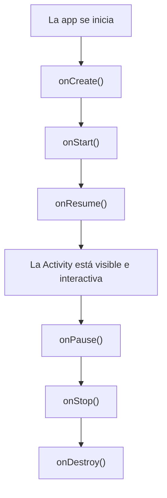

# Capítulo 26: Ciclo de vida de una `Activity` y tu primer `@Composable`

## Introducción

En el capítulo anterior conociste `MainActivity` y viste que su método `onCreate` contiene una llamada a `setContent { }`, donde vive la interfaz. En este capítulo profundizamos en esas dos ideas.

Primero entenderás el **ciclo de vida de una `Activity`**: cómo Android crea, muestra, oculta y destruye las pantallas de tu app, y por qué eso te importa. Después escribirás tu **primer componente de interfaz** con Jetpack Compose —un `@Composable`— y aprenderás a verlo al instante con `@Preview`, sin siquiera ejecutar la app.

## ¿Qué es una Activity?

Como vimos, una **`Activity`** es una **pantalla** de tu aplicación. `MainActivity` es la que se abre al iniciar la app, pero una aplicación puede tener varias.

Lo importante es que una `Activity` **no está siempre presente**. Android la **crea** cuando hace falta y la **destruye** cuando ya no se necesita, según lo que hace el usuario: abrir la app, cambiar a otra aplicación, girar el teléfono, volver atrás… Tu código no controla del todo *cuándo* ocurre esto; lo controla el sistema. Por eso necesitas una forma de reaccionar a esos momentos, y ahí entra el ciclo de vida.

## El ciclo de vida de una Activity

El **ciclo de vida** es la secuencia de estados por los que pasa una `Activity`, desde que nace hasta que muere. En cada transición, Android llama a un **método** que tú puedes sobrescribir (como ya hiciste con `onCreate`) para ejecutar código en ese momento:



- **`onCreate()`**: la `Activity` se está creando. Aquí preparas la pantalla; por eso el `setContent { }` va aquí.
- **`onStart()`**: la pantalla pasa a ser **visible** para el usuario.
- **`onResume()`**: la pantalla pasa al **primer plano** y el usuario ya puede interactuar con ella.
- **`onPause()`**: la pantalla **pierde el foco** (por ejemplo, aparece un diálogo encima).
- **`onStop()`**: la pantalla deja de ser **visible** (el usuario cambió a otra app).
- **`onDestroy()`**: la `Activity` se está **destruyendo**.

No necesitas memorizarlos todos ahora. La idea clave es que estos métodos te permiten reaccionar a los cambios: por ejemplo, pausar un video en `onPause` cuando la pantalla deja de estar en primer plano, y reanudarlo en `onResume`.

> [!NOTE]
> Con Jetpack Compose, en la práctica tocarás pocos de estos métodos directamente: Compose y las herramientas modernas se encargan de gran parte del trabajo. Aun así, entender el ciclo de vida es fundamental, porque la `Activity` es la que **aloja** tu interfaz Compose.

## Cambios de configuración y recreación

Hay un comportamiento del ciclo de vida que sorprende a quienes empiezan y conviene conocer desde ya. Cuando ocurre un **cambio de configuración** —el más común es **girar** el dispositivo—, Android **destruye y vuelve a crear** la `Activity` desde cero: llama a `onDestroy` y luego a `onCreate` otra vez.

¿La consecuencia? Cualquier dato que estuvieras guardando dentro de la `Activity` **se pierde** en ese proceso. Imagina un contador en pantalla: al girar el teléfono, volvería a cero.

Esta es una de las razones por las que, más adelante, el estado de la pantalla no vivirá en la `Activity`, sino en un **`ViewModel`**, una clase diseñada para **sobrevivir** a estas recreaciones. Lo veremos en detalle en la parte de arquitectura; por ahora, quédate con el problema.

## Tu primer `@Composable`

Pasemos ahora a lo que va dentro de `setContent { }`: la interfaz, construida con **Jetpack Compose**.

Compose es un kit de herramientas **declarativo**: en lugar de crear y modificar elementos de pantalla paso a paso, tú **describes** cómo debe verse la interfaz, y Compose se encarga de dibujarla. Esa descripción se hace con **funciones componibles** (*composables*): funciones normales de Kotlin marcadas con la anotación **`@Composable`**.

Aquí tienes tu primer composable, que muestra un texto en pantalla:

```kotlin
@Composable
fun Saludo() {
    Text("¡Hola, Android!")
}
```

Analicémoslo:

- La anotación `@Composable` le indica a Compose que esta función **describe una parte de la interfaz**.
- `Text(...)` es, a su vez, otro composable: uno que ya viene con Compose y que muestra texto en pantalla.

Así se construye una interfaz en Compose: **componiendo** unas funciones dentro de otras. Un composable puede llamar a otros composables, y así se van armando pantallas complejas a partir de piezas simples.

> [!NOTE]
> Por convención, los nombres de las funciones componibles se escriben con **mayúscula inicial** (`Saludo`, `Text`), a diferencia de las funciones normales de Kotlin, que usan minúscula inicial.

## Vistas previas con `@Preview`

Una de las mejores cosas de Compose es que puedes **ver** un composable directamente en Android Studio, sin tener que ejecutar la app en un emulador o dispositivo. Para eso está la anotación **`@Preview`**.

Creas una función componible aparte, la marcas con `@Preview` (además de `@Composable`) y, dentro, llamas al composable que quieres previsualizar:

```kotlin
@Preview
@Composable
fun SaludoPreview() {
    Saludo()
}
```

Android Studio mostrará, en un panel junto al editor, cómo se ve `Saludo`. Cada vez que cambies el código, la vista previa se actualiza. Esto hace que construir interfaces sea mucho más rápido: ves el resultado al instante.

## Juntando todo

Volvamos a `MainActivity` del capítulo anterior. Ahora puedes entender cómo encaja todo: en `onCreate`, `setContent { }` recibe el composable que será la interfaz de la pantalla:

```kotlin
class MainActivity : ComponentActivity() {
    override fun onCreate(savedInstanceState: Bundle?) {
        super.onCreate(savedInstanceState)
        setContent {
            Saludo() // nuestra interfaz
        }
    }
}

@Composable
fun Saludo() {
    Text("¡Hola, Android!")
}

@Preview
@Composable
fun SaludoPreview() {
    Saludo()
}
```

Cuando el usuario abre la app, Android crea `MainActivity`, llama a `onCreate` y `setContent` dibuja el composable `Saludo`. Ese texto es tu primera interfaz hecha con Compose.

## Resumen

En este capítulo diste tus primeros pasos en la interfaz de Android:

- Una **`Activity`** es una pantalla que Android **crea y destruye** según el uso; tu código no controla del todo cuándo.
- El **ciclo de vida** son los estados por los que pasa una `Activity`, con métodos como `onCreate`, `onStart`, `onResume`, `onPause`, `onStop` y `onDestroy` que puedes sobrescribir para reaccionar a cada momento.
- Un **cambio de configuración** (como girar el dispositivo) **destruye y recrea** la `Activity`, lo que hace perder su estado; por eso más adelante usaremos un `ViewModel`.
- **Jetpack Compose** es declarativo: describes la interfaz con funciones **`@Composable`**. `Text` es un composable básico, y los composables se **componen** unos dentro de otros.
- La anotación **`@Preview`** te permite ver un composable en Android Studio sin ejecutar la app.

En el próximo capítulo profundizarás en los **fundamentos de Compose**: los componentes básicos, los modificadores y cómo se organiza la interfaz.
