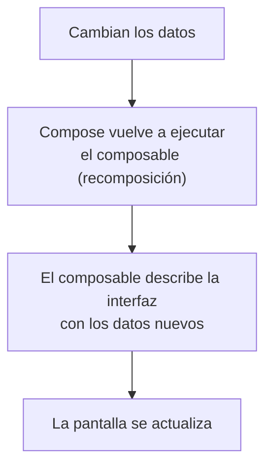

# Capítulo 27: Fundamentos de Compose: composables, recomposición y `Modifier`

## Introducción

En el capítulo anterior escribiste tu primer `@Composable` y viste que Compose es **declarativo**: describes la interfaz y Compose la dibuja. Ahora profundizaremos en los tres fundamentos que sostienen todo lo que construirás con Compose:

- Los **composables con parámetros**, que los hacen reutilizables.
- La **recomposición**, el mecanismo por el que la interfaz se actualiza sola cuando cambian los datos.
- El **`Modifier`**, la herramienta para ajustar la apariencia y el comportamiento de cada componente.

Con estas tres ideas entenderás el "cómo" y el "porqué" de Compose, y estarás listo para construir interfaces reales.

## Composables con parámetros

Un composable es una función, así que —como cualquier función— puede recibir **parámetros**. Esto es lo que los hace reutilizables. En vez de un saludo fijo, podemos parametrizar el nombre:

```kotlin
@Composable
fun Saludo(nombre: String) {
    Text("¡Hola, $nombre!")
}
```

Ahora el mismo composable sirve para saludar a cualquiera:

```kotlin
Saludo("Ana")   // muestra: ¡Hola, Ana!
Saludo("Diego") // muestra: ¡Hola, Diego!
```

Y, tal como una función puede llamar a otras, un composable puede llamar a **otros composables**. Así se construye una interfaz en Compose: componiendo piezas pequeñas para formar pantallas complejas.

> [!NOTE]
> Por ahora combinaremos composables de a uno. Para **organizar varios elementos** en pantalla (uno debajo de otro, en fila, etc.) necesitarás los *layouts*, que veremos en un capítulo próximo.

## La recomposición

Aquí está la idea central de Compose. En la interfaz tradicional, cuando un dato cambiaba, tenías que buscar el elemento de pantalla y actualizarlo tú a mano. En Compose no: cuando cambian los datos que un composable **lee**, Compose **vuelve a ejecutar** ese composable con los datos nuevos y actualiza lo que se muestra. A ese "volver a ejecutar" se le llama **recomposición**.

Piénsalo así: un composable no es un dibujo fijo, sino una **descripción** de cómo debe verse la interfaz *para unos datos dados*. Si los datos cambian, Compose recalcula la descripción y redibuja solo lo necesario.



Esto es justo lo que anticipamos al hablar de `StateFlow`: la interfaz **observa** los datos y **reacciona** a sus cambios, sin que tengas que actualizarla manualmente. En el próximo capítulo verás cómo se declaran esos datos que, al cambiar, provocan la recomposición (el **estado**).

> [!IMPORTANT]
> Como un composable puede ejecutarse muchas veces (una por cada recomposición) y en cualquier orden, no debes poner dentro de él acciones con efectos secundarios (como modificar una variable externa o escribir en un archivo). Un composable solo debería **describir** la interfaz a partir de los datos que recibe.

## Modificadores (`Modifier`)

Un `Text` por sí solo es solo texto pegado a la esquina. ¿Cómo le das espacio alrededor, un tamaño, un color de fondo, o haces que responda a un toque? Con un **`Modifier`** ("modificador").

Un `Modifier` es un objeto que le pasas a un composable para **ajustar su apariencia o su comportamiento**. Casi todos los composables aceptan un parámetro `modifier`:

```kotlin
Text(
    text = "¡Hola!",
    modifier = Modifier.padding(16.dp)
)
```

Aquí `Modifier.padding(16.dp)` le agrega un espacio de 16 alrededor del texto.

> [!NOTE]
> `dp` significa *density-independent pixels* (píxeles independientes de la densidad). Es la unidad de medida de Compose para tamaños y espacios, y se adapta sola a pantallas de distinta densidad, para que tu interfaz se vea consistente en cualquier dispositivo.

Los modificadores se **encadenan**, uno tras otro, y cada uno se aplica en orden:

```kotlin
Text(
    text = "¡Hola!",
    modifier = Modifier
        .padding(16.dp)
        .background(Color.Yellow)
)
```

El **orden importa**. No es lo mismo poner primero el espaciado y luego el fondo, que al revés: en el ejemplo de arriba, el fondo amarillo se pinta *dentro* del espaciado; si invirtieras las llamadas, el amarillo cubriría también ese espacio.

A continuación, algunos de los modificadores más usados:

| Modificador | Qué hace | Parámetros |
| :--- | :--- | :--- |
| `padding(...)` | Agrega espacio alrededor del elemento. | Un `Dp` para todos los lados, o valores por lado (`horizontal`/`vertical`, o `start`/`top`/`end`/`bottom`). |
| `size(...)` | Fija un ancho y un alto concretos. | Un `Dp` (cuadrado), o `width` y `height` en `Dp`. |
| `width(...)` / `height(...)` | Fija solo el ancho o solo el alto. | Un `Dp`. |
| `fillMaxWidth()` | Hace que el elemento ocupe todo el ancho disponible. | Opcional: una fracción `Float` (0f–1f); por defecto, todo el ancho. |
| `fillMaxHeight()` | Ocupa todo el alto disponible. | Opcional: una fracción `Float`; por defecto, todo el alto. |
| `fillMaxSize()` | Ocupa todo el ancho y el alto disponibles. | Opcional: una fracción `Float`; por defecto, todo el espacio. |
| `background(...)` | Aplica un color (o degradado) de fondo. | Un `Color` (o un `Brush` para degradados) y, opcionalmente, una `Shape`. |
| `border(...)` | Dibuja un borde alrededor del elemento. | El grosor (`Dp`), un `Color` y, opcionalmente, una `Shape`. |
| `clip(...)` | Recorta el elemento a una forma (por ejemplo, esquinas redondeadas). | Una `Shape` (p. ej., `RoundedCornerShape` o `CircleShape`). |
| `clickable { ... }` | Hace que el elemento responda a los toques. | Una lambda `onClick` que se ejecuta al tocar. |

> [!NOTE]
> Existen además modificadores que solo están disponibles **dentro de ciertos layouts** (como `weight`, para repartir el espacio en una fila o columna, o `align`, para alinear dentro de un contenedor). Los verás cuando lleguemos a los layouts.

### La convención del parámetro `modifier`

Cuando crees tus propios composables, es una buena práctica que reciban un parámetro `modifier` y lo apliquen a su elemento principal, con este patrón:

```kotlin
@Composable
fun Saludo(nombre: String, modifier: Modifier = Modifier) {
    Text(
        text = "¡Hola, $nombre!",
        modifier = modifier
    )
}
```

Al darle el valor por defecto `Modifier` (un modificador vacío), quien use `Saludo` puede pasarle ajustes desde fuera o no pasarle ninguno. Esto hace tus composables mucho más flexibles y reutilizables, y es la convención que sigue todo Compose.

## Resumen

En este capítulo asentaste los fundamentos de Jetpack Compose:

- Los **composables** son funciones que pueden recibir **parámetros** y llamarse entre sí; así se construye la interfaz componiendo piezas.
- La **recomposición** es el mecanismo por el que Compose **vuelve a ejecutar** un composable cuando cambian los datos que lee, actualizando la interfaz automáticamente. Un composable describe la UI para unos datos dados y no debe tener efectos secundarios.
- Un **`Modifier`** ajusta la apariencia y el comportamiento de un composable (`padding`, `background`, `fillMaxWidth`, `clickable`…). Se **encadena**, el **orden importa**, y usa la unidad **`dp`** para los tamaños.
- Por convención, tus composables deberían recibir un parámetro `modifier` con valor por defecto `Modifier` y aplicarlo a su elemento principal.

En el próximo capítulo verás el **estado en Compose**: cómo declarar los datos que, al cambiar, disparan la recomposición, con `remember` y `mutableStateOf`.
