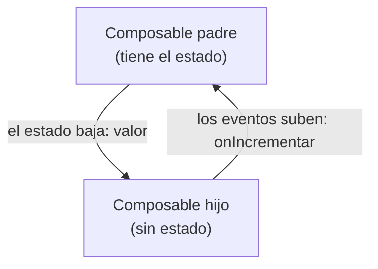

# Capítulo 28: Estado en Compose: `remember`, `mutableStateOf` y *state hoisting*

## Introducción

En el capítulo anterior aprendiste la **recomposición**: cuando cambian los datos que un composable lee, Compose lo vuelve a ejecutar y actualiza la interfaz. Pero quedó una pregunta pendiente: ¿cómo se declaran esos datos que, al cambiar, disparan la recomposición?

La respuesta es el **estado** (*state*). En este capítulo aprenderás a crear estado con `mutableStateOf`, a conservarlo entre recomposiciones con `remember`, a mantenerlo incluso al girar el dispositivo con `rememberSaveable`, y una técnica fundamental para organizar bien tu interfaz: el ***state hoisting*** o "elevación del estado".

## El problema: una variable normal no basta

Intentemos algo sencillo: un contador que aumenta cada vez que tocas un botón. Con lo que sabes, podrías intentar una variable normal:

```kotlin
@Composable
fun Contador() {
    var contador = 0

    Button(onClick = { contador++ }) {
        Text("Has tocado $contador veces")
    }
}
```

Pero esto **no funciona**: por más que toques el botón, el número no cambia en pantalla. Y hay dos razones:

1. Compose **no sabe** que `contador` cambió, así que no recompone: la interfaz nunca se entera de la actualización.
2. Aunque recompusiera, `contador` es una variable normal que se **reinicia a 0** cada vez que la función se vuelve a ejecutar.

Necesitamos algo que Compose pueda **observar** y que, además, **sobreviva** a las recomposiciones. Esas dos necesidades las resuelven `mutableStateOf` y `remember`.

> [!NOTE]
> `Button` es un componente de Material, que veremos en detalle más adelante. Por ahora basta con saber que su parámetro `onClick` recibe la acción que se ejecuta al tocarlo.

## `mutableStateOf` y `remember`

La solución tiene dos partes que trabajan juntas.

**`mutableStateOf`** crea un valor **observable**: un contenedor de estado que Compose vigila. Cuando su contenido cambia, Compose recompone los composables que lo leen.

**`remember`** le dice a Compose que **recuerde** ese valor entre recomposiciones, en lugar de recrearlo cada vez.

Combinándolos:

```kotlin
@Composable
fun Contador() {
    val contador = remember { mutableStateOf(0) }

    Button(onClick = { contador.value++ }) {
        Text("Has tocado ${contador.value} veces")
    }
}
```

Ahora sí funciona. Al leer `contador.value` dentro del `Text`, Compose registra que ese texto **depende** de ese estado. Cuando tocas el botón y haces `contador.value++`, el estado cambia, Compose recompone y el texto se actualiza con el nuevo número. Y gracias a `remember`, el valor no se pierde entre recomposiciones.

## La sintaxis `by`

Escribir `.value` cada vez es un poco engorroso. Kotlin ofrece una forma más limpia mediante una **propiedad delegada**, con la palabra clave `by`:

```kotlin
@Composable
fun Contador() {
    var contador by remember { mutableStateOf(0) }

    Button(onClick = { contador++ }) {
        Text("Has tocado $contador veces")
    }
}
```

Con `by`, usas `contador` directamente, como si fuera una variable normal: lo lees sin `.value` y lo modificas con `contador++`. Por detrás sigue siendo el mismo estado observable. Fíjate en que ahora se declara con `var`, porque lo vas a modificar. Esta es la forma que verás con más frecuencia.

> [!NOTE]
> Esta sintaxis necesita importar `getValue` y `setValue` de Compose; Android Studio agrega esos imports por ti automáticamente.

## Sobrevivir a la rotación: `rememberSaveable`

¿Recuerdas que, al girar el dispositivo, Android **destruye y recrea** la `Activity`, perdiendo su estado? Ese problema también afecta a `remember`: como la recreación empieza todo de cero, el valor guardado con `remember` se **pierde** al rotar.

Para esos casos existe **`rememberSaveable`**, que funciona igual que `remember`, pero **guarda** el estado y lo **restaura** tras una recreación por cambio de configuración:

```kotlin
var contador by rememberSaveable { mutableStateOf(0) }
```

Con este simple cambio, tu contador conserva su valor aunque gires el teléfono. Úsalo cuando quieras que un estado sobreviva a la rotación (por ejemplo, lo que el usuario escribió en un formulario).

## State hoisting: elevar el estado

Hasta ahora, nuestro `Contador` guarda su propio estado dentro de sí mismo. Funciona, pero tiene inconvenientes: nadie desde fuera puede conocer el valor actual ni controlarlo, y el composable es difícil de reutilizar y de previsualizar con distintos valores.

La solución es el ***state hoisting*** ("elevación del estado"): **sacar el estado del composable y moverlo hacia quien lo llama**. El composable queda **sin estado** (*stateless*): recibe el valor a mostrar y una **función** para avisar de los cambios.

```kotlin
@Composable
fun Contador(valor: Int, onIncrementar: () -> Unit) {
    Button(onClick = onIncrementar) {
        Text("Has tocado $valor veces")
    }
}
```

Ahora `Contador` no guarda nada: solo muestra el `valor` que recibe y, al tocarlo, invoca `onIncrementar`. El estado vive en el composable **padre**:

```kotlin
@Composable
fun Pantalla() {
    var contador by remember { mutableStateOf(0) }

    Contador(
        valor = contador,
        onIncrementar = { contador++ }
    )
}
```

Fíjate en el patrón: el **estado baja** (el padre le pasa `valor` al hijo) y los **eventos suben** (el hijo avisa al padre con `onIncrementar`). A este flujo en una sola dirección se le llama **flujo de datos unidireccional**:



Este patrón trae grandes ventajas: el composable `Contador` es **reutilizable** (sirve con cualquier valor y cualquier acción), fácil de **previsualizar** (le pasas un valor fijo) y hay una **única fuente de verdad** para el estado. Es, además, la misma idea que viste con `StateFlow` y que sostiene la arquitectura MVVM: el estado vive en un solo lugar, la interfaz lo observa y le comunica los eventos.

## Resumen

En este capítulo aprendiste a manejar el estado en Compose:

- El **estado** son los datos que, al cambiar, provocan la recomposición.
- **`mutableStateOf`** crea un valor **observable** por Compose; **`remember`** lo **conserva** entre recomposiciones. Juntos: `remember { mutableStateOf(...) }`.
- La sintaxis **`by`** te deja usar el estado como una variable normal, sin `.value`.
- **`rememberSaveable`** conserva el estado también tras una recreación por cambio de configuración (como girar el dispositivo).
- El ***state hoisting*** consiste en **elevar el estado** al composable padre, dejando al hijo **sin estado**: recibe el valor y una función para los eventos. Esto sigue el **flujo de datos unidireccional** (el estado baja, los eventos suben) y hace tus composables reutilizables.

En el próximo capítulo aprenderás a **organizar varios elementos** en la pantalla con los *layouts* (`Column`, `Row`, `Box`) y a mostrar listas con `LazyColumn`.
