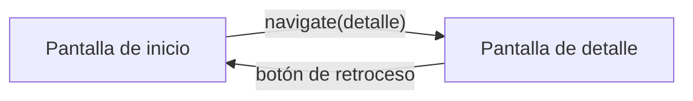

# Capítulo 31: Navegación con Navigation Compose

## Introducción

Hasta ahora, tu app ha vivido en una sola pantalla. Pero las aplicaciones reales tienen **varias**: una lista y su detalle, una pantalla de ajustes, un formulario… y el usuario se mueve entre ellas. En este capítulo aprenderás a hacer esa **navegación** entre pantallas con **Navigation Compose**, la biblioteca oficial para ello. Con esto cierras la parte de interfaz con Compose.

> [!NOTE]
> Navigation Compose no viene incluido en la plantilla del proyecto; es una dependencia que se agrega en el `build.gradle.kts`, a través del catálogo de versiones que viste al crear el proyecto.

## Las piezas: `NavController` y `NavHost`

Navigation Compose se apoya en dos piezas principales:

- El **`NavController`** es el objeto que **controla** la navegación: lleva la cuenta de las pantallas visitadas (la *pila de navegación*) y es a quien le pides ir a una pantalla o volver atrás.
- El **`NavHost`** es un composable que define el **mapa de navegación**: declara cuáles son las pantallas (los *destinos*) y con qué **ruta** se llega a cada una.

Cada pantalla se identifica con una **ruta** (*route*), que no es más que un texto único, como `"inicio"` o `"detalle"`.

## Definir las pantallas: el `NavHost`

Primero creas el `NavController` (con `remember`, para que sobreviva a las recomposiciones) y luego declaras el `NavHost` con sus destinos:

```kotlin
@Composable
fun App() {
    val navController = rememberNavController()

    NavHost(
        navController = navController,
        startDestination = "inicio"
    ) {
        composable("inicio") {
            PantallaInicio()
        }
        composable("detalle") {
            PantallaDetalle()
        }
    }
}
```

`startDestination` indica la pantalla que se muestra al abrir la app. Cada bloque `composable("ruta") { ... }` asocia una ruta con el composable que se dibuja cuando se navega a ella.

## Navegar entre pantallas

Para ir de una pantalla a otra, le pides al `NavController` que **navegue** a una ruta:

```kotlin
navController.navigate("detalle")
```

Normalmente esto ocurre en respuesta a una acción del usuario, como tocar un botón:

```kotlin
Button(onClick = { navController.navigate("detalle") }) {
    Text("Ver detalle")
}
```

Visualmente, el flujo entre dos pantallas se ve así:



## Volver atrás

¿Y para volver? La buena noticia es que el **botón de retroceso** del sistema ya funciona solo: al presionarlo, Navigation quita la pantalla actual de la pila y muestra la anterior. Si quieres volver atrás desde tu propio código (por ejemplo, con un botón "Cancelar"), usas:

```kotlin
navController.popBackStack()
```

## Pasar datos entre pantallas

Muchas veces, al navegar a un detalle, necesitas decirle **qué** elemento mostrar. Para eso, la ruta puede incluir **argumentos**, indicados entre llaves:

```kotlin
composable("detalle/{id}") { backStackEntry ->
    val id = backStackEntry.arguments?.getString("id")
    PantallaDetalle(id = id)
}
```

Y, al navegar, incluyes el valor en la ruta:

```kotlin
navController.navigate("detalle/42")
```

Así, la pantalla de detalle recibe el `id` (`"42"`) y puede mostrar el elemento correspondiente. Fíjate en que el argumento llega como texto; si necesitas un número, tendrás que convertirlo con `toInt()`, como viste al principio del curso.

> [!TIP]
> Como buena práctica, en lugar de pasar el `NavController` a cada pantalla, es preferible que las pantallas reciban **funciones** de navegación (por ejemplo, `onVerDetalle: (String) -> Unit`). Así quedan desacopladas de la navegación y son más fáciles de reutilizar y previsualizar, siguiendo la misma idea del *state hoisting* que viste con el estado.

## Resumen

En este capítulo aprendiste a moverte entre pantallas:

- **Navigation Compose** gestiona la navegación entre composables. Es una dependencia que se agrega al proyecto.
- El **`NavController`** controla la navegación (la pila de pantallas); el **`NavHost`** define el mapa de destinos, cada uno identificado por una **ruta**.
- Navegas con `navController.navigate("ruta")`, normalmente en respuesta a una acción del usuario.
- El **botón de retroceso** del sistema funciona automáticamente; también puedes volver con `popBackStack()`.
- Puedes **pasar datos** incluyendo argumentos en la ruta (`"detalle/{id}"`) y leerlos en el destino.
- Como buena práctica, pasa **funciones** de navegación a las pantallas en vez del `NavController`, para mantenerlas desacopladas.

Con esto cierras la parte de **interfaz con Jetpack Compose**. En la próxima parte del curso darás un paso clave hacia las apps profesionales: la **arquitectura MVVM**, que organiza tu código separando la interfaz, la lógica y los datos.
