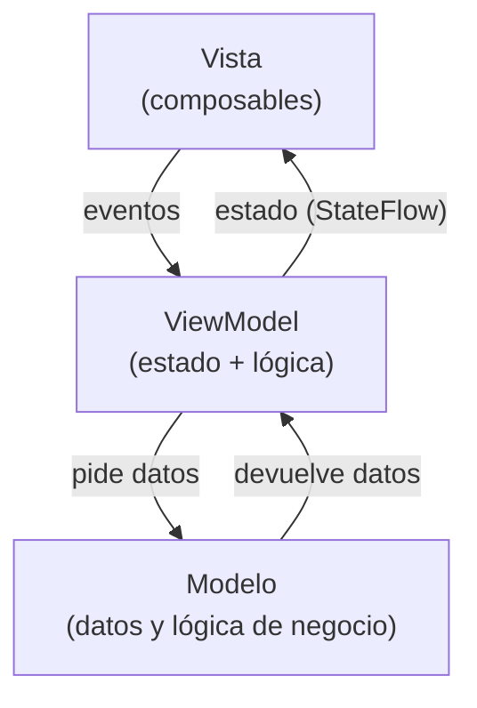

# Capítulo 32: Qué es MVVM y por qué usarlo

## Introducción

Ya sabes construir interfaces con Compose y manejar su estado. Pero, a medida que una app crece, surge una pregunta de fondo: ¿**dónde** debería vivir el estado y la lógica? ¿En los propios composables? Si metes todo ahí —los datos, las reglas, las llamadas a la red—, la interfaz se convierte en un enredo difícil de entender, probar y mantener.

Para resolver esto existe la **arquitectura**: una forma de organizar el código en partes con responsabilidades claras. En esta parte del curso aprenderás **MVVM**, la arquitectura recomendada para Android. Este capítulo es conceptual: verás **qué** es MVVM y **por qué** conviene usarlo; el código vendrá en los capítulos siguientes.

## El problema: todo junto en la interfaz

Imagina un composable que lo hace todo: guarda el estado, contiene la lógica del negocio y, además, pide los datos a una fuente externa. Funciona para algo pequeño, pero trae problemas serios cuando la app crece:

- Es **difícil de probar**: la lógica está entrelazada con la interfaz, así que no puedes verificarla sin dibujar la pantalla.
- Es **difícil de mantener**: el composable se vuelve enorme y hace demasiadas cosas a la vez (justo lo contrario del principio de responsabilidad única que viste en el anexo).
- **Pierde el estado**: como el composable vive dentro de una `Activity`, al girar el dispositivo se recrea y el estado se pierde (el problema que vimos con el ciclo de vida).

La solución es **separar responsabilidades**: que cada parte del código se ocupe de una sola cosa. Eso es exactamente lo que propone MVVM.

## ¿Qué es MVVM?

**MVVM** son las siglas de **Model-View-ViewModel** ("Modelo-Vista-ViewModel"). Es un patrón que organiza el código en **tres capas**, cada una con una responsabilidad clara:

- La **Vista** (*View*) es la **interfaz**: tus composables. Su único trabajo es **mostrar** el estado y **avisar** de los eventos del usuario (un toque, un texto escrito). No contiene lógica; es "tonta" a propósito.
- El **ViewModel** es el **intermediario**. Guarda el **estado** de la pantalla y lo expone para que la Vista lo observe. Recibe los eventos de la Vista, ejecuta la lógica correspondiente y actualiza el estado.
- El **Modelo** (*Model*) son los **datos y la lógica de negocio**: de dónde vienen los datos (una red, una base de datos) y las reglas que los rigen.

Gráficamente, las tres capas se relacionan así:

Fíjate en las flechas: la Vista **observa** el estado del ViewModel y le **envía** eventos; el ViewModel, a su vez, pide y recibe datos del Modelo. La Vista nunca habla directamente con el Modelo: siempre pasa por el ViewModel.

## El flujo de datos

El patrón sigue un **flujo de datos unidireccional**, que ya conoces del *state hoisting*: el **estado baja** (del ViewModel a la Vista) y los **eventos suben** (de la Vista al ViewModel).

- El ViewModel expone el estado; para eso usaremos un `StateFlow`, como viste en la parte de asincronía.
- La Vista recolecta ese estado y, ante cada cambio, se **recompone** sola (la recomposición de Compose).
- Cuando el usuario hace algo, la Vista no lo resuelve por su cuenta: se lo **comunica** al ViewModel, que decide qué hacer.

En otras palabras, MVVM es el *state hoisting* llevado al nivel de toda la pantalla: el estado se eleva hasta el ViewModel, la única fuente de verdad.

## ¿Por qué usar MVVM?

Separar el código en estas tres capas trae ventajas concretas:

- **Separación de responsabilidades**: cada capa hace una sola cosa, así el código es más fácil de entender y de modificar (el principio SRP en acción).
- **Testabilidad**: como la lógica vive en el ViewModel, aislada de la interfaz, puedes probarla sin necesidad de dibujar ninguna pantalla.
- **Sobrevive a los cambios de configuración**: el ViewModel está diseñado para **vivir más** que la `Activity`, así que, al girar el dispositivo, el estado **no se pierde** (resolviendo el problema que dejamos pendiente en el capítulo del ciclo de vida).
- **Única fuente de verdad**: el estado vive en un solo lugar, lo que evita inconsistencias.

Por todo esto, MVVM es la arquitectura que **Google recomienda** para las apps Android modernas.

## Cómo se conecta con lo que ya sabes

Quizás notaste que MVVM no introduce ideas nuevas, sino que **junta** varias que ya viste a lo largo del curso:

- El *state hoisting* (elevar el estado): el ViewModel es el lugar al que se eleva el estado de toda la pantalla.
- El `StateFlow`: el mecanismo con el que el ViewModel expone su estado a la Vista.
- La `sealed class UiState`: una forma habitual de representar ese estado (cargando, éxito, error).
- El `viewModelScope`: el *scope* donde el ViewModel lanza sus coroutines (por ejemplo, para pedir datos).

En los próximos capítulos construiremos cada pieza: el ViewModel, la separación en capas y la conexión con la interfaz.

## Resumen

En este capítulo conociste la arquitectura MVVM:

- Sin una arquitectura, poner el estado y la lógica dentro de los composables los vuelve difíciles de probar y mantener y, además, hace perder el estado al girar el dispositivo.
- **MVVM** (Model-View-ViewModel) separa el código en tres capas: la **Vista** (los composables, que muestran el estado y avisan de eventos), el **ViewModel** (que guarda el estado y ejecuta la lógica) y el **Modelo** (los datos y la lógica de negocio).
- Sigue un **flujo de datos unidireccional**: el estado baja (del ViewModel a la Vista) y los eventos suben (de la Vista al ViewModel).
- Sus ventajas: separación de responsabilidades, testabilidad, supervivencia a los cambios de configuración y una única fuente de verdad.
- MVVM reúne varias piezas que ya conoces: *state hoisting*, `StateFlow`, `UiState` y `viewModelScope`.

En el próximo capítulo pondrás esto en práctica: crearás tu primer **`ViewModel`**, expondrás su estado con `StateFlow` y lo conectarás con la interfaz.
