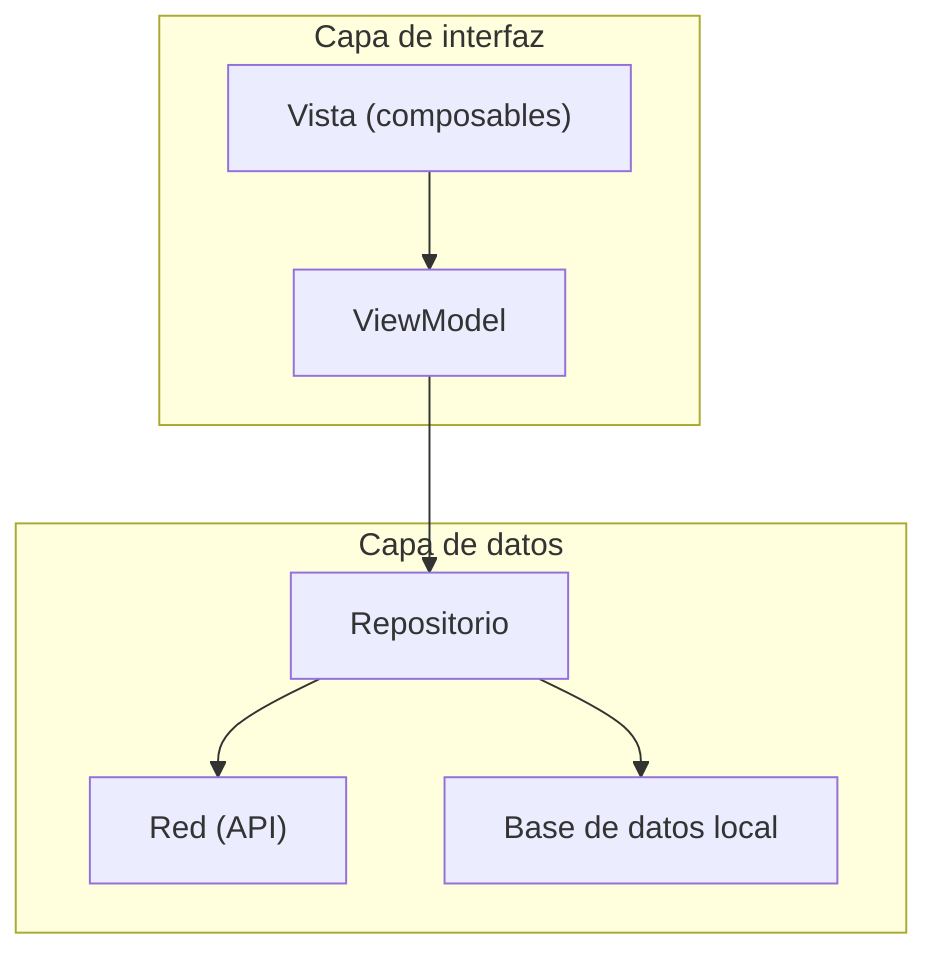

# Capítulo 34: Repositorio y separación de capas

## Introducción

En el capítulo anterior, el `ViewModel` llamaba a una función `obtenerDatos()`, pero no dijimos **de dónde** salían esos datos. Ahí quedó un cabo suelto que este capítulo viene a resolver.

Si el `ViewModel` se encargara él mismo de pedir los datos a la red, leer una base de datos y procesar las respuestas, acabaría haciendo demasiadas cosas. En este capítulo aprenderás a **separar** esa responsabilidad en su propia capa, con el patrón **repositorio**, y a organizar la app en capas bien delimitadas.

## El problema: el ViewModel no debería saberlo todo

Recuerda cuál es el trabajo del `ViewModel`: guardar el estado de la pantalla y su lógica de presentación. Si además lo cargamos con los detalles de **cómo** se obtienen los datos —abrir una conexión de red, interpretar la respuesta, consultar una base de datos—, aparecen dos problemas:

- El `ViewModel` asume **demasiadas responsabilidades** a la vez (otra vez, lo contrario del principio de responsabilidad única).
- Queda **acoplado** a una fuente de datos concreta: si mañana quieres cambiar de la red a una base de datos local, tendrías que reescribir el `ViewModel`.

La solución es separar **"cómo presentar los datos"** (tarea del `ViewModel`) de **"cómo obtener los datos"** (una tarea aparte).

## La capa de datos: el repositorio

Esa nueva tarea vive en la **capa de datos**, y su pieza principal es el **repositorio**: una clase dedicada exclusivamente a **proveer los datos**. El repositorio es la **fuente única** de información: el `ViewModel` le pide los datos, y el repositorio decide cómo conseguirlos (de la red, de una base de datos local, de una caché, o de una combinación de todo eso).

```kotlin
class DatosRepository {
    suspend fun obtenerDatos(): List<String> {
        // aquí se decide de dónde vienen los datos
        // (una petición de red, una consulta a la base de datos, etc.)
    }
}
```

Ahora el `ViewModel` simplemente le pide los datos al repositorio, sin saber ni preocuparse por su origen:

```kotlin
class MiViewModel(private val repository: DatosRepository) : ViewModel() {
    private val _uiState = MutableStateFlow<UiState>(UiState.Cargando)
    val uiState: StateFlow<UiState> = _uiState.asStateFlow()

    fun cargarDatos() {
        viewModelScope.launch {
            _uiState.value = UiState.Cargando
            val datos = repository.obtenerDatos()
            _uiState.value = UiState.Exito(datos)
        }
    }
}
```

El `ViewModel` recibe el repositorio por su **constructor** y lo usa. Su código no menciona la red ni la base de datos: esos detalles quedan encapsulados en el repositorio.

## Las capas de la aplicación

Con esta separación, la app queda organizada en **capas**, cada una con su responsabilidad, donde cada capa solo se comunica con la de abajo:



- La **capa de interfaz** (la Vista y el `ViewModel`) se ocupa de mostrar el estado y reaccionar al usuario.
- La **capa de datos** (el repositorio y sus fuentes) se ocupa de obtener y guardar la información.

Cada capa tiene un trabajo claro, y ninguna se mete en el de las demás. Esto hace la app mucho más fácil de entender, probar y ampliar.

## La estructura del proyecto en carpetas

Estas capas no son solo un concepto: se reflejan en **cómo organizas las carpetas** (los *paquetes*) de tu proyecto. Una forma habitual y ordenada es agrupar el código **por capa**:

```text
com.ejemplo.miapp/
├── data/                      # capa de datos
│   ├── DatosRepository.kt          # la interfaz del repositorio
│   └── DatosRepositoryImpl.kt      # su implementación
├── model/                     # modelos de dominio (las clases que usa la app)
│   └── Usuario.kt
├── ui/                        # capa de interfaz
│   ├── PantallaUsuarios.kt         # composables (la Vista)
│   ├── UsuariosViewModel.kt        # el ViewModel
│   ├── UiState.kt                  # el estado de la interfaz
│   └── theme/                      # el tema de Material (generado por Android Studio)
└── MainActivity.kt            # el punto de entrada
```

La idea es simple: cada archivo vive en el paquete de la capa a la que pertenece. Un `ViewModel` va en `ui/`; el repositorio, en `data/`; los modelos que la app usa, en `model/`. Así, con solo mirar la ubicación de un archivo, sabes cuál es su responsabilidad.

> [!NOTE]
> Esta estructura irá creciendo con el curso. En el próximo capítulo añadiremos un paquete `di/` para la inyección de dependencias, y al llegar a Retrofit sumaremos, dentro de `data/`, un subpaquete `remote/` con el acceso a la red y los DTOs.

Existen otras maneras de organizar un proyecto —por ejemplo, **por funcionalidad**, agrupando en un mismo paquete todo lo relacionado con una pantalla—, pero organizar **por capas** es claro y más que suficiente para empezar.

## Depender de una abstracción

Hay una mejora más, y es justo el principio de **inversión de dependencias (DIP)** que viste en el anexo. En el ejemplo anterior, el `ViewModel` depende de la clase concreta `DatosRepository`. Es preferible que dependa de una **interfaz**, y que la implementación concreta se defina aparte:

```kotlin
interface DatosRepository {
    suspend fun obtenerDatos(): List<String>
}

class DatosRepositoryImpl : DatosRepository {
    override suspend fun obtenerDatos(): List<String> {
        // la obtención real de los datos
    }
}
```

El `ViewModel` no cambia: sigue recibiendo un `DatosRepository`, pero ahora es la **interfaz**, no una clase concreta. ¿Qué ganas con esto?

- **Testabilidad**: para probar el `ViewModel`, puedes pasarle un repositorio **falso** que devuelva datos de prueba, sin tocar la red.
- **Flexibilidad**: puedes cambiar la implementación (de la red a una base de datos, por ejemplo) sin modificar el `ViewModel`.

Es exactamente lo que promete DIP: los componentes importantes dependen de **abstracciones**, no de detalles concretos.

## ¿Cómo llega el repositorio al ViewModel?

Queda una pregunta: si el `ViewModel` recibe el repositorio por su constructor, **¿quién crea el repositorio y se lo entrega?** Alguien tiene que construir la implementación concreta (`DatosRepositoryImpl`) y pasársela.

Podrías hacerlo a mano, pero en apps reales, con muchas dependencias entrelazadas, eso se vuelve engorroso. Para resolverlo existe la **inyección de dependencias**, el tema del próximo capítulo: una técnica (y una herramienta, Hilt) que se encarga de crear y entregar automáticamente cada pieza donde se necesita.

## Resumen

En este capítulo separaste tu código en capas:

- El `ViewModel` no debería ocuparse de **cómo** se obtienen los datos; esa es una responsabilidad aparte.
- El **repositorio** es la clase de la **capa de datos** que provee la información, ocultando su origen (red, base de datos, caché). El `ViewModel` solo le pide los datos.
- La app se organiza en **capas** (interfaz y datos), donde cada una tiene una responsabilidad clara y solo se comunica con la de abajo.
- Estas capas se reflejan en la **estructura de carpetas**: se organiza el código por capa (`data/`, `model/`, `ui/`), de modo que la ubicación de cada archivo revela su responsabilidad.
- Siguiendo el principio **DIP**, el `ViewModel` depende de una **interfaz** de repositorio, no de una clase concreta, lo que mejora la testabilidad y la flexibilidad.
- El repositorio llega al `ViewModel` por su **constructor**; quién lo crea y lo entrega es el trabajo de la inyección de dependencias.

En el próximo capítulo verás precisamente eso: la **inyección de dependencias** con **Hilt**, que arma y conecta todas estas piezas por ti.
