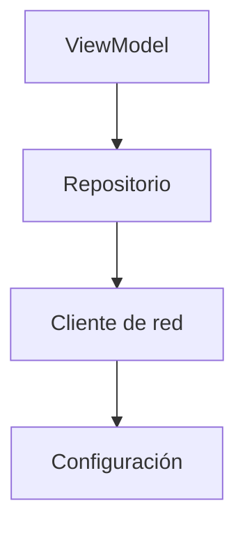

# Capítulo 35: Inyección de dependencias (manual y con Hilt)

## Introducción

En el capítulo anterior quedó una pregunta abierta: si el `ViewModel` recibe el repositorio por su constructor, **¿quién crea el repositorio y se lo entrega?** La respuesta es la **inyección de dependencias** (*dependency injection*, o DI).

En este capítulo entenderás qué es la inyección de dependencias, cómo hacerla **a mano**, y cómo **Hilt** —la herramienta recomendada para Android— la automatiza. Con esto cierras la parte de arquitectura.

## ¿Qué es la inyección de dependencias?

Una **dependencia** es un objeto que una clase necesita para hacer su trabajo. El `ViewModel` depende de un repositorio; el repositorio, a su vez, podría depender de un cliente de red. La pregunta es: ¿cómo obtiene una clase sus dependencias?

Hay dos opciones:

- Que la clase **cree** sus propias dependencias por dentro: `val repository = DatosRepositoryImpl()`. Esto la deja **acoplada** a esa implementación concreta.
- Que la clase **reciba** sus dependencias desde fuera, normalmente por su **constructor**. A esto se le llama **inyección de dependencias**.

De hecho, ya estuviste inyectando dependencias sin ponerle nombre: cuando el `ViewModel` recibía el repositorio por su constructor, alguien de fuera se lo estaba **inyectando**. Las ventajas ya las conoces del principio DIP: desacoplamiento, y la posibilidad de pasar una implementación falsa para las pruebas.

## Inyección manual

La forma más directa de inyectar dependencias es **a mano**: creas los objetos y los vas pasando, empezando por los más básicos:

```kotlin
val repository = DatosRepositoryImpl()
val viewModel = MiViewModel(repository)
```

Para una app pequeña, esto basta. Pero a medida que crece, la **cadena de dependencias** se alarga: el repositorio necesita un cliente de red, que necesita una configuración, y así sucesivamente.



Tendrías que construir todo ese grafo a mano, en el orden correcto, y repetirlo en cada lugar donde se necesite. Se vuelve tedioso y propenso a errores. Aquí es donde una herramienta de inyección automática ayuda muchísimo.

## Hilt: inyección automática

**Hilt** es la biblioteca de inyección de dependencias **recomendada para Android** (está construida sobre otra llamada Dagger). La idea es simple: le indicas **una vez** cómo crear cada pieza, y Hilt **genera automáticamente** todo el código para construirlas y conectarlas donde hagan falta. Tú ya no armas el grafo a mano.

> [!NOTE]
> Hilt requiere algo de configuración inicial en el proyecto (una dependencia y un *plugin* de Gradle) que se hace una sola vez.

## Lo esencial de Hilt

Hilt funciona a base de **anotaciones**. Estas son las que necesitas para el caso típico.

Primero, preparas la app anotando tu clase `Application` y tu `Activity`:

```kotlin
@HiltAndroidApp
class MiApp : Application()

@AndroidEntryPoint
class MainActivity : ComponentActivity() { /* ... */ }
```

Luego, le dices a Hilt cómo **crear** una clase marcando su constructor con `@Inject`. Así, Hilt sabe construir el repositorio (y le inyectará, a su vez, lo que este necesite):

```kotlin
class DatosRepositoryImpl @Inject constructor() : DatosRepository {
    override suspend fun obtenerDatos(): List<String> { /* ... */ }
}
```

Como el `ViewModel` depende de la **interfaz** `DatosRepository`, hay que decirle a Hilt qué implementación usar cuando alguien pida esa interfaz. Eso se hace en un **módulo**, con `@Binds`:

```kotlin
@Module
@InstallIn(SingletonComponent::class)
abstract class DataModule {
    @Binds
    abstract fun bindRepository(impl: DatosRepositoryImpl): DatosRepository
}
```

El `ViewModel` se marca con `@HiltViewModel` y recibe sus dependencias por el constructor, también con `@Inject`:

```kotlin
@HiltViewModel
class MiViewModel @Inject constructor(
    private val repository: DatosRepository
) : ViewModel() {
    // ... la misma lógica de antes ...
}
```

Y, por último, en el composable obtienes el `ViewModel` con `hiltViewModel()` (en lugar del `viewModel()` que viste antes). Hilt se encarga de crear el `ViewModel` **con su repositorio ya inyectado**:

```kotlin
@Composable
fun Pantalla(viewModel: MiViewModel = hiltViewModel()) {
    val estado by viewModel.uiState.collectAsStateWithLifecycle()
    // ... mostrar el estado ...
}
```

Fíjate en lo que logramos: en ningún lugar escribiste `DatosRepositoryImpl()` ni pasaste el repositorio a mano. Hilt lee las anotaciones, arma el grafo completo de dependencias y entrega cada pieza ya construida donde se necesita.

## Resumen

En este capítulo aprendiste a conectar todas las piezas de tu arquitectura:

- Una **dependencia** es un objeto que una clase necesita. La **inyección de dependencias** consiste en **recibirlas desde fuera** (por el constructor) en lugar de crearlas internamente, lo que desacopla el código.
- La **inyección manual** (crear y pasar los objetos a mano) funciona en apps pequeñas, pero se vuelve tediosa cuando la cadena de dependencias crece.
- **Hilt** es la herramienta recomendada para Android: con anotaciones, arma y entrega automáticamente el grafo de dependencias.
- Anotaciones esenciales: `@HiltAndroidApp` (en la `Application`), `@AndroidEntryPoint` (en la `Activity`), `@Inject constructor` (cómo crear una clase), `@Module` + `@Binds` (qué implementación usar para una interfaz) y `@HiltViewModel` (para los ViewModels).
- En el composable, obtienes el `ViewModel` con `hiltViewModel()`, ya con sus dependencias inyectadas.

Con esto **cierras la arquitectura MVVM**: interfaz, ViewModel, repositorio y las dependencias que los conectan. En la próxima parte del curso aprenderás a traer datos reales desde internet con **Retrofit**, la pieza que faltaba en la capa de datos.
