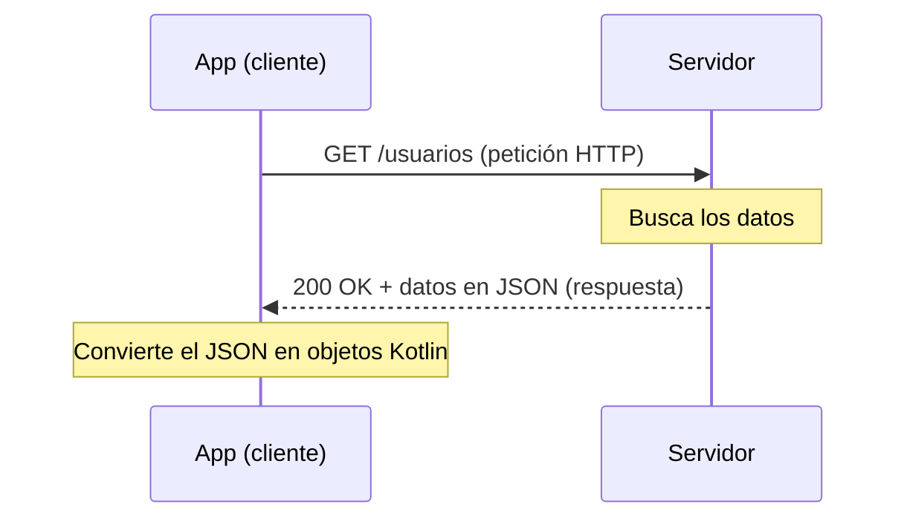

# Capítulo 36: HTTP, REST y JSON: cómo se comunican las apps con un servidor

## Introducción

Las aplicaciones rara vez trabajan aisladas. La mayoría obtienen sus datos de un **servidor** a través de internet: la lista de publicaciones de una red social, el clima de tu ciudad, el catálogo de una tienda. Antes de aprender a hacer eso con Retrofit, necesitas entender **cómo** se comunican una app y un servidor.

En este capítulo, más conceptual, verás los tres pilares de esa comunicación: **HTTP** (el protocolo que usan para hablar), **REST** (la forma en que suele organizarse la API) y **JSON** (el formato en que viajan los datos). Con esta base, en los próximos capítulos usarás Retrofit para ponerlo todo en práctica.

## El modelo cliente-servidor

La comunicación por internet sigue el modelo **cliente-servidor**. Tu app es el **cliente**: envía una **petición** (*request*) pidiendo algo. Del otro lado, un **servidor** recibe esa petición, hace su trabajo y devuelve una **respuesta** (*response*).

Es como pedir en un restaurante: tú (el cliente) haces un pedido al mesero, la cocina (el servidor) lo prepara y te devuelve el plato. Ni tú entras a la cocina ni la cocina decide por ti: cada uno cumple su rol, y se comunican mediante pedidos y entregas.

## HTTP: el protocolo

Para que el cliente y el servidor se entiendan, usan un **protocolo**: un conjunto de reglas comunes. En la web, ese protocolo es **HTTP** (*HyperText Transfer Protocol*). Toda la comunicación funciona en pares de **petición** y **respuesta**.

Una **petición** HTTP incluye, principalmente:

- Una **URL**: la dirección de aquello que pides (por ejemplo, `https://api.ejemplo.com/usuarios`).
- Un **método**, que indica **qué** quieres hacer. Los más comunes son:
  - `GET`: **obtener** datos.
  - `POST`: **crear** algo nuevo.
  - `PUT` (o `PATCH`): **modificar** algo existente.
  - `DELETE`: **eliminar** algo.

La **respuesta** del servidor incluye:

- Un **código de estado**, que resume cómo fue todo:
  - `2xx` (como `200 OK`): éxito.
  - `4xx` (como `404 Not Found`): error del cliente; por ejemplo, pediste algo que no existe.
  - `5xx` (como `500`): error del servidor.
- Un **cuerpo** (*body*) con los datos solicitados, normalmente en formato JSON.

## REST: el estilo de la API

Un servidor expone sus funciones a través de una **API** (interfaz de programación de aplicaciones): el conjunto de URLs a las que tu app puede llamar. **REST** es el **estilo** más común para diseñar esas APIs.

La idea central de REST son los **recursos**: las "cosas" que la API maneja (usuarios, productos, publicaciones). Cada recurso tiene su propia **URL** (llamada *endpoint*), y operas sobre él combinándola con un método HTTP:

- `GET /usuarios` → obtener la lista de usuarios.
- `GET /usuarios/42` → obtener el usuario con id 42.
- `POST /usuarios` → crear un usuario nuevo.
- `DELETE /usuarios/42` → eliminar el usuario 42.

Así, la **URL dice sobre qué** actúas y el **método dice qué haces**. Esta forma ordenada y predecible es lo que hace tan cómodas a las APIs REST.

## JSON: el formato de los datos

Cuando el servidor responde con datos, necesita un formato que ambos lados entiendan. El más usado es **JSON** (*JavaScript Object Notation*): un formato de texto, legible tanto para máquinas como para personas.

JSON representa los datos con dos estructuras básicas. Un **objeto**, entre llaves `{ }`, es un conjunto de pares **clave-valor** (te recordará a un mapa):

```json
{
  "id": 42,
  "nombre": "Ana",
  "activo": true
}
```

Y un **arreglo**, entre corchetes `[ ]`, es una **lista** de elementos:

```json
[
  { "id": 1, "nombre": "Ana" },
  { "id": 2, "nombre": "Diego" }
]
```

Fíjate en lo natural que resulta: un objeto JSON se parece muchísimo a una `data class` de Kotlin, y un arreglo, a una `List`. Esa cercanía es la que aprovecharemos para convertir el JSON en objetos de Kotlin, como verás al hablar de serialización.

## Todo junto: una petición de principio a fin

Reuniendo las tres piezas, así se ve una comunicación típica: tu app envía una petición HTTP a un *endpoint* REST, y el servidor responde con un código de estado y datos en JSON, que la app convierte en objetos.



Todo esto —abrir la conexión, enviar la petición, esperar la respuesta, interpretar el JSON— es trabajo que, por suerte, no tendrás que hacer a mano: de eso se encarga **Retrofit**, la biblioteca que veremos a continuación.

## Resumen

En este capítulo, más conceptual, entendiste cómo se comunican las apps con un servidor:

- Las apps siguen el modelo **cliente-servidor**: el cliente (tu app) envía una **petición** y el servidor devuelve una **respuesta**.
- **HTTP** es el protocolo de esa comunicación. Una petición lleva una **URL** y un **método** (`GET`, `POST`, `PUT`, `DELETE`); la respuesta trae un **código de estado** (`200`, `404`, `500`) y, a menudo, un cuerpo de datos.
- **REST** es el estilo más común de API: expone **recursos** con su **URL** (*endpoint*), sobre los que operas según el método HTTP.
- **JSON** es el formato habitual de los datos: **objetos** (`{ }`, clave-valor) y **arreglos** (`[ ]`, listas), que se parecen mucho a las `data class` y `List` de Kotlin.

En el próximo capítulo empezarás a poner esto en práctica con **Retrofit**: configurarás la biblioteca para hacer peticiones a una API con muy poco código.
