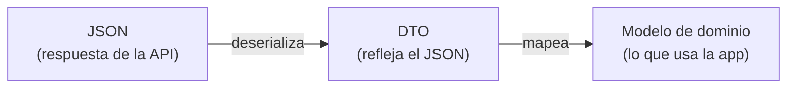

# Capítulo 38: Serialización JSON y modelos de datos (DTO)

## Introducción

En el capítulo anterior configuraste Retrofit con un convertidor de `kotlinx.serialization`, pero quedó una pregunta: ¿cómo se transforma exactamente el **JSON** que llega de la API en objetos de Kotlin? Ese proceso se llama **serialización** (más precisamente, *deserialización*).

En este capítulo aprenderás a modelar el JSON con `kotlinx.serialization`, a manejar los casos en que los nombres no coinciden, y a organizar tus clases de datos con un patrón importante: los **DTOs**, que separan los datos tal como vienen de la API de los modelos que tu app realmente usa.

## Serialización y deserialización

Son dos conceptos, uno el inverso del otro:

- **Serializar** es convertir un objeto en un formato de texto para enviarlo o guardarlo; por ejemplo, un objeto de Kotlin → un texto JSON.
- **Deserializar** es lo contrario: tomar ese texto y reconstruir el objeto; un texto JSON → un objeto de Kotlin.

Cuando consumes una API, casi siempre **deserializas**: la respuesta llega como texto JSON y necesitas convertirla en objetos con los que trabajar. (Por costumbre, se suele llamar "serialización" a todo el tema.)

La biblioteca que hace esta magia en Kotlin es **`kotlinx.serialization`**, y Retrofit la usa a través del convertidor que instalaste.

## Modelar el JSON con `@Serializable`

Para que `kotlinx.serialization` sepa cómo convertir un JSON en una clase, esa clase debe estar marcada con la anotación **`@Serializable`**, y sus propiedades deben **coincidir** con las claves del JSON.

Supongamos que la API devuelve este JSON:

```json
{
  "id": 42,
  "nombre": "Ana"
}
```

La clase que lo representa es una `data class` marcada con `@Serializable`:

```kotlin
@Serializable
data class UsuarioDto(
    val id: Int,
    val nombre: String
)
```

Con eso, `kotlinx.serialization` lee el JSON, empareja cada clave con la propiedad del mismo nombre y crea el objeto. Fíjate en lo directo que resulta: el JSON y la `data class` tienen prácticamente la misma forma.

> [!NOTE]
> Para usar `@Serializable` necesitas el *plugin* de serialización de Kotlin y la dependencia `kotlinx-serialization-json`, que se agregan al proyecto una sola vez.

## Cuando los nombres no coinciden: `@SerialName`

En la práctica, las APIs no siempre nombran sus campos como te gustaría. Es muy común que el JSON use `snake_case` (`nombre_completo`) mientras que en Kotlin prefieres `camelCase` (`nombreCompleto`). Para conectar ambos, usas la anotación **`@SerialName`**, indicando el nombre tal como aparece en el JSON:

```kotlin
@Serializable
data class UsuarioDto(
    val id: Int,
    @SerialName("nombre_completo") val nombreCompleto: String
)
```

Así, la clave `nombre_completo` del JSON se asigna a tu propiedad `nombreCompleto`.

Otro caso frecuente: la API devuelve **más campos** de los que te interesan. Por defecto, eso provocaría un error. Para evitarlo, se configura el lector de JSON para que **ignore las claves desconocidas**:

```kotlin
val json = Json { ignoreUnknownKeys = true }
```

Es un ajuste habitual y muy recomendable al consumir APIs que no controlas.

## DTOs: separar los datos de la API de tu modelo

Fíjate en que a la clase de los ejemplos la llamamos `UsuarioDto`, no `Usuario`. Esa terminación **`Dto`** no es casual: indica que es un **DTO** (*Data Transfer Object*, "objeto de transferencia de datos"), una clase cuyo único propósito es **reflejar la forma del JSON** de la API.

¿Por qué no usar ese DTO directamente en toda la app? Por dos razones:

- La forma en que la API entrega los datos no siempre es la más cómoda para tu aplicación (nombres raros, campos anidados, datos que no necesitas).
- Si la API **cambia**, no quieres que ese cambio se propague por todo tu código.

Por eso es buena práctica **separar** los DTOs de tus **modelos de dominio**: las clases limpias que tu app realmente usa. El repositorio recibe los DTOs, los **transforma** (mapea) en modelos de dominio y, hacia arriba, solo entrega estos últimos.

```kotlin
// DTO: refleja el JSON de la API
@Serializable
data class UsuarioDto(
    val id: Int,
    @SerialName("nombre_completo") val nombreCompleto: String
)

// Modelo de dominio: lo que usa la app
data class Usuario(
    val id: Int,
    val nombre: String
)

// Mapeo de DTO a modelo de dominio
fun UsuarioDto.aDominio(): Usuario {
    return Usuario(id = id, nombre = nombreCompleto)
}
```

Fíjate en que el mapeo es una **función de extensión** (de las que viste en la parte de POO): convierte un `UsuarioDto` en un `Usuario` de forma limpia. Así, si mañana la API renombra un campo, solo ajustas el DTO y su mapeo; el resto de la app, que trabaja con `Usuario`, ni se entera.

## El flujo completo

Reuniendo las piezas del capítulo anterior y de este, el recorrido de un dato desde la API hasta tu app es:



- Retrofit hace la petición y recibe el **JSON**.
- El convertidor de `kotlinx.serialization` lo **deserializa** en un **DTO**.
- El repositorio **mapea** el DTO a un **modelo de dominio**.
- El `ViewModel` y la interfaz trabajan con ese modelo limpio.

Cada capa recibe los datos en la forma que le conviene, y los detalles de la API quedan contenidos en un solo lugar.

## Resumen

En este capítulo aprendiste a convertir el JSON en objetos y a organizarlos bien:

- **Serializar** es objeto → texto (JSON); **deserializar** es texto → objeto. Al consumir una API, deserializas.
- **`kotlinx.serialization`** convierte el JSON en clases marcadas con **`@Serializable`**, cuyas propiedades coinciden con las claves del JSON.
- Con **`@SerialName`** conectas nombres que no coinciden (por ejemplo, el `snake_case` del JSON con el `camelCase` de Kotlin), y con `ignoreUnknownKeys = true` evitas errores cuando la API trae campos de más.
- Un **DTO** es una clase que refleja el JSON de la API. Conviene **separarlo** de tus **modelos de dominio** y mapear de uno a otro (con una función de extensión, por ejemplo), para que los cambios de la API no afecten a toda la app.

En el próximo capítulo cerrarás la parte de red juntándolo todo: manejarás los **estados de red** (cargando, éxito, error) en el `ViewModel`, conectando Retrofit, el repositorio y la interfaz.
