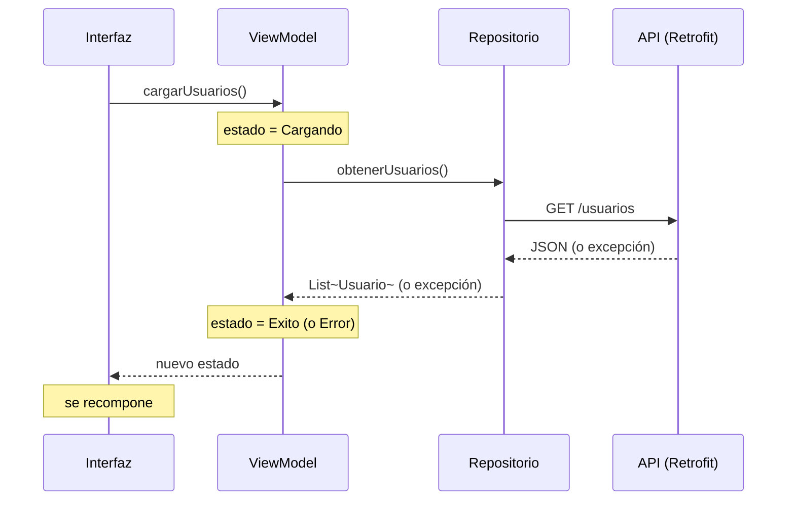

# Capítulo 39: Estados de red: *loading*, *success* y *error*

## Introducción

Ya tienes todas las piezas: **Retrofit** para pedir los datos, un **repositorio** que los provee, un **`ViewModel`** con su `UiState`, y una interfaz que reacciona al estado. En este capítulo las **unes** en el flujo completo de una petición de red, manejando sus tres estados —**cargando**, **éxito** y **error**— de principio a fin. Con esto cierras la parte de red y completas la arquitectura que venías construyendo.

## Los tres estados de una petición

Una petición de red tiene dos características que no puedes ignorar: **toma tiempo** y **puede fallar** (por falta de conexión, un error del servidor, datos mal formados…). Por eso, en todo momento, tu pantalla estará en uno de tres estados:

- **Cargando**: la petición está en curso. Muestra un indicador de progreso.
- **Éxito**: los datos llegaron. Muéstralos.
- **Error**: algo salió mal. Muestra un mensaje (y, idealmente, una opción para reintentar).

Ya modelaste exactamente esto con una `sealed class`, en la parte de POO. Ahora la usamos con un modelo de dominio real:

```kotlin
sealed class UiState {
    object Cargando : UiState()
    data class Exito(val usuarios: List<Usuario>) : UiState()
    data class Error(val mensaje: String) : UiState()
}
```

## El ViewModel: orquestar los tres estados

El `ViewModel` es el director de orquesta: pide los datos al repositorio y va cambiando el estado según lo que ocurra.

```kotlin
@HiltViewModel
class UsuariosViewModel @Inject constructor(
    private val repository: UsuariosRepository
) : ViewModel() {

    private val _uiState = MutableStateFlow<UiState>(UiState.Cargando)
    val uiState: StateFlow<UiState> = _uiState.asStateFlow()

    fun cargarUsuarios() {
        viewModelScope.launch {
            _uiState.value = UiState.Cargando
            try {
                val usuarios = repository.obtenerUsuarios()
                _uiState.value = UiState.Exito(usuarios)
            } catch (e: Exception) {
                _uiState.value = UiState.Error("No se pudieron cargar los datos")
            }
        }
    }
}
```

Sigue la secuencia:

1. Antes de empezar, pone el estado en **`Cargando`**.
2. Dentro de un **`try`**, pide los datos al repositorio. Si todo va bien, pasa a **`Exito`** con la lista.
3. Si la petición **lanza una excepción** (recuerda el manejo de excepciones que viste antes), el **`catch`** la atrapa y pone el estado en **`Error`**.

Así, cualquier fallo de la red —que en Retrofit se manifiesta como una excepción— se convierte en un estado de `Error` que la interfaz sabrá mostrar, en lugar de tumbar la app.

> [!TIP]
> En vez de `try/catch`, también puedes usar `runCatching`, que viste en el capítulo de excepciones y encaja muy bien aquí. Y si quisieras distinguir tipos de error (sin conexión, servidor caído, etc.), podrías atrapar excepciones más específicas y dar mensajes distintos.

## La interfaz: reaccionar a cada estado

La interfaz observa el estado y decide qué mostrar en cada caso, con el `when` exhaustivo que ya conoces:

```kotlin
@Composable
fun PantallaUsuarios(viewModel: UsuariosViewModel = hiltViewModel()) {
    val estado by viewModel.uiState.collectAsStateWithLifecycle()

    when (val actual = estado) {
        is UiState.Cargando -> CircularProgressIndicator()
        is UiState.Exito    -> ListaUsuarios(actual.usuarios)
        is UiState.Error    -> MensajeError(
            mensaje = actual.mensaje,
            onReintentar = { viewModel.cargarUsuarios() }
        )
    }
}
```

- En **`Cargando`**, muestra un `CircularProgressIndicator` (el indicador de progreso circular de Material).
- En **`Exito`**, muestra la lista con los datos (por ejemplo, en una `LazyColumn`).
- En **`Error`**, muestra el mensaje y un botón para **reintentar**, que simplemente vuelve a llamar a `cargarUsuarios()`.

La interfaz no sabe nada de red ni de excepciones: solo reacciona al estado que le entrega el `ViewModel`.

## El flujo completo

Este es el recorrido completo, uniendo todo lo que aprendiste en las últimas partes del curso:



Cuando la interfaz pide cargar, el `ViewModel` marca `Cargando`, le pide los datos al repositorio, que a su vez usa Retrofit para llamar a la API. Según el resultado —datos o excepción—, el `ViewModel` pasa a `Exito` o a `Error`, y la interfaz se recompone para mostrar lo que corresponda. Cada capa hace su parte, y el usuario siempre ve un estado claro.

## Resumen

En este capítulo uniste todas las piezas para manejar una petición de red:

- Una petición de red **toma tiempo** y **puede fallar**, así que la pantalla siempre está en uno de tres estados: **cargando**, **éxito** o **error**, modelados con tu `UiState`.
- El **`ViewModel`** orquesta esos estados: pone `Cargando`, pide los datos al repositorio dentro de un `try`, pasa a `Exito` si llegan y a `Error` (en el `catch`) si algo falla.
- Las excepciones de red se **convierten en un estado de `Error`**, en lugar de tumbar la app.
- La **interfaz** observa el estado y, con un `when`, muestra el indicador de carga, los datos o el mensaje de error (con opción de reintentar).

Con esto **cierras la arquitectura completa** de una app moderna: interfaz declarativa con Compose, estado en un `ViewModel`, datos desde un repositorio con Retrofit y un manejo claro de los estados de red. En la próxima parte del curso pondrás en práctica absolutamente todo lo aprendido, construyendo una aplicación completa de principio a fin.
