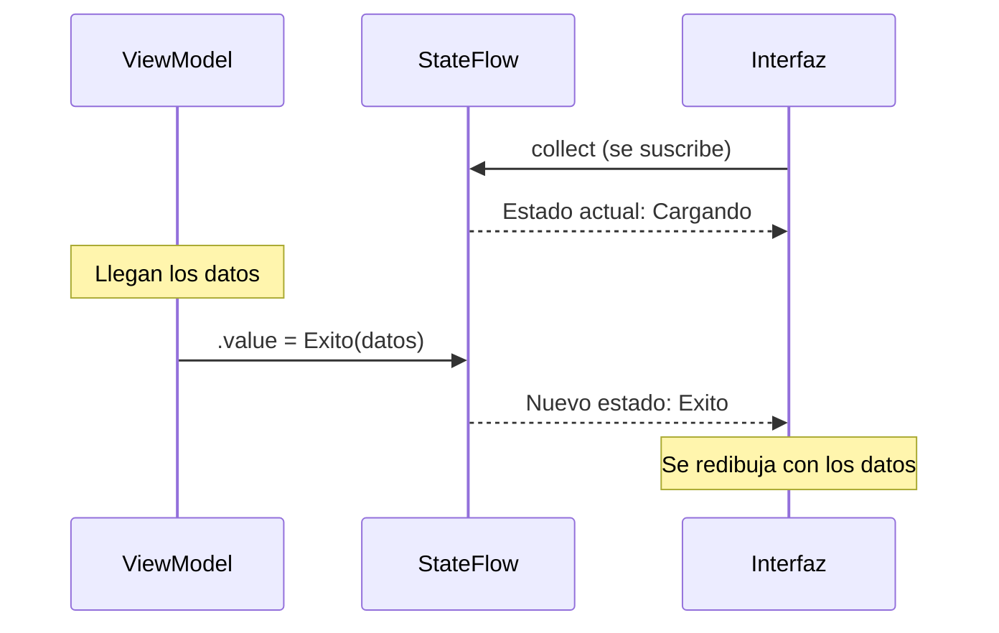

# Capítulo 24: `Flow`, `StateFlow` y `SharedFlow`

## Introducción

En el capítulo anterior, una función `suspend` te daba **un solo** resultado: una descarga, un valor. Pero muchas veces necesitas una **secuencia de valores** que van llegando **a lo largo del tiempo**: los resultados de una búsqueda que se actualizan mientras escribes, las lecturas de un sensor o —lo más importante para nosotros— el **estado de una pantalla** que va cambiando (cargando, luego con datos).

Para esto, Kotlin ofrece el **`Flow`** ("flujo"). En este capítulo verás qué es un Flow, cómo crearlo y recolectarlo, y dos variantes especializadas —**`StateFlow`** y **`SharedFlow`**— que son la base de cómo la interfaz de una app moderna reacciona automáticamente a los cambios. Con esto cerramos la parte de asincronía y quedamos listos para la arquitectura MVVM.

> [!NOTE]Nota
> `Flow` y sus variantes forman parte de la misma biblioteca de coroutines (`kotlinx.coroutines`) que viste en el capítulo anterior.

## ¿Qué es un Flow?

Un **`Flow`** es un **flujo de valores asíncronos**: una fuente que puede **emitir varios valores a lo largo del tiempo**, en lugar de devolver uno solo.

La diferencia con lo que ya conoces:

- Una función `suspend` es como pedir **un** café: esperas un momento y lo recibes, una sola vez.
- Un `Flow` es como una **suscripción**: los valores van llegando, uno tras otro, a medida que están disponibles.

Otra forma de verlo: un `Flow` se parece a una lista, pero sus elementos no están todos desde el principio, sino que **aparecen con el tiempo**.

## Crear y recolectar un Flow

Para crear un flujo, usas el constructor `flow { }` y, dentro, **emites** valores con `emit()`:

```kotlin
fun numeros(): Flow<Int> = flow {
    emit(1)
    delay(1000)
    emit(2)
    delay(1000)
    emit(3)
}
```

Este flujo emite `1`, espera un segundo, emite `2`, espera otro, y emite `3`. Para **recibir** esos valores, te suscribes con `collect`, que ejecuta un bloque por cada valor que llega:

```kotlin
fun main() = runBlocking {
    numeros().collect { valor ->
        println(valor)
    }
}
```

**Salida** (con un segundo de pausa entre cada número):

```plaintext
1
2
3
```

Dos detalles importantes: `collect` es una función `suspend` (se suspende esperando los valores, sin bloquear el hilo) y el flujo es "frío" (*cold*): su código no se ejecuta hasta que alguien lo recolecta. Si nadie hace `collect`, no se emite nada.

## Operadores de Flow

¿Recuerdas `map` y `filter` de las colecciones? Los flujos tienen los **mismos operadores**, y funcionan igual, pero aplicados a los valores a medida que llegan:

```kotlin
fun main() = runBlocking {
    numeros()
        .filter { it % 2 == 1 } // solo los impares: 1, 3
        .map { it * 10 }        // los multiplica por 10: 10, 30
        .collect { println(it) }
}
```

Todo lo que aprendiste sobre transformar colecciones se traslada a los flujos. La diferencia es que aquí los valores se procesan **conforme se emiten**, no todos de golpe.

## StateFlow: un flujo con estado

Un `Flow` normal no **recuerda** su último valor: si te suscribes tarde, te pierdes lo ya emitido. Pero para la interfaz de una app queremos justo lo contrario: un flujo que **siempre tenga un valor actual** (el estado presente de la pantalla) y que **avise cuando ese valor cambia**.

Para eso está el **`StateFlow`**. Es un flujo que **guarda un valor** y emite cada actualización. Se crea con `MutableStateFlow`, dándole un valor inicial, y accedes o cambias su valor con la propiedad `.value`:

```kotlin
val contador = MutableStateFlow(0)

println(contador.value) // 0
contador.value = 1      // actualiza el estado
println(contador.value) // 1
```

Cualquiera que recolecte ese `StateFlow` recibe **de inmediato** el valor actual y, luego, cada cambio. Esto lo hace perfecto para representar el **estado de la interfaz**. Retomando la `sealed class UiState` del capítulo de `enum` y `sealed class`:

```kotlin
val estado = MutableStateFlow<UiState>(UiState.Cargando)

// Más tarde, cuando llegan los datos:
estado.value = UiState.Exito(listOf("Ana", "Diego"))
```

La pantalla, suscrita a `estado`, empieza mostrando el indicador de carga y, en cuanto el estado pasa a `Exito`, se **redibuja sola** con los datos.

## SharedFlow: para eventos entre componentes

Falta mencionar al primo del `StateFlow`: el **`SharedFlow`**. Ambos son flujos que pueden tener varios suscriptores («calientes», *hot*), pero se usan para cosas distintas:

- Un **`StateFlow`** representa un **estado**: siempre tiene un valor actual y responde a la pregunta «¿qué debo mostrar ahora?» (la pantalla está cargando, o con datos). Al suscribirte, recibes de inmediato el último valor.
- Un **`SharedFlow`** es un emisor de **eventos**: emite valores a los suscriptores activos en ese instante, sin guardar necesariamente un valor actual. Es útil para comunicación entre componentes en segundo plano (por ejemplo, notificar que una sincronización terminó).

> [!WARNING]Cuidado con los eventos de interfaz
> En muchos tutoriales verás `SharedFlow` usado para eventos de la pantalla («muestra un Snackbar», «navega»). Tiene un problema: si la pantalla se está recreando al girar el dispositivo justo cuando se emite el evento, **el evento se pierde**, porque en esa fracción de segundo nadie estaba recolectando. En la parte de arquitectura (capítulo 40) verás cómo resolverlo modelando esos eventos como parte del propio `UiState`.

La regla práctica: usa `StateFlow` para el **estado** de la interfaz (y para los eventos que la pantalla debe ver sí o sí) y `SharedFlow` cuando necesites emitir eventos a múltiples suscriptores independientes sin guardar un valor fijo.

## La conexión con MVVM

Aquí se juntan varias piezas del curso y aparece un patrón muy habitual en las apps:

- El **ViewModel** (una clase que veremos en detalle en la parte de arquitectura) mantiene un `StateFlow<UiState>` con el estado de la pantalla.
- Lanza una coroutine (en su `viewModelScope`, del capítulo anterior) que pide los datos a una fuente externa (por ejemplo, la red) en el hilo de `IO`.
- Cuando los datos llegan, actualiza el `.value` del `StateFlow`.
- La **interfaz** recolecta ese `StateFlow` y, ante cada cambio, se redibuja automáticamente.

Visto en el tiempo:



Este flujo de datos en una sola dirección —el estado vive en el ViewModel, la interfaz solo lo observa y reacciona— es el corazón de MVVM, y lo construiremos paso a paso más adelante.

## Resumen

Con este capítulo cerraste la parte de asincronía:

- Un **`Flow`** es un flujo de valores asíncronos que se emiten con `emit` y se reciben con `collect`. Es "frío": no se ejecuta hasta que alguien lo recolecta.
- Los flujos admiten los mismos **operadores** que las colecciones (`map`, `filter`…), aplicados a los valores a medida que llegan.
- Un **`StateFlow`** es un flujo que **guarda un valor actual** y emite sus cambios; es ideal para el **estado de la interfaz**. Se crea con `MutableStateFlow` y se actualiza con `.value`.
- Un **`SharedFlow`** sirve para emitir eventos a múltiples suscriptores independientes, sin guardar un valor actual. Para eventos de interfaz que no deben perderse (Snackbar, navegación), es mejor modelarlos como estado (capítulo 40).
- Este mecanismo —el estado en un `StateFlow` que la interfaz observa y al que reacciona— es la base de la arquitectura **MVVM**.

Con esto tienes todos los fundamentos de Kotlin y de la asincronía. En la próxima parte del curso, ¡por fin abrimos Android Studio y creamos nuestra primera aplicación con Jetpack Compose!
