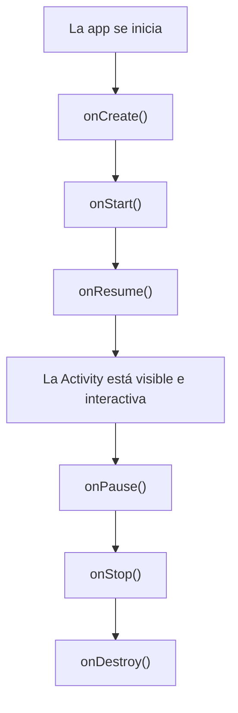

# Capítulo 26: Ciclo de vida de una `Activity`

## Introducción

En el capítulo anterior conociste `MainActivity` y viste que su método `onCreate` contiene una llamada a `setContent { }`, donde vive la interfaz. Antes de construir esa interfaz, conviene entender el objeto que la contiene.

En este capítulo conocerás el **ciclo de vida de una `Activity`**: cómo Android crea, muestra, oculta y destruye las pantallas de tu app, y por qué eso te importa.

## ¿Qué es una Activity?

Como vimos, una **`Activity`** es una **pantalla** de tu aplicación. `MainActivity` es la que se abre al iniciar la app, pero una aplicación puede tener varias.

Lo importante es que una `Activity` **no está siempre presente**. Android la **crea** cuando hace falta y la **destruye** cuando ya no se necesita, según lo que hace el usuario: abrir la app, cambiar a otra aplicación, girar el teléfono, volver atrás… Tu código no controla del todo *cuándo* ocurre esto; lo controla el sistema. Por eso necesitas una forma de reaccionar a esos momentos, y ahí entra el ciclo de vida.

## El ciclo de vida de una Activity

El **ciclo de vida** es la secuencia de estados por los que pasa una `Activity`, desde que nace hasta que muere. En cada transición, Android llama a un **método** que tú puedes sobrescribir (como ya hiciste con `onCreate`) para ejecutar código en ese momento:

- **`onCreate()`**: la `Activity` se está creando. Aquí preparas la pantalla; por eso el `setContent { }` va aquí.
- **`onStart()`**: la pantalla pasa a ser **visible** para el usuario.
- **`onResume()`**: la pantalla pasa al **primer plano** y el usuario ya puede interactuar con ella.
- **`onPause()`**: la pantalla **pierde el foco** (por ejemplo, aparece un diálogo encima).
- **`onStop()`**: la pantalla deja de ser **visible** (el usuario cambió a otra app).
- **`onDestroy()`**: la `Activity` se está **destruyendo**.

No necesitas memorizarlos todos ahora. La idea clave es que estos métodos te permiten reaccionar a los cambios: por ejemplo, pausar un video en `onPause` cuando la pantalla deja de estar en primer plano, y reanudarlo en `onResume`.

> [!NOTE]Nota
> Con Jetpack Compose, en la práctica tocarás pocos de estos métodos directamente: Compose y las herramientas modernas se encargan de gran parte del trabajo. Aun así, entender el ciclo de vida es fundamental, porque la `Activity` es la que **aloja** tu interfaz Compose.

## Cambios de configuración y recreación

Hay un comportamiento del ciclo de vida que sorprende a quienes empiezan y conviene conocer desde ya. Cuando ocurre un **cambio de configuración** —el más común es **girar** el dispositivo—, Android **destruye y vuelve a crear** la `Activity` desde cero: llama a `onDestroy` y luego a `onCreate` otra vez.

¿La consecuencia? Cualquier dato que estuvieras guardando dentro de la `Activity` **se pierde** en ese proceso. Imagina un contador en pantalla: al girar el teléfono, volvería a cero.

Esta es una de las razones por las que, más adelante, el estado de la pantalla no vivirá en la `Activity`, sino en un **`ViewModel`**, una clase diseñada para **sobrevivir** a estas recreaciones. Lo veremos en detalle en la parte de arquitectura; por ahora, quédate con el problema.

## Resumen

En este capítulo conociste el contenedor de las pantallas de Android:

- Una **`Activity`** es una pantalla que Android **crea y destruye** según el uso; tu código no controla del todo cuándo.
- El **ciclo de vida** son los estados por los que pasa una `Activity`, con métodos como `onCreate`, `onStart`, `onResume`, `onPause`, `onStop` y `onDestroy` que puedes sobrescribir para reaccionar a cada momento.
- Un **cambio de configuración** (como girar el dispositivo) **destruye y recrea** la `Activity`, lo que hace perder su estado; por eso más adelante usaremos un `ViewModel`.

Antes de construir la interfaz que va dentro de `setContent { }`, el próximo capítulo te dará un mapa de cómo se organiza una app: qué trabajos hace y por qué no conviene ponerlos todos en la `Activity`.
