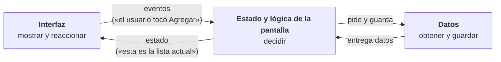

# Capítulo 27: Cómo se organiza una app: responsabilidades y flujo de datos

## Introducción

Antes de escribir tu primera pantalla, conviene tener un **mapa** del terreno. En este capítulo no escribirás código: verás qué trabajos tiene que hacer cualquier app, por qué no conviene hacerlos todos en el mismo lugar y en qué dirección se mueven los datos. Es un capítulo corto, y su objetivo es que, cuando lleguen las piezas concretas, sepas dónde encaja cada una.

Usaremos como ejemplo una app que construirás en la Parte VII: **Mi lista de tareas**. El usuario escribe una tarea, la agrega a la lista, la marca como hecha o la elimina.

## Los cinco trabajos de una app

Por simple que sea, una app como la lista de tareas tiene que hacer cinco trabajos distintos:

| Trabajo | En la lista de tareas |
| :--- | :--- |
| **Mostrar** | Dibujar la lista, el campo de texto y el contador de pendientes. |
| **Reaccionar** | Detectar que el usuario tocó «Agregar» o marcó una casilla. |
| **Decidir** | Aplicar las reglas: una tarea vacía no se agrega; al marcarla, cambia a hecha. |
| **Obtener** | Conseguir las tareas existentes al abrir la app. |
| **Guardar** | Conservar las tareas para que sigan ahí mañana. |

Los dos primeros tienen que ver con la **interfaz**. Los tres últimos tienen que ver con los **datos** y sus reglas, y no dependen de cómo se vea la pantalla: la regla «una tarea vacía no se agrega» es la misma si la pantalla es de un teléfono, de una tableta o de un reloj.

## Por qué no todo en la `Activity`

La forma más directa de escribir la app sería poner los cinco trabajos en un solo lugar: la `Activity` y su interfaz. Para una pantalla de prueba funciona, pero tiene tres problemas que ya puedes anticipar:

- **Se pierde el estado.** Como viste en el capítulo anterior, al girar el dispositivo Android destruye y recrea la `Activity`. Si las tareas viven ahí, desaparecen.
- **Todo cambia a la vez.** Si mañana las tareas se guardan en un servidor en lugar de en el teléfono, tendrías que modificar el mismo archivo que dibuja la pantalla, con el riesgo de romper algo que no tenía nada que ver.
- **Es difícil de probar.** Para comprobar que una tarea vacía no se agrega, tendrías que abrir la app y tocar botones, porque la regla está mezclada con el dibujo.

La solución es la misma que viste con las clases en la Parte IV: **separar responsabilidades**. Cada parte del código se ocupa de un trabajo, y se comunica con las demás a través de una puerta bien definida.

## Tres zonas

Si agrupas los cinco trabajos, aparecen tres zonas:

- La **interfaz** no toma decisiones. Muestra el estado que recibe y avisa cuando el usuario hace algo.
- La zona de **estado y lógica** recibe esos avisos, aplica las reglas y produce el nuevo estado de la pantalla. Además, sobrevive a la rotación.
- La zona de **datos** sabe de dónde vienen las tareas y dónde se guardan. Nadie más necesita saberlo.

## Los datos fluyen en un solo sentido

Fíjate en las flechas del diagrama. El **estado baja** hacia la interfaz y los **eventos suben** desde ella. La interfaz nunca modifica los datos directamente: solo avisa de lo que pasó.

Así ocurre agregar una tarea:

1. El usuario escribe «Comprar pan» y toca **Agregar** (*reaccionar*).
2. La interfaz avisa: «el usuario quiere agregar "Comprar pan"».
3. La lógica comprueba que el texto no esté vacío (*decidir*) y le pide a la zona de datos que la guarde (*guardar*).
4. La lógica produce el nuevo estado: la lista con una tarea más.
5. La interfaz recibe ese estado y se vuelve a dibujar (*mostrar*).

A este recorrido se le llama **flujo de datos unidireccional**. Su ventaja es que siempre sabes dónde buscar: si la lista se ve mal, el problema está en cómo se muestra el estado; si una tarea vacía se agregó, el problema está en la lógica.

Hay una segunda regla, igual de importante: **las dependencias apuntan hacia los datos**. La interfaz conoce a la lógica, y la lógica conoce a la zona de datos, pero no al revés. La zona de datos no sabe que existe una pantalla. Por eso puedes cambiar la pantalla sin tocar los datos, o cambiar de dónde vienen los datos sin tocar la pantalla.

## El mapa que vas a construir

A lo largo del curso, cada zona tendrá su pieza concreta de Android:

| Zona | Pieza | Dónde la verás |
| :--- | :--- | :--- |
| Interfaz | Composables de **Jetpack Compose** | Parte VII |
| Estado y lógica | **`ViewModel`** | Parte VIII |
| Datos | **Repositorio** que usa una fuente: en memoria, una API REST o una base de datos local | Partes VIII y IX |

Esta organización tiene nombre: **MVVM** (*Model-View-ViewModel*), la arquitectura que recomienda Android. No necesitas recordarlo ahora. En la Parte VII construirás la lista de tareas con todo dentro de la interfaz, y comprobarás en primera persona que las tareas se pierden al girar el teléfono. En la Parte VIII moverás cada trabajo a su zona.

> [!IMPORTANT]
> Estas tres zonas son **responsabilidades**, no carpetas. Una app pequeña puede tener todo en unos pocos archivos y respetar igualmente el flujo de datos. Lo que importa es quién decide, quién muestra y quién guarda; cómo organices después los archivos es una decisión aparte, que verás en la Parte VIII.

## Resumen

- Toda app hace cinco trabajos: **mostrar**, **reaccionar**, **decidir**, **obtener** y **guardar**.
- Ponerlos todos en la `Activity` hace que el estado se pierda al girar, que un cambio arrastre a todo lo demás y que la lógica sea difícil de probar.
- Se agrupan en tres zonas: **interfaz**, **estado y lógica** y **datos**.
- El **estado baja** y los **eventos suben** (flujo de datos unidireccional); las **dependencias apuntan hacia los datos**.
- En el curso, esas zonas serán **Compose**, el **`ViewModel`** y el **repositorio**: la arquitectura **MVVM**. Son responsabilidades, no carpetas.

En la próxima parte empezarás por la primera zona: la **interfaz**, con Jetpack Compose.
