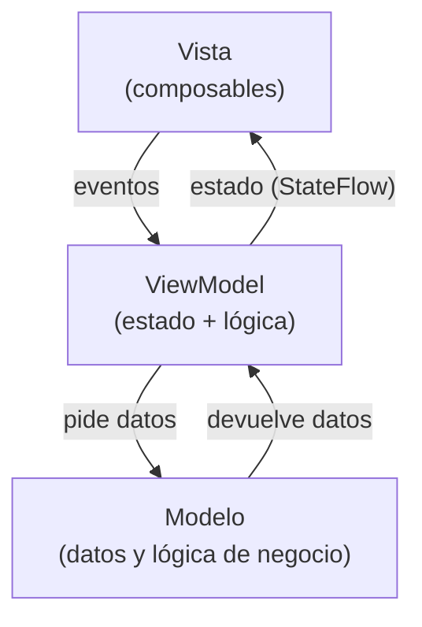

# Capítulo 29: Qué es MVVM y por qué usarlo

## Introducción

En el capítulo anterior viste que cualquier app se organiza en tres zonas —**interfaz**, **estado y lógica** y **datos**— y que esa organización tiene nombre: **MVVM**. Este capítulo profundiza en ese nombre: verás **qué** es MVVM, **por qué** conviene usarlo y, como adelanto, el árbol de carpetas que irás llenando durante el resto del curso. Es un capítulo conceptual, sin código; las piezas concretas (Compose, `ViewModel`, repositorio) las construirás en las partes siguientes.

## El problema: todo junto en el mismo lugar

En el capítulo anterior viste por qué no conviene poner los cinco trabajos de una app —mostrar, reaccionar, decidir, obtener y guardar— todos dentro de la `Activity`: el estado se pierde al girar el dispositivo, un cambio en una parte arrastra a las demás, y la lógica es difícil de probar porque está mezclada con el dibujo de la pantalla.

Ese problema no es exclusivo de la `Activity`: ocurre cada vez que **una sola pieza de código hace demasiadas cosas a la vez** (otra vez, lo contrario del principio de responsabilidad única que viste en el anexo), sin importar si esa pieza es una `Activity`, un composable de Jetpack Compose (que construirás en la Parte VII) o cualquier otra forma de interfaz.

La solución es la misma que ya conoces: **separar responsabilidades**. Cada parte del código se ocupa de una sola cosa. Eso es exactamente lo que propone MVVM.

## ¿Qué es MVVM?

**MVVM** son las siglas de **Model-View-ViewModel** ("Modelo-Vista-ViewModel"). Es un patrón que organiza el código en **tres capas**, cada una con una responsabilidad clara, y que corresponde una a una con las tres zonas que ya conoces:

- La **Vista** (*View*) es la **interfaz**: en Android moderno, un conjunto de composables de Jetpack Compose. Su único trabajo es **mostrar** el estado y **avisar** de los eventos del usuario (un toque, un texto escrito). No contiene lógica; es "tonta" a propósito.
- El **ViewModel** es el **intermediario**: la zona de **estado y lógica**. Guarda el **estado** de la pantalla y lo expone para que la Vista lo observe. Recibe los eventos de la Vista, ejecuta la lógica correspondiente y actualiza el estado.
- El **Modelo** (*Model*) son los **datos**: de dónde vienen (una red, una base de datos) y las reglas que los rigen.

Gráficamente, las tres capas se relacionan así:



Fíjate en las flechas: la Vista **observa** el estado del ViewModel y le **envía** eventos; el ViewModel, a su vez, pide y recibe datos del Modelo. La Vista nunca habla directamente con el Modelo: siempre pasa por el ViewModel. Es el mismo flujo de datos unidireccional del capítulo anterior, solo que ahora cada zona tiene nombre propio.

## El flujo de datos

El patrón sigue un **flujo de datos unidireccional**: el **estado baja** (del ViewModel a la Vista) y los **eventos suben** (de la Vista al ViewModel).

- El ViewModel expone el estado; para eso usaremos un `StateFlow`, como viste en la parte de asincronía.
- La Vista observa ese estado y, ante cada cambio, se redibuja sola.
- Cuando el usuario hace algo, la Vista no lo resuelve por su cuenta: se lo **comunica** al ViewModel, que decide qué hacer.

> [!NOTE]Nota
> En la Parte VII verás esta misma idea aplicada a un solo composable, bajo el nombre ***state hoisting*** ("elevación del estado"). MVVM es ese mismo principio llevado al nivel de toda la pantalla: en vez de elevar el estado a un composable padre, lo elevas hasta el ViewModel, la única fuente de verdad.

## ¿Por qué usar MVVM?

Separar el código en estas tres capas trae ventajas concretas:

- **Separación de responsabilidades**: cada capa hace una sola cosa, así el código es más fácil de entender y de modificar (el principio SRP en acción).
- **Testabilidad**: como la lógica vive en el ViewModel, aislada de la interfaz, puedes probarla sin necesidad de dibujar ninguna pantalla.
- **Sobrevive a los cambios de configuración**: el ViewModel está diseñado para **vivir más** que la `Activity`, así que, al girar el dispositivo, el estado **no se pierde** (resolviendo el problema que dejamos pendiente en el capítulo del ciclo de vida).
- **Única fuente de verdad**: el estado vive en un solo lugar, lo que evita inconsistencias.

Por todo esto, MVVM es la arquitectura que **Google recomienda** para las apps Android modernas.

## Cómo se conecta con lo que ya sabes

MVVM no introduce ideas nuevas de la nada, sino que **junta** varias que ya viste a lo largo del curso, o que verás pronto bajo otro nombre:

- El `StateFlow`: el mecanismo con el que el ViewModel expone su estado a la Vista.
- La `sealed class UiState`: una forma habitual de representar ese estado (cargando, éxito, error).
- El `viewModelScope`: el *scope* donde el ViewModel lanza sus coroutines (por ejemplo, para pedir datos).
- El *state hoisting*: la misma idea de elevar el estado, que verás aplicada a un composable en la Parte VII antes de verla aplicada a toda una pantalla.

## Un adelanto: la estructura de carpetas

Cada zona de MVVM también se refleja en cómo organizas las carpetas (los *paquetes*) de tu proyecto. No necesitas entender cada línea todavía —cada carpeta se explica en detalle cuando llegue su capítulo—, pero conviene tener el mapa completo desde ahora:

```text
com.ejemplo.miapp/
├── data/                      # capa de datos (Parte VIII, cap. 44)
│   ├── local/                      # caché con Room (Parte IX, cap. 50)
│   ├── remote/                     # acceso a la red y DTOs (Parte IX, cap. 47-48)
│   ├── DatosRepository.kt          # la interfaz del repositorio
│   └── DatosRepositoryImpl.kt      # su implementación
├── model/                     # modelos de dominio, a medida que los definas
│   └── Usuario.kt
├── ui/                        # capa de interfaz
│   ├── PantallaUsuarios.kt         # composables, la Vista (Parte VII)
│   ├── UsuariosViewModel.kt        # el ViewModel (Parte VIII, cap. 42)
│   ├── UiState.kt                  # el estado de la interfaz (Parte VIII, cap. 42)
│   └── theme/                      # el tema de Material (generado por Android Studio, Parte VII)
├── di/                        # inyección de dependencias con Hilt (Parte VIII, cap. 45)
└── MainActivity.kt            # el punto de entrada
```

La idea de fondo es la misma que ya conoces: cada archivo vive en el paquete de la capa a la que pertenece, así que con solo mirar la ubicación de un archivo sabes cuál es su responsabilidad.

> [!NOTE]Nota
> Este árbol no es "la" estructura oficial de MVVM en Android: es la que construirás en este curso. Vas a encontrar otras organizaciones igual de válidas —por ejemplo, con `viewmodels/` como paquete propio en vez de junto a cada pantalla dentro de `ui/`, con `navigation/` separado de `ui/`, o con una capa `domain/` explícita (`domain/model/`, `domain/usecase/`) en proyectos más grandes—. Lo que importa no es cómo se llaman las carpetas, sino que se respete la lógica del patrón: separar los modelos de la lógica de presentación, mantener la Vista como una capa reactiva que solo consume estado (sin lógica propia) y agrupar con claridad la navegación, el tema, las validaciones o el acceso a servicios externos. Dicho de otro modo, la clave está en quién hace qué, no en los nombres exactos.

## Resumen

En este capítulo profundizaste en la arquitectura que nombró el capítulo anterior:

- **MVVM** (Model-View-ViewModel) separa el código en tres capas, una por cada zona que ya conoces: la **Vista** (la interfaz, que muestra el estado y avisa de eventos), el **ViewModel** (que guarda el estado y ejecuta la lógica) y el **Modelo** (los datos y la lógica de negocio).
- Sigue un **flujo de datos unidireccional**: el estado baja (del ViewModel a la Vista) y los eventos suben (de la Vista al ViewModel), la misma idea que verás pronto como *state hoisting* a nivel de un solo composable.
- Sus ventajas: separación de responsabilidades, testabilidad, supervivencia a los cambios de configuración y una única fuente de verdad.
- MVVM reúne piezas que ya conoces (`StateFlow`, `sealed class`, `viewModelScope`) con otras que verás pronto (*state hoisting*, composables, `ViewModel`).
- El proyecto se organiza en carpetas que reflejan estas capas (`data/`, `model/`, `ui/`, `di/`); iniciarás a construirlas en la Parte VII y las irás completando hasta la Parte IX. Los nombres exactos pueden variar de un proyecto a otro: lo que no cambia es la separación de responsabilidades que hay detrás.

En el próximo capítulo empieza la construcción: crearás tu primer **composable**, la primera pieza de la Vista.
