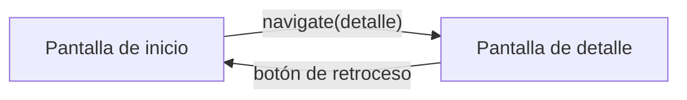

# Capítulo 32: Navegación con Navigation Compose

## Introducción

Hasta ahora, tu app ha vivido en una sola pantalla. Pero las aplicaciones reales tienen **varias**: una lista y su detalle, una pantalla de ajustes, un formulario… y el usuario se mueve entre ellas. En este capítulo aprenderás a hacer esa **navegación** entre pantallas con **Navigation Compose**, la biblioteca oficial para ello.

> [!NOTE]Nota
> Navigation Compose no viene incluido en la plantilla del proyecto; es una dependencia que se agrega en el `build.gradle.kts`, a través del catálogo de versiones que viste al crear el proyecto.

## Las piezas: `NavController` y `NavHost`

Navigation Compose se apoya en dos piezas principales:

- El **`NavController`** es el objeto que **controla** la navegación: lleva la cuenta de las pantallas visitadas (la *pila de navegación*) y es a quien le pides ir a una pantalla o volver atrás.
- El **`NavHost`** es un composable que define el **mapa de navegación**: declara cuáles son las pantallas (los *destinos*) y con qué **ruta** se llega a cada una.

Cada pantalla se identifica con una **ruta** (*route*), que no es más que un texto único, como `"inicio"` o `"detalle"`.

## Barras de navegación y destinos principales

Las barras de navegación no reemplazan al `NavHost`: son controles visibles que disparan cambios en el `NavController`. La elección depende del espacio y del número de destinos principales:

- **`TopAppBar`** identifica la pantalla actual y ofrece acciones contextuales, como buscar, guardar o volver. En un detalle suele mostrar una flecha de retroceso.
- **`NavigationBar`** (la navegación inferior) es adecuada en ventanas compactas para unos pocos destinos principales que el usuario visita con frecuencia.
- **`NavigationRail`** ocupa una franja lateral en ventanas medianas y deja más espacio vertical para el contenido.
- **`ModalNavigationDrawer`** contiene destinos adicionales o menos frecuentes. Se abre desde un botón de menú y no debería esconder la navegación principal necesaria para orientarse.

Una barra inferior puede observar el destino actual y navegar sin duplicar la pila:

```kotlin
@Composable
fun AppNavigationBar(
    navController: NavHostController,
    destinations: List<AppDestination>
) {
    val backStackEntry by navController.currentBackStackEntryAsState()
    val currentRoute = backStackEntry?.destination?.route

    NavigationBar {
        destinations.forEach { destination ->
            NavigationBarItem(
                selected = currentRoute == destination.route,
                onClick = {
                    navController.navigate(destination.route) {
                        popUpTo(navController.graph.startDestinationId) {
                            saveState = true
                        }
                        launchSingleTop = true
                        restoreState = true
                    }
                },
                icon = { Icon(destination.icon, destination.label) },
                label = { Text(destination.label) }
            )
        }
    }
}
```

Para una ventana ancha, la misma lista de destinos puede alimentar un `NavigationRail` o un `ModalNavigationDrawer`. La navegación visible y el `NavHost` deben compartir el mismo modelo de destinos, para que no aparezca una opción en la barra sin una ruta correspondiente.

## Modelar rutas y destinos

Las cadenas repartidas por todo el código son fáciles de escribir mal. Un `sealed class` o un `object` centraliza las rutas y deja claro qué destinos son principales y cuáles son detalles:

```kotlin
sealed class AppDestination(val route: String, val label: String, val icon: ImageVector) {
    data object Inicio : AppDestination("inicio", "Inicio", Icons.Default.Home)
    data object Ajustes : AppDestination("ajustes", "Ajustes", Icons.Default.Settings)
    data object Detalle : AppDestination("detalle/{id}", "Detalle", Icons.Default.Info)
}

val destinosPrincipales = listOf(AppDestination.Inicio, AppDestination.Ajustes)
```

La ruta con `{id}` es una **declaración** de argumento; la ruta que se usa al navegar contiene el valor concreto. Para valores que puedan incluir espacios o caracteres especiales, codifica el argumento o, cuando el flujo lo requiera, pasa solo un identificador estable y recupera el objeto desde el estado de la app o su repositorio. No pases objetos grandes dentro de una ruta.

## Definir las pantallas: el `NavHost`

Primero creas el `NavController` (con `remember`, para que sobreviva a las recomposiciones) y luego declaras el `NavHost` con sus destinos:

```kotlin
@Composable
fun App() {
    val navController = rememberNavController()

    NavHost(
        navController = navController,
        startDestination = "inicio"
    ) {
        composable("inicio") {
            PantallaInicio()
        }
        composable("detalle") {
            PantallaDetalle()
        }
    }
}
```

`startDestination` indica la pantalla que se muestra al abrir la app. Cada bloque `composable("ruta") { ... }` asocia una ruta con el composable que se dibuja cuando se navega a ella.

## Navegar entre pantallas

Para ir de una pantalla a otra, le pides al `NavController` que **navegue** a una ruta:

```kotlin
navController.navigate("detalle")
```

Normalmente esto ocurre en respuesta a una acción del usuario, como tocar un botón:

```kotlin
Button(onClick = { navController.navigate("detalle") }) {
    Text("Ver detalle")
}
```

Visualmente, el flujo entre dos pantallas se ve así:



## Volver atrás

¿Y para volver? La buena noticia es que el **botón de retroceso** del sistema ya funciona solo: al presionarlo, Navigation quita la pantalla actual de la pila y muestra la anterior. Si quieres volver atrás desde tu propio código (por ejemplo, con un botón "Cancelar"), usas:

```kotlin
navController.popBackStack()
```

## Pasar datos entre pantallas

Muchas veces, al navegar a un detalle, necesitas decirle **qué** elemento mostrar. Para eso, la ruta puede incluir **argumentos**, indicados entre llaves:

```kotlin
composable("detalle/{id}") { backStackEntry ->
    val id = backStackEntry.arguments?.getString("id")
    PantallaDetalle(id = id)
}
```

Y, al navegar, incluyes el valor en la ruta:

```kotlin
navController.navigate("detalle/42")
```

Así, la pantalla de detalle recibe el `id` (`"42"`) y puede mostrar el elemento correspondiente. Fíjate en que el argumento llega como texto; si necesitas un número, tendrás que convertirlo con `toInt()`, como viste al principio del curso.

> [!TIP]Sugerencia
> Como buena práctica, en lugar de pasar el `NavController` a cada pantalla, es preferible que las pantallas reciban **funciones** de navegación (por ejemplo, `onVerDetalle: (String) -> Unit`). Así quedan desacopladas de la navegación y son más fáciles de reutilizar y previsualizar, siguiendo la misma idea del *state hoisting* que viste con el estado.

La barra y el contenido también deben adaptarse juntos. En una ventana compacta, `NavigationBar` puede llevar a una pantalla completa; en una ventana expandida, la misma acción puede seleccionar el panel de la izquierda mientras el detalle permanece visible. En ambos casos, la fuente de verdad sigue siendo el estado del `NavController`, y `NavHost` continúa declarando los destinos.

## Resumen

En este capítulo aprendiste a moverte entre pantallas:

- **Navigation Compose** gestiona la navegación entre composables. Es una dependencia que se agrega al proyecto.
- El **`NavController`** controla la navegación (la pila de pantallas); el **`NavHost`** define el mapa de destinos, cada uno identificado por una **ruta**.
- `TopAppBar`, `NavigationBar`, `NavigationRail` y `ModalNavigationDrawer` son superficies de orientación y acciones; se conectan al `NavController`, pero no sustituyen al `NavHost`.
- Las rutas se pueden centralizar en un modelo de destinos para evitar cadenas inconsistentes y coordinar la navegación compacta y expandida.
- Navegas con `navController.navigate("ruta")`, normalmente en respuesta a una acción del usuario.
- El **botón de retroceso** del sistema funciona automáticamente; también puedes volver con `popBackStack()`.
- Puedes **pasar datos** incluyendo argumentos en la ruta (`"detalle/{id}"`) y leerlos en el destino.
- Como buena práctica, pasa **funciones** de navegación a las pantallas en vez del `NavController`, para mantenerlas desacopladas.

Ya sabes construir y conectar pantallas completas. En el próximo capítulo cerrarás la parte de Compose dándole a la interfaz su **estilo final** con Material 3: el tema, los colores y la tipografía.
