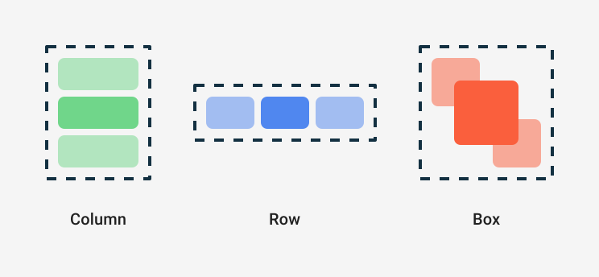

# Capítulo 29: `Modifier` y layouts: `Column`, `Row` y `Box`

## Introducción

En el capítulo anterior escribiste composables que muestran un texto. Pero una interfaz real necesita dos cosas más: **ajustar** cada elemento (darle espacio, tamaño, un fondo, que responda a un toque) y **organizar** varios elementos en pantalla (uno debajo de otro, en fila o superpuestos).

En este capítulo aprenderás ambas: el **`Modifier`**, la herramienta para ajustar la apariencia y el comportamiento de cada composable, y los tres **layouts** básicos de Compose —`Column`, `Row` y `Box`—, junto con cómo distribuir y alinear sus hijos.

## Modificadores (`Modifier`)

Un `Text` por sí solo es solo texto pegado a la esquina. ¿Cómo le das espacio alrededor, un tamaño, un color de fondo, o haces que responda a un toque? Con un **`Modifier`** ("modificador").

Un `Modifier` es un objeto que le pasas a un composable para **ajustar su apariencia o su comportamiento**. Casi todos los composables aceptan un parámetro `modifier`:

```kotlin
Text(
    text = "¡Hola!",
    modifier = Modifier.padding(16.dp)
)
```

Aquí `Modifier.padding(16.dp)` le agrega un espacio de 16 alrededor del texto.

> [!NOTE]Nota
> `dp` significa *density-independent pixels* (píxeles independientes de la densidad). Es la unidad de medida de Compose para tamaños y espacios, y se adapta sola a pantallas de distinta densidad, para que tu interfaz se vea consistente en cualquier dispositivo.

Los modificadores se **encadenan**, uno tras otro, y cada uno se aplica en orden:

```kotlin
Text(
    text = "¡Hola!",
    modifier = Modifier
        .padding(16.dp)
        .background(Color.Yellow)
)
```

El **orden importa**. No es lo mismo poner primero el espaciado y luego el fondo, que al revés: en el ejemplo de arriba, el fondo amarillo se pinta *dentro* del espaciado; si invirtieras las llamadas, el amarillo cubriría también ese espacio.

A continuación, algunos de los modificadores más usados:

| Modificador | Qué hace | Parámetros |
| :--- | :--- | :--- |
| `padding(...)` | Agrega espacio alrededor del elemento. | Un `Dp` para todos los lados, o valores por lado (`horizontal`/`vertical`, o `start`/`top`/`end`/`bottom`). |
| `size(...)` | Fija un ancho y un alto concretos. | Un `Dp` (cuadrado), o `width` y `height` en `Dp`. |
| `width(...)` / `height(...)` | Fija solo el ancho o solo el alto. | Un `Dp`. |
| `fillMaxWidth()` | Hace que el elemento ocupe todo el ancho disponible. | Opcional: una fracción `Float` (0f–1f); por defecto, todo el ancho. |
| `fillMaxHeight()` | Ocupa todo el alto disponible. | Opcional: una fracción `Float`; por defecto, todo el alto. |
| `fillMaxSize()` | Ocupa todo el ancho y el alto disponibles. | Opcional: una fracción `Float`; por defecto, todo el espacio. |
| `background(...)` | Aplica un color (o degradado) de fondo. | Un `Color` (o un `Brush` para degradados) y, opcionalmente, una `Shape`. |
| `border(...)` | Dibuja un borde alrededor del elemento. | El grosor (`Dp`), un `Color` y, opcionalmente, una `Shape`. |
| `clip(...)` | Recorta el elemento a una forma (por ejemplo, esquinas redondeadas). | Una `Shape` (p. ej., `RoundedCornerShape` o `CircleShape`). |
| `clickable { ... }` | Hace que el elemento responda a los toques. | Una lambda `onClick` que se ejecuta al tocar. |

> [!NOTE]Nota
> Existen además modificadores que solo están disponibles **dentro de ciertos layouts** (como `weight`, para repartir el espacio en una fila o columna, o `align`, para alinear dentro de un contenedor). Los verás cuando lleguemos a los layouts.

### La convención del parámetro `modifier`

Cuando crees tus propios composables, es una buena práctica que reciban un parámetro `modifier` y lo apliquen a su elemento principal, con este patrón:

```kotlin
@Composable
fun Saludo(nombre: String, modifier: Modifier = Modifier) {
    Text(
        text = "¡Hola, $nombre!",
        modifier = modifier
    )
}
```

Al darle el valor por defecto `Modifier` (un modificador vacío), quien use `Saludo` puede pasarle ajustes desde fuera o no pasarle ninguno. Esto hace tus composables mucho más flexibles y reutilizables, y es la convención que sigue todo Compose.

## El problema: los elementos se superponen

Si colocas dos composables juntos sin más, Compose los dibuja en el **mismo lugar**, uno encima del otro:

```kotlin
@Composable
fun Pantalla() {
    Text("Primero")
    Text("Segundo") // ¡se dibuja encima del anterior!
}
```

Para arreglarlo, necesitas un **layout**: un composable cuyo trabajo es **organizar** a sus hijos. Compose ofrece tres básicos, que resuelven las tres formas fundamentales de disponer elementos:



## `Column`: en vertical

Un `Column` organiza a sus hijos **en vertical**, uno debajo del otro:

```kotlin
Column {
    Text("Primero")
    Text("Segundo")
    Text("Tercero")
}
```

Ahora los tres textos aparecen apilados de arriba abajo, en el orden en que los escribiste.

## `Row`: en horizontal

Un `Row` organiza a sus hijos **en horizontal**, uno al lado del otro:

```kotlin
Row {
    Text("Izquierda")
    Text("Centro")
    Text("Derecha")
}
```

Es idéntico a `Column`, pero en el eje horizontal.

## `Box`: superponer elementos

Un `Box` **apila** a sus hijos, uno **encima** de otro. Es útil para superponer cosas: un texto sobre una imagen, una insignia sobre un ícono, etcétera.

```kotlin
Box {
    Text("Fondo")
    Text("Encima") // se dibuja sobre el anterior
}
```

Combinando estos tres layouts (y anidándolos unos dentro de otros) puedes construir prácticamente cualquier pantalla.

## Distribución y alineación

Dentro de un `Column` o un `Row`, a menudo querrás controlar **cómo se reparten** los hijos y **cómo se alinean**. Para eso, estos layouts reciben dos parámetros. La clave es distinguir sus dos ejes:

- En un `Column`, el eje principal es **vertical**. Controlas la distribución vertical con `verticalArrangement` y la alineación horizontal con `horizontalAlignment`.
- En un `Row`, el eje principal es **horizontal**. Controlas la distribución horizontal con `horizontalArrangement` y la alineación vertical con `verticalAlignment`.

Por ejemplo, un `Column` que separa sus hijos con espacio y los centra horizontalmente:

```kotlin
Column(
    verticalArrangement = Arrangement.spacedBy(8.dp),
    horizontalAlignment = Alignment.CenterHorizontally
) {
    Text("Primero")
    Text("Segundo")
}
```

Algunos valores útiles de `Arrangement` son `spacedBy(...)` (un espacio fijo entre elementos), `SpaceBetween` (reparte el espacio sobrante entre ellos) y `Center` (los agrupa al centro). Y de `Alignment`, `Start`, `CenterHorizontally` y `End` (o `Top`, `CenterVertically` y `Bottom` en un `Row`).

## El modificador `weight`

Al principio de este capítulo mencionamos que hay modificadores que solo funcionan dentro de ciertos layouts. `weight` es el más importante: dentro de un `Row` o un `Column`, reparte el **espacio disponible** entre los hijos de forma proporcional.

```kotlin
Row {
    Text("Izquierda", modifier = Modifier.weight(1f))
    Text("Derecha", modifier = Modifier.weight(1f))
}
```

Aquí ambos textos reciben el mismo peso (`1f`), así que se reparten el ancho **a la mitad**. Si a uno le dieras `weight(2f)` y al otro `weight(1f)`, el primero ocuparía el doble de espacio que el segundo.

## Resumen

En este capítulo aprendiste a ajustar y organizar composables:

- Un **`Modifier`** ajusta la apariencia y el comportamiento de un composable (`padding`, `background`, `fillMaxWidth`, `clickable`…). Se **encadena**, el **orden importa**, y usa la unidad **`dp`** para los tamaños.
- Por convención, tus composables deberían recibir un parámetro `modifier` con valor por defecto `Modifier` y aplicarlo a su elemento principal.
- Sin un layout, los composables se **superponen**. Los tres layouts básicos son `Column` (vertical), `Row` (horizontal) y `Box` (apilados).
- `Column` y `Row` controlan la **distribución** (`Arrangement`) en su eje principal y la **alineación** (`Alignment`) en el eje cruzado.
- El modificador **`weight`**, dentro de un `Row` o `Column`, reparte el espacio disponible de forma proporcional.

En el próximo capítulo verás cómo Android organiza sus **recursos** (imágenes, el ícono de la app, textos), algo que necesitarás antes de sacarles todo el provecho a los componentes de Material 3.
