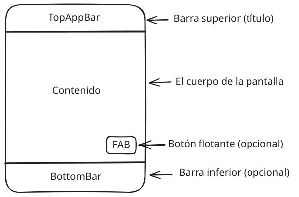

# Capítulo 33: Estructura de pantalla: `Scaffold` y `LazyColumn`

## Introducción

Ya sabes organizar composables con `Column`, `Row` y `Box`, y darles estado. Pero la mayoría de las pantallas comparten una estructura —una barra superior, el contenido, quizás una barra inferior o un botón flotante— y muchas muestran **listas largas** de datos. En este capítulo aprenderás a montar el **esqueleto** de una pantalla con `Scaffold`, a organizarla por **jerarquías** de composables y a mostrar listas de forma eficiente con `LazyColumn`.

## `Scaffold`: el esqueleto de una pantalla

La mayoría de las pantallas comparten una estructura: una barra arriba, el contenido en el medio, quizás una barra abajo o un botón flotante. En lugar de armar eso a mano, Material ofrece el **`Scaffold`** ("andamio"), un composable que provee **espacios** (*slots*) para cada una de esas partes:



Un uso típico, con una barra superior y el contenido:

```kotlin
Scaffold(
    topBar = {
        TopAppBar(title = { Text("Mi aplicación") })
    }
) { innerPadding ->
    Column(modifier = Modifier.padding(innerPadding)) {
        // el contenido de la pantalla
    }
}
```

Fíjate en el `innerPadding`: el `Scaffold` te entrega el espacio que ocupan las barras para que **apartes** el contenido y no quede tapado por ellas. Por eso se lo pasas como `padding` al composable de contenido. (Ya habías visto este patrón en el `MainActivity` que generó Android Studio.) Ese contenido normalmente es un layout, como `Column`, o una lista con `LazyColumn`, que verás a continuación.

> [!NOTE]Nota
> Algunos componentes de Material 3, como `TopAppBar`, están marcados todavía como *experimentales*, lo que obliga a añadir la anotación `@OptIn(ExperimentalMaterial3Api::class)` sobre la función que los usa. Android Studio te avisa y la agrega por ti.

## `LazyColumn`: listas eficientes

Un `Column` dibuja **todos** sus hijos de una vez. Eso está bien para unos pocos elementos, pero ¿y si tienes una lista de cientos o miles de elementos? Dibujarlos todos a la vez sería lento y desperdiciaría memoria, sobre todo porque la mayoría ni siquiera caben en la pantalla.

Para eso está el **`LazyColumn`**: una columna con desplazamiento (*scroll*) que solo compone los elementos **visibles** en cada momento, y los va reutilizando a medida que te desplazas. Así puede mostrar listas enormes sin problemas.

En vez de escribir cada hijo a mano, le pasas la lista con la función `items`:

```kotlin
val nombres = listOf("Ana", "Diego", "Elena")

LazyColumn {
    items(nombres) { nombre ->
        Text(nombre)
    }
}
```

`items(nombres)` recorre la lista y, por cada elemento, ejecuta la lambda que describe cómo mostrarlo (aquí, un `Text` con su nombre). El desplazamiento funciona automáticamente. También existe `LazyRow`, su equivalente horizontal.

> [!NOTE]Nota
> Si vienes del desarrollo Android tradicional, `LazyColumn` cumple el papel del antiguo `RecyclerView`, pero con muchísimo menos código: no necesitas adaptadores ni *view holders*.

Este es, precisamente, el componente que sueles poner dentro del contenido de un `Scaffold` para mostrar listas largas de datos: un `LazyColumn` con un `items` que recorre los elementos, recibiendo el `innerPadding` que viste al principio del capítulo.

## Diseñar por jerarquías

Una pantalla mantenible no se construye como una única función enorme. Conviene organizarla en una jerarquía: una raíz que decide la estructura general, secciones que agrupan contenido relacionado y componentes pequeños que muestran un dato o emiten un evento.

```kotlin
@Composable
fun ContactosScreen() {
    Scaffold(
        topBar = { ContactosTopBar() },
        bottomBar = { ContactosBottomBar() }
    ) { innerPadding ->
        ContactosContent(modifier = Modifier.padding(innerPadding))
    }
}

@Composable
private fun ContactosContent(modifier: Modifier = Modifier) {
    LazyColumn(modifier = modifier) {
        item { ContactosHeader() }
        items(contactos, key = { it.id }) { contacto ->
            ContactoItem(contacto = contacto)
        }
    }
}
```

Esta separación ayuda a que cada pieza tenga una responsabilidad clara y permite previsualizar una sección con datos de ejemplo. La raíz conoce la estructura de la pantalla; los hijos reciben datos y callbacks. El estado compartido no debe esconderse en cada fila, sino vivir en el nivel más bajo que necesite coordinarlo, o en el `ViewModel` cuando la pantalla tenga lógica de negocio.

## Resumen

En este capítulo aprendiste a construir la estructura de una pantalla completa:

- El **`Scaffold`** ofrece la estructura básica de una pantalla, con espacios para la barra superior (`TopAppBar`), el contenido, una barra inferior y un botón flotante.
- **`LazyColumn`** muestra listas con desplazamiento de forma eficiente, componiendo solo los elementos visibles; se llena con la función `items`. Su versión horizontal es `LazyRow`.
- Una pantalla se organiza mejor por **jerarquías**: la raíz coordina la estructura y los componentes hijos reciben datos y eventos.

Ya tienes todas las piezas para una primera app completa. En el tutorial que sigue construirás **Mi lista de tareas** con lo aprendido en esta parte.
