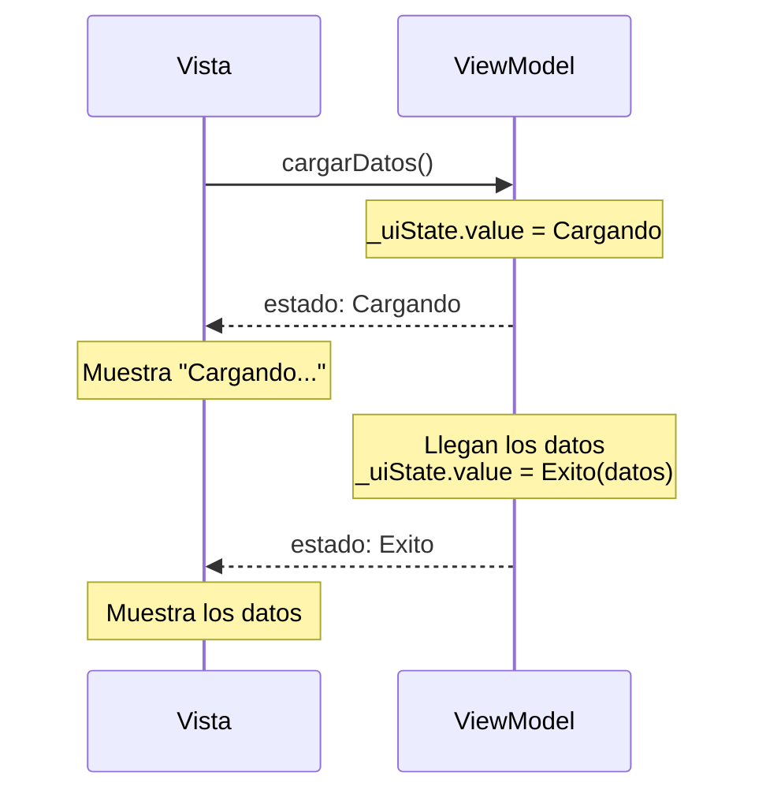

# Capítulo 39: `ViewModel` y el estado de la interfaz (`UiState`)

## Introducción

En el capítulo anterior conociste MVVM en teoría. Ahora lo pondrás en práctica construyendo su pieza central: el **`ViewModel`**, la clase que guarda el estado de la pantalla y ejecuta su lógica. Aprenderás a crear uno, a **exponer** su estado de forma segura con `StateFlow`, a **actualizarlo** y a **conectarlo** con la interfaz. Aquí se juntan, por fin, el `StateFlow`, el `UiState` y el `viewModelScope` que fuiste viendo por separado.

## La clase `ViewModel`

Android ofrece una clase base llamada **`ViewModel`**. Para crear el tuyo, defines una clase que hereda de ella:

```kotlin
class MiViewModel : ViewModel() {
    // estado y lógica de la pantalla
}
```

Su gran ventaja es la que anticipamos: un `ViewModel` está diseñado para **vivir más que la `Activity`**. Cuando el dispositivo gira y la `Activity` se recrea, el `ViewModel` **sigue existiendo**, con su estado intacto. Ese problema del ciclo de vida queda resuelto sin que hagas nada especial.

> [!NOTE]Nota
> La clase `ViewModel` viene en una biblioteca de Android (`lifecycle`), que se agrega como dependencia en el proyecto.

## Exponer el estado de forma segura

El `ViewModel` guarda el estado de la pantalla. Usaremos para ello el `UiState` que viste en el capítulo de `sealed class`:

```kotlin
sealed class UiState {
    object Cargando : UiState()
    data class Exito(val elementos: List<String>) : UiState()
    data class Error(val mensaje: String) : UiState()
}
```

Ahora, aquí hay un detalle de diseño importante. El `ViewModel` necesita **cambiar** el estado, pero la interfaz solo debería **leerlo**, nunca modificarlo. Para lograrlo, se usa un patrón muy común: una propiedad **mutable y privada**, y otra **de solo lectura y pública**.

```kotlin
class MiViewModel : ViewModel() {
    private val _uiState = MutableStateFlow<UiState>(UiState.Cargando)
    val uiState: StateFlow<UiState> = _uiState.asStateFlow()
}
```

- `_uiState` es un `MutableStateFlow` **privado**: solo el `ViewModel` puede cambiar su valor. Por convención, su nombre empieza con guion bajo.
- `uiState` es un `StateFlow` **público** (de solo lectura), que la interfaz observará. El método `asStateFlow()` "expone" el estado sin permitir modificarlo.

Así se cumple la **encapsulación**: el estado solo se modifica desde dentro del `ViewModel`, la única fuente de verdad.

> [!NOTE]Nota
> Una `sealed class` como esta encaja cuando los estados son **excluyentes**: la pantalla está en uno solo a la vez (cargando, éxito o error). Hay pantallas donde eso no alcanza, porque muestran **varias cosas a la vez** (una lista, si está cargando más elementos, un mensaje pendiente…). Para esas, `UiState` se modela mejor como una **`data class`**, con una propiedad por cada dato. Verás el caso concreto en el próximo tutorial.

## Actualizar el estado

Para cambiar el estado, el `ViewModel` asigna un nuevo valor a `_uiState.value`. Como esto suele implicar una tarea lenta (pedir datos), la lanzamos en una coroutine dentro del **`viewModelScope`**, el *scope* del capítulo de coroutines:

```kotlin
class MiViewModel : ViewModel() {
    private val _uiState = MutableStateFlow<UiState>(UiState.Cargando)
    val uiState: StateFlow<UiState> = _uiState.asStateFlow()

    fun cargarDatos() {
        viewModelScope.launch {
            _uiState.value = UiState.Cargando
            val datos = obtenerDatos() // una función suspend que trae los datos
            _uiState.value = UiState.Exito(datos)
        }
    }
}
```

Usar `viewModelScope` es importante: si el `ViewModel` se destruye, sus coroutines se cancelan solas, evitando trabajo innecesario. (La función `obtenerDatos()` representa la capa de datos, el **Modelo**, que veremos en el próximo capítulo.)

### Cargar los datos al crear el `ViewModel`: el bloque `init`

Si `cargarDatos()` trae lo que la pantalla necesita **desde el principio**, no tiene sentido esperar a que algo la llame: se dispara sola, en el bloque `init` de la clase.

```kotlin
class MiViewModel : ViewModel() {
    private val _uiState = MutableStateFlow<UiState>(UiState.Cargando)
    val uiState: StateFlow<UiState> = _uiState.asStateFlow()

    init {
        cargarDatos()
    }

    fun cargarDatos() {
        viewModelScope.launch {
            _uiState.value = UiState.Cargando
            val datos = obtenerDatos()
            _uiState.value = UiState.Exito(datos)
        }
    }
}
```

El `init` se ejecuta **una sola vez**, cuando se crea la instancia del `ViewModel`. Como el `ViewModel` sobrevive al giro de pantalla, esa creación también ocurre una sola vez: la carga no se repite cada vez que la `Activity` se recrea, solo la primera vez que alguien pide este `ViewModel`. `cargarDatos()` se mantiene **pública** para poder llamarla de nuevo, por ejemplo desde un botón «Reintentar».

### Cambiar el estado a partir del anterior: `update {}`

Asignar directamente a `_uiState.value`, como en los ejemplos de arriba, funciona bien cuando el nuevo estado no depende del anterior: pasas de `Cargando` a `Exito` y listo. Pero si necesitas **partir del valor actual** —agregar un elemento a una lista, marcar algo como hecho, apagar un mensaje ya mostrado—, hacerlo con `.value` tiene un problema: entre que lees `_uiState.value` y le asignas el resultado, otra coroutine podría haber cambiado el estado, y esa modificación se perdería.

`MutableStateFlow` ofrece **`update { }`** para este caso: recibe el estado actual y devuelve el nuevo, en una sola operación que no puede interrumpirse a la mitad.

```kotlin
data class ContadorUiState(val valor: Int = 0)

class ContadorViewModel : ViewModel() {
    private val _uiState = MutableStateFlow(ContadorUiState())
    val uiState: StateFlow<ContadorUiState> = _uiState.asStateFlow()

    fun incrementar() {
        _uiState.update { estado -> estado.copy(valor = estado.valor + 1) }
    }
}
```

`estado` es el valor actual, y la lambda devuelve el nuevo con `copy` (capítulo 17), cambiando solo lo que hace falta. Es el patrón que usarás siempre que `UiState` sea una `data class`: reserva la asignación directa (`_uiState.value = ...`) para cuando reemplazas el estado completo, como al pasar de un caso de una `sealed class` a otro.

## Conectar el ViewModel con la interfaz

Falta unir el `ViewModel` con la Vista. En el composable, obtienes el `ViewModel` con la función `viewModel()` y **recolectas** su estado para que la interfaz reaccione a los cambios:

```kotlin
@Composable
fun Pantalla(viewModel: MiViewModel = viewModel()) {
    val estado by viewModel.uiState.collectAsStateWithLifecycle()

    when (estado) {
        is UiState.Cargando -> Text("Cargando...")
        is UiState.Exito    -> Text("Se cargaron ${estado.elementos.size} elementos")
        is UiState.Error    -> Text("Error: ${estado.mensaje}")
    }
}
```

Analicemos las piezas nuevas:

- `viewModel()` obtiene la instancia del `ViewModel` (la misma a través de las recomposiciones y de los giros de pantalla).
- `collectAsStateWithLifecycle()` **recolecta** el `StateFlow` y lo convierte en un estado de Compose: cada vez que el `ViewModel` cambia `uiState`, este composable se **recompone** con el nuevo valor.
- El `when` decide qué mostrar según el estado, aprovechando el *smart cast* de la `sealed class`.

Y para disparar la lógica, la Vista simplemente invoca las funciones del `ViewModel`:

```kotlin
Button(onClick = { viewModel.cargarDatos() }) {
    Text("Cargar")
}
```

> [!NOTE]Nota
> `collectAsStateWithLifecycle()` es la forma recomendada de recolectar un `StateFlow` en Compose, porque solo recolecta mientras la pantalla está visible. Requiere una pequeña dependencia adicional (`lifecycle-runtime-compose`).

## El flujo completo

Con todo junto, el ciclo de MVVM queda así: la Vista pide una acción, el `ViewModel` actualiza el estado, y la Vista se redibuja sola al observar ese cambio.



Fíjate en que la Vista nunca guarda ni calcula el estado: solo lo **muestra** y **avisa** de los eventos. Toda la lógica vive en el `ViewModel`.

## Resumen

En este capítulo construiste el corazón de MVVM:

- Un **`ViewModel`** es una clase que hereda de `ViewModel` y guarda el estado y la lógica de una pantalla. **Sobrevive** a los cambios de configuración, como el giro de pantalla.
- El estado se expone con el patrón **`MutableStateFlow` privado + `StateFlow` público** (`_uiState` / `uiState` con `asStateFlow()`), de modo que solo el `ViewModel` puede modificarlo. Una `sealed class` sirve para estados excluyentes; una **`data class`** sirve cuando la pantalla muestra varios datos a la vez.
- El `ViewModel` actualiza el estado asignando a `_uiState.value` (para reemplazarlo entero) o con **`update { }`** (para partir del valor actual sin perder cambios concurrentes), normalmente dentro de una coroutine en **`viewModelScope`**.
- Si la pantalla necesita datos desde el principio, se cargan en el bloque **`init`**: se ejecuta una sola vez por `ViewModel`, y no se repite al girar la pantalla.
- La Vista obtiene el `ViewModel` con `viewModel()`, recolecta su estado con **`collectAsStateWithLifecycle()`** y decide qué mostrar con un `when` sobre el `UiState`.
- La Vista solo muestra el estado y avisa de eventos (invocando funciones del `ViewModel`); toda la lógica queda en el `ViewModel`.

En el próximo capítulo verás cómo manejar lo que **ocurre una vez** en lugar de dibujarse mientras dura un estado: mostrar un mensaje o navegar después de una acción.
