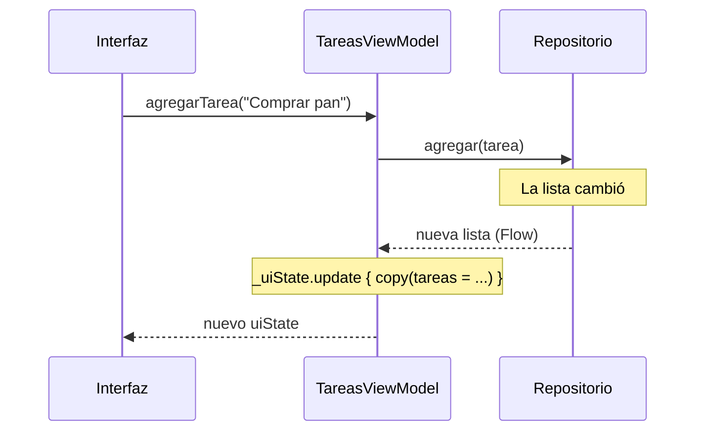

# Tutorial: Mi lista de tareas (parte 4)

## Qué vamos a construir

En la tercera parte, `TareasViewModel` tomó el control del estado de la app. Pero todavía hace dos trabajos: decide **qué mostrar** y además **guarda los datos**. En los capítulos 41 y 42 viste cómo separar esos trabajos con un repositorio y cómo conectar las piezas con Hilt.

En esta cuarta parte vas a reorganizar la app por dentro, otra vez sin cambiar lo que ve el usuario. Al terminar, tendrá:

- una interfaz `TareasRepository` en la capa de datos, con una implementación que guarda las tareas en memoria;
- un `ViewModel` que recibe el repositorio por su constructor y **observa** sus tareas;
- **Hilt** configurado, entregando el repositorio al `ViewModel` sin que lo crees a mano;
- tres **pruebas unitarias** del `ViewModel`, que se ejecutan en segundos y sin emulador.

> [!NOTE]Nota
> Las pantallas (`ListaTareasScreen`, `DetalleTareaScreen`) y `TareasUiState` no cambian en esta parte. Es justo lo que promete la separación en capas: reorganizar los datos no debería obligarte a tocar la interfaz.

## Paso 1: Configurar Hilt

Hilt genera código al compilar, a partir de tus anotaciones. Para eso usa **KSP** (*Kotlin Symbol Processing*), un procesador que se agrega como plugin de Gradle. La configuración se hace una sola vez y tiene tres partes.

Primero, en el catálogo `gradle/libs.versions.toml`, agrega las versiones, las bibliotecas y los plugins:

```toml
[versions]
hilt = "2.60.1"
hiltLifecycleViewmodelCompose = "1.4.0"
ksp = "2.3.12"
coroutines = "1.11.0"

[libraries]
hilt-android = { group = "com.google.dagger", name = "hilt-android", version.ref = "hilt" }
hilt-compiler = { group = "com.google.dagger", name = "hilt-compiler", version.ref = "hilt" }
androidx-hilt-lifecycle-viewmodel-compose = { group = "androidx.hilt", name = "hilt-lifecycle-viewmodel-compose", version.ref = "hiltLifecycleViewmodelCompose" }
kotlinx-coroutines-test = { group = "org.jetbrains.kotlinx", name = "kotlinx-coroutines-test", version.ref = "coroutines" }

[plugins]
hilt = { id = "com.google.dagger.hilt.android", version.ref = "hilt" }
ksp = { id = "com.google.devtools.ksp", version.ref = "ksp" }
```

Agrega cada línea en su sección, **sin borrar** las que ya tenías. `kotlinx-coroutines-test` no es parte de Hilt: la usarás en las pruebas del paso 8.

Segundo, en el `build.gradle.kts` de la **raíz** del proyecto, declara los dos plugins sin aplicarlos:

```kotlin
plugins {
    // ... los que ya tenías
    alias(libs.plugins.hilt) apply false
    alias(libs.plugins.ksp) apply false
}
```

Tercero, en `build.gradle.kts (Module :app)`, aplícalos y agrega las dependencias:

```kotlin
plugins {
    // ... los que ya tenías
    alias(libs.plugins.hilt)
    alias(libs.plugins.ksp)
}

// ...

dependencies {
    // ... las que ya tenías
    implementation(libs.hilt.android)
    ksp(libs.hilt.compiler)
    implementation(libs.androidx.hilt.lifecycle.viewmodel.compose)

    testImplementation(libs.kotlinx.coroutines.test)
}
```

- `hilt-compiler` se agrega con **`ksp(...)`**: es el generador de código, que solo se usa al compilar y no forma parte de la app.
- `hilt-lifecycle-viewmodel-compose` trae la función `hiltViewModel()`.
- `testImplementation` agrega una biblioteca solo para las pruebas.

Pulsa **Sync Now**.

> [!WARNING]Advertencia
> Las versiones de Hilt, KSP y Kotlin tienen que ser compatibles entre sí. Las de este tutorial son las que se usaron para probar el código del curso. Si al sincronizar aparece un error de versiones, revisa la documentación de Hilt y de KSP y usa las que indiquen para tu versión de Kotlin.

## Paso 2: Preparar la app para Hilt

Como viste en el capítulo 42, Hilt necesita una clase `Application` anotada con `@HiltAndroidApp`: es el punto donde empieza a construir las dependencias. Tu proyecto todavía no tiene una, así que créala. En el paquete principal, crea el archivo `MiListaDeTareasApp.kt`:

```kotlin
import android.app.Application
import dagger.hilt.android.HiltAndroidApp

@HiltAndroidApp
class MiListaDeTareasApp : Application()
```

Android no la usará hasta que la declares en `AndroidManifest.xml`. Agrega el atributo `android:name` a la etiqueta `<application>`:

```xml
<application
    android:name=".MiListaDeTareasApp"
    android:allowBackup="true"
    ... >
```

El punto inicial significa «en el paquete de la app». Por último, anota `MainActivity` con `@AndroidEntryPoint`, para que Hilt pueda entregar dependencias a lo que se muestra dentro de ella:

```kotlin
@AndroidEntryPoint
class MainActivity : ComponentActivity() {
    // ... sin cambios
}
```

Su import es `dagger.hilt.android.AndroidEntryPoint`.

> [!WARNING]Advertencia
> Si olvidas el `android:name` del manifiesto, la app compila pero se cierra al abrirse, con un error que dice que la `Activity` no está conectada a Hilt. Es el descuido más común al configurar Hilt.

## Paso 3: El contrato del repositorio

Crea un paquete `data` dentro del paquete principal: en la vista **Project**, clic derecho sobre `com.ejemplo.milistadetareas` → **New > Package** → escribe `data`. Ahí vivirá la capa de datos.

Dentro de `data`, crea el archivo `TareasRepository.kt` con la **interfaz** del repositorio:

```kotlin
package com.ejemplo.milistadetareas.data

import com.ejemplo.milistadetareas.Tarea
import kotlinx.coroutines.flow.Flow

interface TareasRepository {
    val tareas: Flow<List<Tarea>>
    suspend fun agregar(tarea: Tarea)
    suspend fun actualizar(tarea: Tarea)
    suspend fun eliminar(id: String)
}
```

Esta interfaz es el **contrato** entre el `ViewModel` y los datos, y cada decisión de su forma tiene un porqué:

- **`tareas` es un `Flow`**, no una lista. El repositorio no entrega una foto de las tareas: entrega un flujo que **vuelve a emitir** cada vez que cambian. Quien lo observa se entera solo de cada cambio, sin tener que volver a preguntar.
- **Las operaciones son `suspend`**. Guardar en memoria es instantáneo, pero guardar en una base de datos o en un servidor no lo es. Al declararlas `suspend` desde ya, la interfaz sirve para cualquier implementación futura sin cambiar.
- **Las operaciones no devuelven la lista nueva**. Después de agregar una tarea, el nuevo valor llega por el `Flow`. Hay una sola vía por la que llegan los datos.

## Paso 4: El repositorio en memoria

En el mismo paquete `data`, crea `TareasRepositoryEnMemoria.kt`:

```kotlin
package com.ejemplo.milistadetareas.data

import com.ejemplo.milistadetareas.Tarea
import javax.inject.Inject
import javax.inject.Singleton
import kotlinx.coroutines.flow.Flow
import kotlinx.coroutines.flow.MutableStateFlow
import kotlinx.coroutines.flow.asStateFlow
import kotlinx.coroutines.flow.update

@Singleton
class TareasRepositoryEnMemoria @Inject constructor() : TareasRepository {

    private val _tareas = MutableStateFlow<List<Tarea>>(emptyList())
    override val tareas: Flow<List<Tarea>> = _tareas.asStateFlow()

    override suspend fun agregar(tarea: Tarea) {
        _tareas.update { lista -> lista + tarea }
    }

    override suspend fun actualizar(tarea: Tarea) {
        _tareas.update { lista -> lista.map { if (it.id == tarea.id) tarea else it } }
    }

    override suspend fun eliminar(id: String) {
        _tareas.update { lista -> lista.filter { it.id != id } }
    }
}
```

Te resultará familiar: es el mismo patrón `MutableStateFlow` privado + versión de solo lectura pública que usa el `ViewModel`, y las mismas operaciones con `+`, `map` y `filter`. Un `StateFlow` es un `Flow`, así que cumple el contrato.

Las dos anotaciones son para Hilt:

- `@Inject constructor()` le dice a Hilt que puede crear esta clase llamando a su constructor (que no recibe nada).
- `@Singleton` le dice que cree **una sola instancia** para toda la app. Es importante: si cada `ViewModel` recibiera su propio repositorio, cada uno tendría su propia lista de tareas.

## Paso 5: Decirle a Hilt qué implementación usar

El `ViewModel` va a pedir un `TareasRepository`, que es una interfaz. Hilt sabe crear `TareasRepositoryEnMemoria`, pero no sabe que es la implementación que debe usar para esa interfaz. Eso se lo dices en un **módulo** con `@Binds`, como en el capítulo 42.

Crea un paquete `di` (de *dependency injection*) junto a `data`, y dentro el archivo `DataModule.kt`:

```kotlin
package com.ejemplo.milistadetareas.di

import com.ejemplo.milistadetareas.data.TareasRepository
import com.ejemplo.milistadetareas.data.TareasRepositoryEnMemoria
import dagger.Binds
import dagger.Module
import dagger.hilt.InstallIn
import dagger.hilt.components.SingletonComponent

@Module
@InstallIn(SingletonComponent::class)
abstract class DataModule {

    @Binds
    abstract fun bindTareasRepository(
        impl: TareasRepositoryEnMemoria
    ): TareasRepository
}
```

Léelo como una regla: «cuando alguien pida un `TareasRepository`, entrégale un `TareasRepositoryEnMemoria`». `@InstallIn(SingletonComponent::class)` indica que la regla vale para toda la app.

Esta línea es la única de todo el proyecto que conoce la implementación concreta. En la quinta parte cambiarás la memoria por una base de datos, y bastará con cambiarla aquí.

> [!NOTE]Nota
> Las pantallas y el `ViewModel` se quedan en el paquete principal, donde ya estaban. En una app más grande los moverías a un paquete `ui/`, como sugiere el capítulo 41; aquí basta con que los datos y la configuración de Hilt tengan su propio lugar.

## Paso 6: El `ViewModel` observa el repositorio

Ahora el cambio central. Reemplaza el contenido de `TareasViewModel.kt` por este:

```kotlin
@HiltViewModel
class TareasViewModel @Inject constructor(
    private val repository: TareasRepository
) : ViewModel() {

    private val _uiState = MutableStateFlow(TareasUiState())
    val uiState: StateFlow<TareasUiState> = _uiState.asStateFlow()

    private var ultimaEliminada: Tarea? = null

    init {
        viewModelScope.launch {
            repository.tareas.collect { tareas ->
                _uiState.update { estado -> estado.copy(tareas = tareas) }
            }
        }
    }

    fun agregarTarea(texto: String) {
        if (texto.isBlank()) return
        viewModelScope.launch {
            repository.agregar(Tarea(texto = texto.trim()))
        }
    }

    fun cambiarCompletada(id: String, completada: Boolean) {
        val tarea = _uiState.value.tareas.firstOrNull { it.id == id } ?: return
        viewModelScope.launch {
            repository.actualizar(tarea.copy(completada = completada))
        }
    }

    fun eliminarTarea(id: String) {
        ultimaEliminada = _uiState.value.tareas.firstOrNull { it.id == id }
        viewModelScope.launch {
            repository.eliminar(id)
            _uiState.update { estado -> estado.copy(mensaje = Mensaje.TareaEliminada) }
        }
    }

    fun deshacerEliminacion() {
        val tarea = ultimaEliminada ?: return
        ultimaEliminada = null
        viewModelScope.launch {
            repository.agregar(tarea)
        }
    }

    fun mensajeMostrado() {
        _uiState.update { estado -> estado.copy(mensaje = null) }
    }
}
```

Con estos imports:

```kotlin
import androidx.lifecycle.ViewModel
import androidx.lifecycle.viewModelScope
import com.ejemplo.milistadetareas.data.TareasRepository
import dagger.hilt.android.lifecycle.HiltViewModel
import javax.inject.Inject
import kotlinx.coroutines.flow.MutableStateFlow
import kotlinx.coroutines.flow.StateFlow
import kotlinx.coroutines.flow.asStateFlow
import kotlinx.coroutines.flow.update
import kotlinx.coroutines.launch
```

Fíjate en lo que cambió y en lo que no:

- **El constructor** recibe el repositorio, con `@Inject`. La clase se anota con `@HiltViewModel`. El `ViewModel` solo conoce la interfaz `TareasRepository`: no sabe que las tareas están en memoria.
- **El bloque `init`** se ejecuta una sola vez, al crear el `ViewModel`. Lanza una coroutine que **recolecta** el `Flow` del repositorio durante toda la vida del `ViewModel`: cada vez que llega una lista nueva, la copia al estado. Es la carga inicial «en el `init`» que recomendaba el capítulo 40.
- **Las acciones ya no tocan la lista**. `agregarTarea` le pide al repositorio que agregue la tarea y termina ahí. La lista nueva llegará sola por el `Flow`, y el `init` la pondrá en el estado. Como las funciones del repositorio son `suspend`, cada acción las llama dentro de `viewModelScope.launch`.
- **El `ViewModel` sigue siendo dueño de lo que es de la pantalla**: el mensaje del Snackbar y `ultimaEliminada`. El repositorio no sabe nada de Snackbars.
- **La interfaz del `ViewModel` no cambió**: las mismas funciones públicas, con los mismos parámetros, y el mismo `uiState`. Por eso las pantallas no se tocan.



## Paso 7: Pedir el `ViewModel` a Hilt

Hay una sola línea que cambiar en la interfaz. La función `viewModel()` crea el `ViewModel` llamando a un constructor sin parámetros, y `TareasViewModel` ya no tiene uno: necesita un repositorio. Quien sabe crearlo con su repositorio es Hilt.

En `App.kt`, cambia la firma de `App`:

```kotlin
@Composable
fun App(viewModel: TareasViewModel = hiltViewModel()) {
    // ... sin cambios
}
```

Y reemplaza el import de `viewModel` por el de `hiltViewModel`:

```kotlin
import androidx.hilt.lifecycle.viewmodel.compose.hiltViewModel
```

> [!NOTE]Nota
> En materiales más antiguos verás `hiltViewModel()` importado desde `androidx.hilt.navigation.compose`. Esa versión está obsoleta; la actual vive en la biblioteca `hilt-lifecycle-viewmodel-compose` que agregaste en el paso 1.

Ejecuta la app. Debe comportarse **exactamente igual** que al final de la tercera parte: agregar, completar, eliminar, deshacer, abrir el detalle y girar la pantalla sin perder las tareas. Si es así, la reorganización salió bien.

## Paso 8: Probar el `ViewModel`

Aquí está la recompensa de haber inyectado el repositorio. Como `TareasViewModel` recibe sus dependencias por el constructor, en una prueba puedes crearlo tú mismo, sin Hilt, sin emulador y sin interfaz:

```kotlin
val viewModel = TareasViewModel(TareasRepositoryEnMemoria())
```

Las **pruebas unitarias** son funciones que ejecutan una parte del código y comprueban que el resultado sea el esperado. En Android viven en la carpeta `src/test/`, que Android Studio muestra como el paquete marcado con **(test)**. La plantilla ya creó ahí un `ExampleUnitTest.kt`; en ese mismo paquete, crea el archivo `TareasViewModelTest.kt`:

```kotlin
package com.ejemplo.milistadetareas

import com.ejemplo.milistadetareas.data.TareasRepositoryEnMemoria
import kotlinx.coroutines.Dispatchers
import kotlinx.coroutines.ExperimentalCoroutinesApi
import kotlinx.coroutines.test.UnconfinedTestDispatcher
import kotlinx.coroutines.test.resetMain
import kotlinx.coroutines.test.runTest
import kotlinx.coroutines.test.setMain
import org.junit.After
import org.junit.Assert.assertEquals
import org.junit.Before
import org.junit.Test

@OptIn(ExperimentalCoroutinesApi::class)
class TareasViewModelTest {

    @Before
    fun setUp() {
        Dispatchers.setMain(UnconfinedTestDispatcher())
    }

    @After
    fun tearDown() {
        Dispatchers.resetMain()
    }

    @Test
    fun agregarTarea_laAgregaAlEstado() = runTest {
        val viewModel = TareasViewModel(TareasRepositoryEnMemoria())

        viewModel.agregarTarea("Comprar pan")

        assertEquals(1, viewModel.uiState.value.tareas.size)
        assertEquals("Comprar pan", viewModel.uiState.value.tareas.first().texto)
    }

    @Test
    fun agregarTarea_ignoraTextoEnBlanco() = runTest {
        val viewModel = TareasViewModel(TareasRepositoryEnMemoria())

        viewModel.agregarTarea("   ")

        assertEquals(0, viewModel.uiState.value.tareas.size)
    }

    @Test
    fun eliminarYDeshacer_restauraLaTarea() = runTest {
        val viewModel = TareasViewModel(TareasRepositoryEnMemoria())
        viewModel.agregarTarea("Estudiar")
        val id = viewModel.uiState.value.tareas.first().id

        viewModel.eliminarTarea(id)
        assertEquals(0, viewModel.uiState.value.tareas.size)
        assertEquals(Mensaje.TareaEliminada, viewModel.uiState.value.mensaje)

        viewModel.deshacerEliminacion()
        assertEquals(1, viewModel.uiState.value.tareas.size)
    }
}
```

Cada prueba sigue el mismo esquema: **prepara** (crea el `ViewModel`), **actúa** (llama a una acción) y **comprueba** (`assertEquals(esperado, obtenido)`). Las piezas nuevas son:

- **`@Test`** marca una función como prueba. Es JUnit, la misma biblioteca de pruebas que se usa en Java.
- **`runTest { }`** ejecuta la prueba dentro de una coroutine de prueba.
- **`Dispatchers.setMain(...)`**. `viewModelScope` lanza sus coroutines en el hilo principal de Android (`Dispatchers.Main`), que no existe cuando las pruebas se ejecutan en tu computador. `setMain` lo reemplaza por un *dispatcher* de prueba antes de cada prueba (`@Before`), y `resetMain` lo restaura después (`@After`). Con `UnconfinedTestDispatcher`, las coroutines se ejecutan de inmediato, así que el estado ya está actualizado en la línea siguiente a cada acción.

Para ejecutarlas, haz clic en el triángulo verde junto a `class TareasViewModelTest` y elige **Run**. También puedes ejecutarlas desde la terminal, en la raíz del proyecto:

```bash
./gradlew testDebugUnitTest
```

Las tres deben pasar en unos segundos. Haz la prueba de romper algo: quita la línea `if (texto.isBlank()) return` del `ViewModel` y vuelve a ejecutarlas. `agregarTarea_ignoraTextoEnBlanco` fallará y te dirá qué esperaba y qué obtuvo. Deja la línea como estaba.

> [!TIP]Sugerencia
> Fíjate en que las pruebas usan el repositorio real en memoria, no uno falso. Es posible porque no depende de nada de Android. En la quinta parte, cuando la app use Room, las pruebas seguirán usando `TareasRepositoryEnMemoria`, y seguirán siendo igual de rápidas.

## Paso 9: Ejecutar y probar

Ejecuta la app una última vez y recorre el flujo completo:

1. Agrega tres tareas, marca una como completada y comprueba el resumen de pendientes.
2. Gira el dispositivo: las tareas siguen ahí.
3. Elimina una tarea y deshaz la eliminación desde el Snackbar.
4. Abre el detalle de una tarea y vuelve.
5. Cierra la app desde la lista de apps recientes y ábrela de nuevo: **las tareas se perdieron**.

El último punto es esperable: el repositorio guarda las tareas en memoria, y la memoria se libera cuando Android cierra el proceso de la app. Pero ahora ese problema tiene un único lugar donde resolverse: la capa de datos.

## Resumen

En esta cuarta parte separaste los datos de la lógica de presentación:

- Configuraste **Hilt** con KSP: plugins y dependencias en Gradle, una `Application` con `@HiltAndroidApp` declarada en el manifiesto y `MainActivity` con `@AndroidEntryPoint`.
- Definiste el contrato **`TareasRepository`**: un `Flow` con las tareas y operaciones `suspend` que no devuelven nada, porque los cambios llegan por el `Flow`.
- Lo implementaste en memoria con un `MutableStateFlow`, como `@Singleton` para que toda la app comparta la misma lista.
- Asociaste la interfaz con su implementación en un **módulo** con `@Binds`, la única línea del proyecto que conoce la implementación concreta.
- Convertiste `TareasViewModel` en un `@HiltViewModel` que recibe el repositorio por su constructor, lo **observa en el `init`** y llama a sus operaciones con `viewModelScope.launch`. Su interfaz pública no cambió, y las pantallas tampoco.
- Obtuviste el `ViewModel` con **`hiltViewModel()`**.
- Escribiste tres **pruebas unitarias** que crean el `ViewModel` a mano con un repositorio en memoria, gracias a la inyección por constructor.

La arquitectura de la app ya está completa: interfaz, `ViewModel`, repositorio y las dependencias que los conectan. Lo único que falta es que las tareas **sobrevivan al cierre de la app**. En la Parte IX, después de aprender a guardar datos en el teléfono con Room, la quinta parte de este tutorial agregará una segunda implementación del repositorio, y cambiarás una sola línea de `DataModule` para usarla.

El código completo de esta etapa está en `code/todo-list-app/etapas/etapa4/`.
