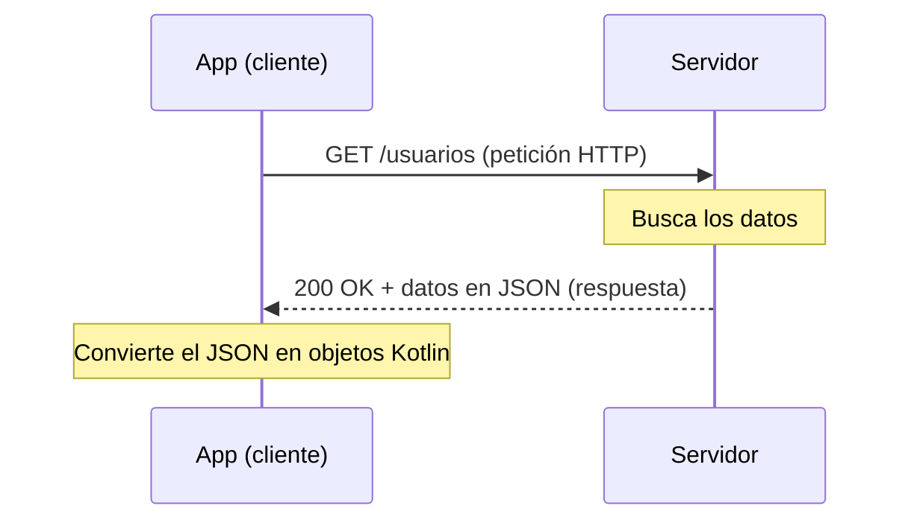

# Capítulo 43: HTTP, REST y JSON: cómo se comunican las apps con un servidor

## Introducción

Las aplicaciones rara vez trabajan aisladas. La mayoría obtienen sus datos de un **servidor** a través de internet: la lista de publicaciones de una red social, el clima de tu ciudad, el catálogo de una tienda. Antes de aprender a hacer eso con Retrofit, necesitas entender **cómo** se comunican una app y un servidor.

En este capítulo verás los tres pilares de esa comunicación: **HTTP** (el protocolo que usan para hablar), **REST** (la forma en que suele organizarse la API) y **JSON** (el formato en que viajan los datos). Al final los pondrás a prueba con la **API de contactos** del curso, la misma que usará tu proyecto final, desde el navegador y sin escribir código.

## El modelo cliente-servidor

La comunicación por internet sigue el modelo **cliente-servidor**. Tu app es el **cliente**: envía una **petición** (*request*) pidiendo algo. Del otro lado, un **servidor** recibe esa petición, hace su trabajo y devuelve una **respuesta** (*response*).

Es como pedir en un restaurante: tú (el cliente) haces un pedido al mesero, la cocina (el servidor) lo prepara y te devuelve el plato. Ni tú entras a la cocina ni la cocina decide por ti: cada uno cumple su rol, y se comunican mediante pedidos y entregas.

## HTTP: el protocolo

Para que el cliente y el servidor se entiendan, usan un **protocolo**: un conjunto de reglas comunes. En la web, ese protocolo es **HTTP** (*HyperText Transfer Protocol*). Toda la comunicación funciona en pares de **petición** y **respuesta**.

Una **petición** HTTP incluye, principalmente:

- Una **URL**: la dirección de aquello que pides (por ejemplo, `https://api.ejemplo.com/usuarios`).
- Un **método**, que indica **qué** quieres hacer. Los más comunes son:
  - `GET`: **obtener** datos.
  - `POST`: **crear** algo nuevo.
  - `PUT` (o `PATCH`): **modificar** algo existente.
  - `DELETE`: **eliminar** algo.

La **respuesta** del servidor incluye:

- Un **código de estado**, que resume cómo fue todo. La primera cifra indica la familia:
  - `2xx`: éxito.
  - `4xx`: error del cliente; por ejemplo, pediste algo que no existe o enviaste datos inválidos.
  - `5xx`: error del servidor.
- Un **cuerpo** (*body*) con los datos solicitados, normalmente en formato JSON.

Una petición también puede llevar un cuerpo. Es lo que ocurre al **crear** o **modificar** algo con `POST` o `PUT`: el cliente envía los datos del nuevo recurso en el cuerpo, también en JSON.

### Los códigos que vas a encontrar

Hay decenas de códigos, pero una app como la de este curso trabaja con unos pocos. Conviene conocerlos bien, porque la app debe reaccionar distinto a cada uno:

| Código | Nombre | Cuándo aparece | Qué hace la app |
|---|---|---|---|
| `200` | OK | La petición salió bien y la respuesta trae datos | Muestra los datos |
| `201` | Created | Un `POST` creó un recurso; la respuesta trae el recurso creado | Vuelve a la lista, que ya lo incluye |
| `204` | No Content | Salió bien, pero no hay nada que devolver (típico de `DELETE`) | Da la acción por terminada |
| `400` | Bad Request | Los datos enviados no son válidos | Muestra qué campo corregir |
| `404` | Not Found | El recurso no existe (por ejemplo, alguien lo eliminó) | Avisa que ya no existe |
| `409` | Conflict | La petición choca con el estado actual (por ejemplo, un correo repetido) | Explica el conflicto |
| `500` | Internal Server Error | Falló algo dentro del servidor | Muestra un error genérico y permite reintentar |

Fíjate en que un error `4xx` es **responsabilidad del cliente**: repetir la misma petición dará el mismo error. Un `5xx`, en cambio, puede resolverse solo, así que tiene sentido ofrecer **reintentar**.

## REST: el estilo de la API

Un servidor expone sus funciones a través de una **API** (interfaz de programación de aplicaciones): el conjunto de URLs a las que tu app puede llamar. **REST** es el **estilo** más común para diseñar esas APIs.

La idea central de REST son los **recursos**: las "cosas" que la API maneja (usuarios, productos, publicaciones). Cada recurso tiene su propia **URL** (llamada *endpoint*), y operas sobre él combinándola con un método HTTP:

- `GET /usuarios` → obtener la lista de usuarios.
- `GET /usuarios/42` → obtener el usuario con id 42.
- `POST /usuarios` → crear un usuario nuevo.
- `PUT /usuarios/42` → reemplazar los datos del usuario 42.
- `DELETE /usuarios/42` → eliminar el usuario 42.

Una URL también puede llevar **parámetros de consulta** (*query parameters*), después de un `?` y separados por `&`. Sirven para filtrar, ordenar o paginar sin cambiar el recurso: `GET /usuarios?search=ana&page=0` pide la primera página de los usuarios que coinciden con «ana».

Así, la **URL dice sobre qué** actúas y el **método dice qué haces**. Esta forma ordenada y predecible es lo que hace tan cómodas a las APIs REST.

## JSON: el formato de los datos

Cuando el servidor responde con datos, necesita un formato que ambos lados entiendan. El más usado es **JSON** (*JavaScript Object Notation*): un formato de texto, legible tanto para máquinas como para personas.

JSON representa los datos con dos estructuras básicas. Un **objeto**, entre llaves `{ }`, es un conjunto de pares **clave-valor** (te recordará a un mapa):

```json
{
  "id": 42,
  "nombre": "Ana",
  "activo": true
}
```

Y un **arreglo**, entre corchetes `[ ]`, es una **lista** de elementos:

```json
[
  { "id": 1, "nombre": "Ana" },
  { "id": 2, "nombre": "Diego" }
]
```

Fíjate en lo natural que resulta: un objeto JSON se parece muchísimo a una `data class` de Kotlin, y un arreglo, a una `List`. Esa cercanía es la que aprovecharemos para convertir el JSON en objetos de Kotlin, como verás al hablar de serialización.

## Todo junto: una petición de principio a fin

Reuniendo las tres piezas, así se ve una comunicación típica: tu app envía una petición HTTP a un *endpoint* REST, y el servidor responde con un código de estado y datos en JSON, que la app convierte en objetos.



Todo esto —abrir la conexión, enviar la petición, esperar la respuesta, interpretar el JSON— es trabajo que, por suerte, no tendrás que hacer a mano: de eso se encargarán `kotlinx.serialization` y **Retrofit**, en los próximos dos capítulos.

## Práctica: explorar la API de contactos

El repositorio del curso incluye una API REST real, en `code/contact-list-api/`: guarda contactos (nombre, apellido, correo, teléfono, dirección y ciudad) y permite listarlos, buscarlos, crearlos, modificarlos y eliminarlos. Es la API que consumirá tu proyecto final. Antes de escribir una línea de Kotlin contra ella, vale la pena conocerla desde fuera.

### Ponerla en marcha

La API está escrita en Java con Spring Boot. Necesitas tener instalado un JDK 21 (el mismo que usa Android Studio sirve). Desde una terminal, en la carpeta `code/contact-list-api/`, ejecuta:

```bash
./mvnw spring-boot:run     # en macOS o Linux (si no tiene permiso de ejecución: sh ./mvnw spring-boot:run)
mvnw.cmd spring-boot:run   # en Windows
```

La primera vez tarda unos minutos, porque descarga sus dependencias. Cuando la terminal muestre una línea con `Started ApiApplication`, la API estará escuchando en `http://localhost:8080`. Al arrancar, carga 50 contactos de ejemplo.

> [!NOTE]Nota
> La API guarda los datos **en memoria**: cada vez que la detienes y la vuelves a iniciar, se pierden tus cambios y vuelven los 50 contactos de ejemplo. Para practicar es una ventaja: nunca puedes «romperla» de forma permanente.

### Swagger: la documentación que se puede probar

Abre en el navegador `http://localhost:8080/swagger-ui.html`. Verás **Swagger UI**, una página generada a partir del código de la API que lista todos sus *endpoints*:

| Método | *Endpoint* | Qué hace |
|---|---|---|
| `GET` | `/api/contact` | Lista los contactos, por páginas. Acepta `search`, `page`, `size` y `sort` |
| `GET` | `/api/contact/{id}` | Obtiene un contacto |
| `POST` | `/api/contact` | Crea un contacto |
| `PUT` | `/api/contact/{id}` | Reemplaza los datos de un contacto |
| `DELETE` | `/api/contact/{id}` | Elimina un contacto |

Cada *endpoint* se despliega al hacer clic. El botón **Try it out** permite completar los parámetros y el cuerpo, y **Execute** envía la petición y muestra la respuesta real: el código de estado, las cabeceras y el cuerpo. Haz las siguientes pruebas.

**1. Obtener un contacto.** En `GET /api/contact/{id}`, escribe `1` como `id`. La respuesta es un `200` con un objeto JSON:

```json
{
  "_links": {
    "self": { "href": "http://localhost:8080/api/contact/1" },
    "update": { "href": "http://localhost:8080/api/contact/1" },
    "delete": { "href": "http://localhost:8080/api/contact/1" }
  },
  "id": 1,
  "firstName": "Miguel Ángel",
  "lastName": "Ramos",
  "email": "miguel.ramos@gmail.com",
  "phone": "+56969878505",
  "address": "Parcela Eva Meraz 8721",
  "city": "Estación Central"
}
```

Los datos del contacto vienen acompañados de un objeto `_links`, con las URLs de las operaciones que se pueden hacer sobre él. Es un formato llamado **HAL**; tu app no lo necesitará, y en el próximo capítulo verás cómo ignorarlo. (Los datos de ejemplo se generan al azar, así que tus nombres serán otros.)

**2. Pedir uno que no existe.** Repite con el `id` `9999`. Ahora la respuesta es un `404`, y el cuerpo describe el error:

```json
{
  "timestamp": "2026-09-23T13:02:16.962982797",
  "status": 404,
  "error": "Not Found",
  "message": "Contact not found",
  "path": "/api/contact/9999"
}
```

Todos los errores de esta API tienen esta misma forma, lo que permitirá tratarlos de manera uniforme.

**3. Listar por páginas.** En `GET /api/contact`, pon `page` en `0`, `size` en `2` y `sort` en `firstName,asc`. La respuesta no es un arreglo, sino un objeto con dos partes importantes:

```json
{
  "_embedded": {
    "contactResponseList": [
      { "id": 24, "firstName": "Adriana", "lastName": "Méndez", "...": "..." },
      { "id": 7, "firstName": "Alejandro", "lastName": "Banda", "...": "..." }
    ]
  },
  "_links": { "...": "..." },
  "page": { "number": 0, "size": 2, "totalElements": 50, "totalPages": 25 }
}
```

La lista está anidada dentro de `_embedded.contactResponseList`, y `page` cuenta en qué página estás y cuántas hay. La API no devuelve los 50 contactos de una vez: los entrega **por páginas**, y la app pedirá la siguiente cuando el usuario llegue al final de la lista.

**4. Buscar.** Deja `size` vacío y escribe un trozo de un apellido que hayas visto en `search`. Solo vuelven los contactos que coinciden. Luego busca `zzzz`: el `page` indica `totalElements: 0`, y la clave `_embedded` **no aparece**. Tu app tendrá que contemplar ese caso.

**5. Crear un contacto.** En `POST /api/contact`, reemplaza el cuerpo de ejemplo por este y ejecútalo:

```json
{
  "firstName": "Ana",
  "lastName": "Rojas",
  "email": "ana.rojas@example.com"
}
```

La respuesta es un `201 Created` con el contacto creado, que ya tiene un `id` asignado por el servidor. Como no enviaste teléfono, dirección ni ciudad, esas claves **no aparecen** en la respuesta.

**6. Provocar un conflicto.** Ejecuta exactamente el mismo `POST` otra vez. Ahora recibes un `409 Conflict`, con el mensaje `"Email contact already exists"`: la API no permite dos contactos con el mismo correo.

**7. Enviar datos inválidos.** Cambia el cuerpo por `{"firstName": "A", "lastName": "Rojas", "email": "malo"}`. La respuesta es un `400`, y el error trae una lista `errors` con un mensaje por cada campo que falló:

```json
{
  "status": 400,
  "error": "Bad Request",
  "message": "Validation error",
  "errors": [
    "email: debe ser una dirección de correo electrónico con formato correcto",
    "firstName: la longitud debe estar entre 3 y 150"
  ],
  "...": "..."
}
```

Cada mensaje empieza con el nombre del campo. Tu formulario usará esa información para marcar el campo exacto que hay que corregir.

**8. Eliminar.** En `DELETE /api/contact/{id}`, usa el `id` del contacto que creaste. La respuesta es un `204 No Content`, sin cuerpo. Si repites la petición, obtienes un `404`.

> [!TIP]Sugerencia
> Swagger UI no es la única forma de probar una API. Debajo de cada respuesta muestra el comando `curl` equivalente, que puedes copiar en una terminal. Y la especificación completa, en formato JSON, está en `http://localhost:8080/v3/api-docs`.

Acabas de recorrer, a mano, todo lo que hará tu app de contactos: listar por páginas, buscar, ver el detalle, crear, editar y eliminar, y reaccionar a cada código de error.

## Resumen

En este capítulo, más conceptual, entendiste cómo se comunican las apps con un servidor:

- Las apps siguen el modelo **cliente-servidor**: el cliente (tu app) envía una **petición** y el servidor devuelve una **respuesta**.
- **HTTP** es el protocolo de esa comunicación. Una petición lleva una **URL**, un **método** (`GET`, `POST`, `PUT`, `DELETE`) y, al crear o modificar, un **cuerpo**; la respuesta trae un **código de estado** y, a menudo, un cuerpo de datos.
- Los códigos más habituales son `200`, `201` y `204` (éxito), `400`, `404` y `409` (errores del cliente) y `500` (error del servidor). La app debe reaccionar distinto a cada familia.
- **REST** es el estilo más común de API: expone **recursos** con su **URL** (*endpoint*), sobre los que operas según el método HTTP. Los **parámetros de consulta** (`?search=ana&page=0`) filtran y paginan.
- **JSON** es el formato habitual de los datos: **objetos** (`{ }`, clave-valor) y **arreglos** (`[ ]`, listas), que se parecen mucho a las `data class` y `List` de Kotlin.
- La **API de contactos** del curso se ejecuta con `./mvnw spring-boot:run` y se explora en **Swagger UI** (`/swagger-ui.html`). Entrega los contactos por páginas en formato HAL, y sus errores tienen siempre la misma forma, con una lista `errors` en los `400`.

En el próximo capítulo verás cómo convertir ese JSON en objetos de Kotlin con **`kotlinx.serialization`**, todavía sin conectarte a la red.
