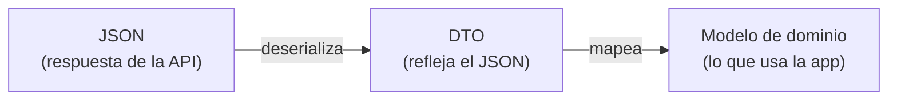

# Capítulo 44: Serialización JSON y modelos de datos (DTO)

## Introducción

En el capítulo anterior exploraste la API de contactos y viste que todas sus respuestas son **texto JSON**. Pero tu app no trabaja con texto: trabaja con objetos de Kotlin. Antes de conectarte a la red, necesitas resolver cómo se convierte uno en otro. Ese proceso se llama **serialización**.

En este capítulo aprenderás a describir el JSON con clases de Kotlin usando **`kotlinx.serialization`**, a resolver los casos difíciles que ya encontraste en Swagger (claves que sobran, claves que faltan, nombres incómodos, objetos anidados) y a organizar esas clases con un patrón importante: los **DTOs**, que separan los datos tal como vienen de la API de los modelos que tu app realmente usa.

Todo se practica **sin red**, con textos JSON copiados de Swagger. Así, cuando en el próximo capítulo conectes Retrofit, la conversión ya estará resuelta y probada.

## Serialización y deserialización

Son dos conceptos, uno el inverso del otro:

- **Serializar** es convertir un objeto en un formato de texto para enviarlo o guardarlo; por ejemplo, un objeto de Kotlin → un texto JSON.
- **Deserializar** es lo contrario: tomar ese texto y reconstruir el objeto; un texto JSON → un objeto de Kotlin.

Tu app hará las dos cosas: **deserializar** las respuestas de la API (la lista, el detalle, los errores) y **serializar** los datos de un contacto nuevo para enviarlos en el cuerpo de un `POST`. Por costumbre, se suele llamar «serialización» a todo el tema.

## Configurar `kotlinx.serialization`

**`kotlinx.serialization`** es la biblioteca oficial de Kotlin para esto. Tiene dos partes: un **plugin del compilador**, que genera el código de conversión de cada clase, y una **biblioteca** con el formato JSON. En el catálogo `gradle/libs.versions.toml`:

```toml
[versions]
kotlinxSerialization = "1.11.0"

[libraries]
kotlinx-serialization-json = { group = "org.jetbrains.kotlinx", name = "kotlinx-serialization-json", version.ref = "kotlinxSerialization" }

[plugins]
kotlin-serialization = { id = "org.jetbrains.kotlin.plugin.serialization", version.ref = "kotlin" }
```

Fíjate en que el plugin usa la versión de **Kotlin** (`version.ref = "kotlin"`), la misma que el plugin de Compose que ya tiene tu proyecto: el plugin es parte del compilador y debe coincidir con él.

En el `build.gradle.kts` de la raíz:

```kotlin
plugins {
    // ... los que ya tenías
    alias(libs.plugins.kotlin.serialization) apply false
}
```

Y en el del módulo `app`:

```kotlin
plugins {
    // ... los que ya tenías
    alias(libs.plugins.kotlin.serialization)
}

dependencies {
    // ... las que ya tenías
    implementation(libs.kotlinx.serialization.json)
}
```

Pulsa **Sync Now**.

## Modelar el JSON con `@Serializable`

Recuerda la respuesta de `GET /api/contact/1`, sin el objeto `_links` por ahora:

```json
{
  "id": 1,
  "firstName": "Miguel Ángel",
  "lastName": "Ramos",
  "email": "miguel.ramos@gmail.com",
  "phone": "+56969878505",
  "address": "Parcela Eva Meraz 8721",
  "city": "Estación Central"
}
```

Para que `kotlinx.serialization` sepa convertirla, se escribe una `data class` marcada con **`@Serializable`**, con una propiedad por cada clave y **con el mismo nombre**:

```kotlin
@Serializable
data class ContactDto(
    val id: Int,
    val firstName: String,
    val lastName: String,
    val email: String,
    val phone: String? = null,
    val address: String? = null,
    val city: String? = null
)
```

Y para convertir, se usa el objeto `Json`:

```kotlin
val contacto = Json.decodeFromString<ContactDto>(textoJson)
println(contacto.firstName)   // Miguel Ángel
```

`decodeFromString` lee el texto, empareja cada clave con la propiedad del mismo nombre y crea el objeto. El tipo entre `< >` le dice qué clase construir. Los tipos también se comprueban: si `id` viniera como texto, la conversión fallaría.

> [!NOTE]Nota
> Las propiedades están en inglés porque deben llamarse igual que las claves del JSON. Es una excepción deliberada a la costumbre del curso de nombrar en español, y un primer indicio de que esta clase le pertenece a la API, no a tu app. Volveremos sobre esto al hablar de los DTOs.

## Las claves que sobran: `ignoreUnknownKeys`

La respuesta real, sin embargo, trae además el objeto `_links` del formato HAL, que `ContactDto` no declara. Si intentas convertirla tal cual, falla:

```text
JsonDecodingException: Unexpected JSON token at offset 6:
Encountered an unknown key '_links' at path: $
```

Por defecto, `kotlinx.serialization` es estricto: una clave desconocida podría ser un error de escritura en tu clase, y prefiere avisarte. Con una API que no controlas, en cambio, lo normal es que traiga más datos de los que te interesan, y que agregue campos nuevos con el tiempo. Por eso se crea una instancia de `Json` configurada para **ignorar** las claves desconocidas:

```kotlin
val json = Json { ignoreUnknownKeys = true }

val contacto = json.decodeFromString<ContactDto>(textoJson)
```

`Json { ... }` es una lambda con receptor, como las del capítulo 21: dentro de las llaves se configuran las opciones. Usa siempre esta instancia, no el `Json` sin configurar. Es un ajuste casi obligatorio al consumir APIs.

## Las claves que faltan: valores por defecto

En el paso 5 de la práctica con Swagger creaste un contacto sin teléfono, dirección ni ciudad, y la respuesta **no traía esas claves**:

```json
{ "id": 51, "firstName": "Ana", "lastName": "Rojas", "email": "ana.rojas@example.com" }
```

Por eso, en `ContactDto`, esas tres propiedades son anulables **y tienen un valor por defecto**: `val phone: String? = null`. Con esa respuesta, el resultado es:

```text
ContactDto(id=51, firstName=Ana, lastName=Rojas, email=ana.rojas@example.com, phone=null, address=null, city=null)
```

Las dos partes son necesarias. El `?` permite que la propiedad sea `null`, pero no le dice a `kotlinx.serialization` qué hacer si la clave no aparece. Sin el `= null`, la conversión falla:

```text
MissingFieldException: Field 'phone' is required for type with serial name 'ContactDto', but it was missing
```

La regla es simple: si una clave **puede no venir**, dale un valor por defecto. Si **siempre viene** (como `id` o `email`), no se lo des: así, si algún día faltara, te enterarías de inmediato.

## Nombres incómodos y objetos anidados: `@SerialName`

La respuesta de la lista paginada es más compleja. Recuerda su forma:

```json
{
  "_embedded": {
    "contactResponseList": [
      { "id": 24, "firstName": "Adriana", "...": "..." },
      { "id": 7, "firstName": "Alejandro", "...": "..." }
    ]
  },
  "_links": { "...": "..." },
  "page": { "number": 0, "size": 2, "totalElements": 50, "totalPages": 25 }
}
```

Cada objeto JSON se modela con su propia clase, y las clases se anidan igual que los objetos:

```kotlin
@Serializable
data class ContactPageDto(
    @SerialName("_embedded") val embedded: ContactEmbeddedDto? = null,
    val page: PageInfoDto
)

@Serializable
data class ContactEmbeddedDto(
    @SerialName("contactResponseList") val contacts: List<ContactDto> = emptyList()
)

@Serializable
data class PageInfoDto(
    val number: Int,
    val size: Int,
    val totalElements: Int,
    val totalPages: Int
)
```

- Un arreglo JSON se convierte en una `List`: `List<ContactDto>`.
- **`@SerialName`** conecta una propiedad con una clave de **otro nombre**. `_embedded` no es un nombre cómodo en Kotlin, así que la propiedad se llama `embedded`, y `@SerialName("_embedded")` indica cómo se llama en el JSON. Lo mismo con `contactResponseList`, que en Kotlin se llama simplemente `contacts`. También lo encontrarás para APIs que usan `snake_case` (`first_name`) cuando en Kotlin prefieres `camelCase`.
- `embedded` es anulable y tiene `= null` porque, como viste al buscar `zzzz`, **la clave `_embedded` no aparece** cuando no hay resultados. Con esa respuesta, el resultado es un `ContactPageDto` con `embedded = null` y `totalElements = 0`, sin errores.
- `_links` no se declara: `ignoreUnknownKeys` lo descarta.

## Los errores también son JSON

Los errores de la API tienen siempre la misma forma, así que también se modelan:

```kotlin
@Serializable
data class ApiErrorDto(
    val status: Int? = null,
    val error: String? = null,
    val message: String? = null,
    val errors: List<String> = emptyList()
)
```

Aquí todo tiene valor por defecto, porque un error puede venir incompleto (y no queremos que convertir un error provoque **otro** error). `errors` solo viene en los `400`; en los demás casos queda como lista vacía. En el capítulo 46 usarás esta clase para mostrar mensajes útiles.

## Serializar: el cuerpo de un `POST`

Para crear un contacto hay que enviar un JSON con sus datos. Se modela igual, con una clase propia, porque no tiene `id` (lo asigna el servidor):

```kotlin
@Serializable
data class ContactRequestDto(
    val firstName: String,
    val lastName: String,
    val email: String,
    val phone: String? = null,
    val address: String? = null,
    val city: String? = null
)
```

Y se convierte en texto con `encodeToString`:

```kotlin
val nuevo = ContactRequestDto(firstName = "Ana", lastName = "Rojas", email = "ana.rojas@example.com")
println(json.encodeToString(nuevo))
// {"firstName":"Ana","lastName":"Rojas","email":"ana.rojas@example.com"}
```

Las propiedades que tienen su valor por defecto (aquí, los tres `null`) **no se escriben**: el JSON queda igual al que enviaste a mano desde Swagger. Si agregas `city = "Temuco"`, esa clave sí aparece.

En la app no llamarás a `encodeToString` ni a `decodeFromString` directamente: Retrofit lo hará por ti en cada petición, usando esta misma instancia de `Json`. Pero entender qué ocurre te permitirá diagnosticar los errores de conversión cuando aparezcan.

## Pruébalo sin red

Las conversiones son funciones puras: reciben un texto y devuelven un objeto. Son perfectas para una prueba unitaria como las del tutorial 4, que se ejecuta en segundos. En `src/test/` de tu proyecto, crea `ContactDtoTest.kt`:

```kotlin
class ContactDtoTest {

    private val json = Json { ignoreUnknownKeys = true }

    @Test
    fun convierteUnContactoSinDatosOpcionales() {
        val texto = """{"id": 51, "firstName": "Ana", "lastName": "Rojas", "email": "ana.rojas@example.com"}"""

        val contacto = json.decodeFromString<ContactDto>(texto)

        assertEquals("Ana", contacto.firstName)
        assertNull(contacto.phone)
    }

    @Test
    fun convierteUnaBusquedaSinResultados() {
        val texto = """{"page": {"number": 0, "size": 20, "totalElements": 0, "totalPages": 0}}"""

        val pagina = json.decodeFromString<ContactPageDto>(texto)

        assertNull(pagina.embedded)
        assertEquals(0, pagina.page.totalElements)
    }
}
```

El texto va entre **triples comillas** (`"""`), las *raw strings* de Kotlin, que permiten escribir comillas dobles sin escaparlas. Copia en otras pruebas las respuestas reales que obtuviste en Swagger: el detalle con `_links`, la lista paginada y los errores `400` y `409`.

## DTOs: separar los datos de la API de tu modelo

Fíjate en que todas estas clases terminan en **`Dto`**. No es casual: indica que son **DTOs** (*Data Transfer Objects*, «objetos de transferencia de datos»), clases cuyo único propósito es **reflejar la forma del JSON** de la API.

¿Por qué no usar `ContactDto` directamente en toda la app? Por dos razones:

- La forma en que la API entrega los datos no siempre es la más cómoda para tu aplicación: nombres en otro idioma, listas anidadas dos niveles dentro de `_embedded`, datos que no necesitas.
- Si la API **cambia** (por ejemplo, renombra `phone` a `mobile`), no quieres que ese cambio se propague por todas tus pantallas.

Por eso es buena práctica **separar** los DTOs de tus **modelos de dominio**: las clases limpias que tu app realmente usa, con los nombres y la forma que le convienen. Para los contactos:

```kotlin
// Modelo de dominio: lo que usa la app
data class Contacto(
    val id: Int,
    val nombre: String,
    val apellido: String,
    val email: String,
    val telefono: String? = null,
    val direccion: String? = null,
    val ciudad: String? = null
) {
    val nombreCompleto: String
        get() = "$nombre $apellido"
}

// Mapeo de DTO a modelo de dominio
fun ContactDto.aDominio(): Contacto = Contacto(
    id = id,
    nombre = firstName,
    apellido = lastName,
    email = email,
    telefono = phone,
    direccion = address,
    ciudad = city
)
```

- `Contacto` **no** es `@Serializable`: no sabe nada de JSON. Puede tener propiedades calculadas, como `nombreCompleto`, que la API no conoce.
- El mapeo es una **función de extensión** (capítulo 20). Verás el mismo patrón en el capítulo 47 con Room: cada fuente de datos tiene sus propias clases, y se traducen al modelo de dominio en el borde de la capa de datos.

Así, si mañana la API renombra un campo, solo ajustas el DTO y su mapeo; el resto de la app, que trabaja con `Contacto`, ni se entera.

## El flujo completo

Reuniendo las piezas, el recorrido de un dato desde la API hasta tu app será:



- Retrofit hará la petición y recibirá el **JSON** (próximo capítulo).
- `kotlinx.serialization` lo **deserializa** en un **DTO**, con la instancia de `Json` que configuraste.
- El repositorio **mapea** el DTO a un **modelo de dominio**.
- El `ViewModel` y la interfaz trabajan solo con ese modelo limpio.

Cada capa recibe los datos en la forma que le conviene, y los detalles de la API quedan contenidos en un solo lugar.

## Resumen

- **Serializar** es objeto → texto (JSON); **deserializar** es texto → objeto. Tu app deserializa respuestas y serializa los cuerpos de `POST` y `PUT`.
- **`kotlinx.serialization`** necesita un plugin del compilador (con la versión de Kotlin) y la biblioteca `kotlinx-serialization-json`.
- Las clases se marcan con **`@Serializable`**, con propiedades del mismo nombre que las claves. `decodeFromString` y `encodeToString` hacen la conversión.
- Usa una instancia `Json { ignoreUnknownKeys = true }` para que las claves que sobran (como `_links`) no provoquen errores.
- Si una clave **puede faltar**, la propiedad necesita un **valor por defecto** (`String? = null`), no solo el `?`. Al serializar, las propiedades con su valor por defecto no se escriben.
- **`@SerialName`** conecta una propiedad con una clave de otro nombre (`_embedded`). Los objetos anidados se modelan con clases anidadas, y los arreglos con `List`.
- Un **DTO** refleja el JSON de la API; el **modelo de dominio** es lo que usa la app. Se traducen con funciones de extensión como `aDominio()`, para que los cambios de la API no afecten a toda la app.

En el próximo capítulo conectarás todo esto a la red con **Retrofit**: pedirás la lista de contactos a la API en ejecución y la verás llegar convertida en objetos.
