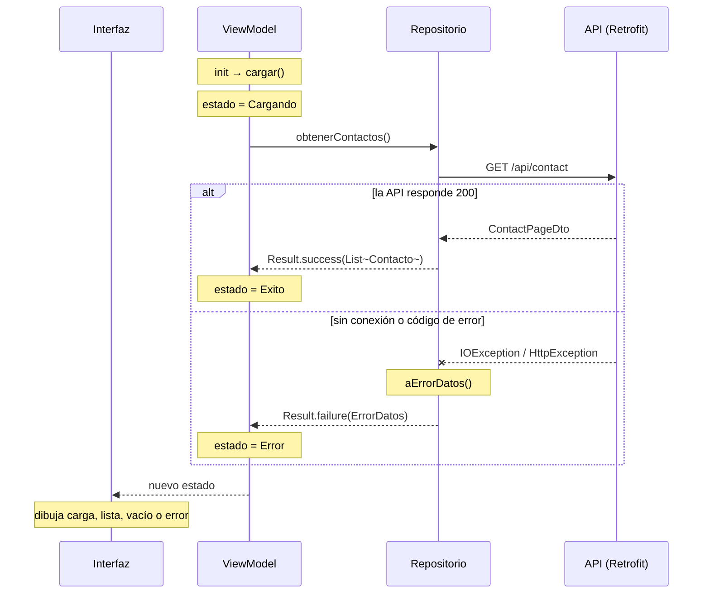

# Capítulo 46: Estados de red: *loading*, *success* y *error*

## Introducción

En el capítulo anterior hiciste tu primera petición con Retrofit. Mientras la API esté en marcha y todo salga bien, funciona. Pero una petición de red tiene dos características que no puedes ignorar: **toma tiempo** y **puede fallar**. El servidor puede estar apagado, el teléfono sin conexión, el contacto puede haber sido eliminado por otra persona o el formulario puede traer un correo repetido.

En este capítulo aprenderás a manejar esas situaciones de principio a fin: modelar los estados de una pantalla que depende de la red, iniciar la carga en el momento correcto, **distinguir los tipos de error** y convertirlos en mensajes útiles, y ofrecer **reintentar**. Es el último paso para que la app se comporte bien con una red real.

## Los estados de una pantalla que carga datos

Mientras espera o después de pedir datos, una pantalla como la lista de contactos está siempre en uno de estos estados:

- **Cargando**: la petición está en curso. Se muestra un indicador de progreso.
- **Éxito**: los datos llegaron. Se muestran.
- **Vacío**: la petición salió bien, pero no hay nada que mostrar. Es un éxito, pero merece su propio mensaje («Todavía no hay contactos»), no una pantalla en blanco.
- **Error**: algo salió mal. Se muestra un mensaje que diga **qué** pasó y, si tiene sentido, un botón para **reintentar**.

Los estados son excluyentes: la pantalla está en uno solo a la vez. Es el caso ideal para una jerarquía sellada, como las `sealed class` del capítulo 19. Aquí se usa una **`sealed interface`**, que funciona igual en un `when` pero no tiene constructor, y casos declarados con **`data object`**, un `object` que además se imprime con su nombre (`Cargando`) en lugar de una dirección de memoria:

```kotlin
sealed interface ContactosUiState {
    data object Cargando : ContactosUiState
    data class Exito(val contactos: List<Contacto>) : ContactosUiState
    data class Error(val error: ErrorDatos) : ContactosUiState
}
```

El estado vacío no necesita un caso propio: es un `Exito` con la lista vacía, y la interfaz lo distingue al dibujar. El `Error` no guarda un texto, sino un **`ErrorDatos`**: el tipo de error, que definirás enseguida. Qué texto mostrar para cada tipo lo decidirá la interfaz.

## Iniciar la carga: en el `init`

El `ViewModel` pide los datos y va cambiando el estado. La primera carga se lanza en el bloque `init`, como recomendaba el capítulo 40:

```kotlin
@HiltViewModel
class ContactosViewModel @Inject constructor(
    private val repository: ContactosRepository
) : ViewModel() {

    private val _uiState = MutableStateFlow<ContactosUiState>(ContactosUiState.Cargando)
    val uiState: StateFlow<ContactosUiState> = _uiState.asStateFlow()

    init {
        cargar()
    }

    fun cargar() {
        viewModelScope.launch {
            _uiState.value = ContactosUiState.Cargando
            _uiState.value = repository.obtenerContactos().fold(
                onSuccess = { contactos -> ContactosUiState.Exito(contactos) },
                onFailure = { error -> ContactosUiState.Error(error.comoErrorDatos()) }
            )
        }
    }
}
```

- El estado **inicial** ya es `Cargando`, y el `init` llama a `cargar()`. Si olvidaras esa llamada, la pantalla mostraría el indicador de progreso para siempre: un error clásico.
- En el `init`, la carga ocurre **una sola vez** por `ViewModel`. Al girar el dispositivo, la pantalla se recrea, pero el `ViewModel` no, así que no se repite la petición.
- `cargar()` es **pública**: el botón «Reintentar» la vuelve a llamar.
- `repository.obtenerContactos()` ya no devuelve una lista, sino un **`Result`** con la lista o con el error. Veamos por qué.

## Por qué el repositorio devuelve `Result`

En el capítulo 14 viste `Result`: un valor que representa un éxito (con un dato) o un fallo (con una excepción), y `runCatching` para obtenerlo. Si el repositorio lanzara las excepciones de Retrofit hacia arriba, cada `ViewModel` tendría que envolver cada llamada en un `try`/`catch`, y conocer `HttpException`, que es un detalle de Retrofit. En cambio, si devuelve un `Result`, el contrato lo dice claramente: **esta operación puede fallar**, y quien la llama está obligado a pensar en los dos casos.

Además de `getOrNull()` y `getOrDefault()`, un `Result` tiene tres funciones que usarás mucho:

```kotlin
resultado
    .onSuccess { contactos -> println("Llegaron ${contactos.size}") }
    .onFailure { error -> println("Falló: ${error.message}") }

val estado = resultado.fold(
    onSuccess = { contactos -> ContactosUiState.Exito(contactos) },
    onFailure = { error -> ContactosUiState.Error(error.comoErrorDatos()) }
)
```

- **`onSuccess { }`** ejecuta el bloque solo si hubo éxito, y **`onFailure { }`** solo si hubo fallo. Las dos devuelven el mismo `Result`, así que se pueden encadenar.
- **`fold`** convierte el `Result` en otro valor, con una función para cada caso. Es lo que usa el `ViewModel` para obtener el nuevo estado en una sola expresión.

Para crear un `Result` a mano, se usan `Result.success(valor)` y `Result.failure(excepcion)`.

## Los tipos de error

«No se pudieron cargar los datos» es un mal mensaje: no dice si el problema es la conexión, el servidor o los datos, ni si reintentar servirá. Para dar mensajes útiles hay que **distinguir** los errores. Con Retrofit, se reducen a dos familias:

| Excepción | Cuándo ocurre | Ejemplos |
|---|---|---|
| `IOException` | La petición **no llegó** al servidor o la respuesta no llegó completa | Sin red, servidor apagado, tiempo de espera agotado |
| `HttpException` | El servidor **respondió**, pero con un código que no es `2xx` | `400`, `404`, `409`, `500` |

Dentro de `HttpException`, el método `code()` da el código, y `response()?.errorBody()` da el cuerpo del error: el JSON con `message` y `errors` que modelaste como `ApiErrorDto` en el capítulo 44.

Pero el `ViewModel` no debería conocer `IOException` ni `HttpException`. La solución es **traducir** los errores en la capa de datos a un tipo propio de la app. Crea `model/ErrorDatos.kt`:

```kotlin
/**
 * Los errores que la capa de datos puede entregar hacia arriba.
 * El ViewModel y la interfaz trabajan con estos casos, no con excepciones de Retrofit.
 */
sealed class ErrorDatos(mensaje: String) : Exception(mensaje) {
    class SinConexion : ErrorDatos("Sin conexión con el servidor")
    class NoEncontrado : ErrorDatos("Recurso no encontrado")
    class Conflicto(mensaje: String) : ErrorDatos(mensaje)
    class Validacion(val errores: List<String>) : ErrorDatos("Datos no válidos")
    class Desconocido(mensaje: String) : ErrorDatos(mensaje)
}

fun Throwable.comoErrorDatos(): ErrorDatos =
    this as? ErrorDatos ?: ErrorDatos.Desconocido(message ?: "Error desconocido")
```

- `ErrorDatos` es una clase **sellada** que hereda de `Exception`, para poder viajar dentro de un `Result.failure`. Cada subclase es un caso que la interfaz sabe explicar.
- `Validacion` guarda la lista `errors` del `400`: el formulario la usará para marcar cada campo.
- `comoErrorDatos()` es una función de extensión para el lado del `ViewModel`: `Result` guarda el fallo como un `Throwable` general, y esta función lo convierte de vuelta en un `ErrorDatos`. Si por algún motivo no lo es, lo trata como `Desconocido`.

La traducción vive en la capa de datos, junto a Retrofit, en `data/remote/Errores.kt`:

```kotlin
/** Traduce cualquier excepción de red a un [ErrorDatos] que el resto de la app entiende. */
fun Throwable.aErrorDatos(json: Json): ErrorDatos = when (this) {
    is ErrorDatos -> this
    is IOException -> ErrorDatos.SinConexion()
    is HttpException -> {
        val cuerpo = response()?.errorBody()?.string()
        val error = cuerpo?.let { runCatching { json.decodeFromString<ApiErrorDto>(it) }.getOrNull() }
        when (code()) {
            400 -> ErrorDatos.Validacion(error?.errors.orEmpty())
            404 -> ErrorDatos.NoEncontrado()
            409 -> ErrorDatos.Conflicto(error?.message ?: "Conflicto")
            else -> ErrorDatos.Desconocido(error?.message ?: "HTTP ${code()}")
        }
    }
    else -> ErrorDatos.Desconocido(message ?: "Error desconocido")
}
```

El `when` con `is` revisa el tipo de la excepción. Para los errores HTTP, lee el cuerpo como texto y lo convierte en un `ApiErrorDto` dentro de un `runCatching`: si el cuerpo no fuera JSON válido, no queremos que traducir un error provoque otro. Luego decide según el código.

> [!NOTE]Nota
> `SocketTimeoutException`, la excepción que aparece cuando falta el permiso de red local (capítulo 45) o el servidor no responde a tiempo, es una subclase de `IOException`. Por eso también se traduce a `SinConexion`.

## Un ayudante en el repositorio

Todas las operaciones del repositorio harán lo mismo: llamar a la API, devolver un `Result.success` si sale bien y un `Result.failure` con el error traducido si falla. Para no repetirlo, se escribe una función privada:

```kotlin
class ContactosRepositoryImpl @Inject constructor(
    private val api: ContactApi,
    private val json: Json
) : ContactosRepository {

    override suspend fun obtenerContactos(): Result<List<Contacto>> =
        llamarApi {
            api.obtenerContactos(pagina = 0, tamano = 20)
                .embedded?.contacts.orEmpty()
                .map { it.aDominio() }
        }

    /**
     * Ejecuta una llamada a la API y convierte cualquier fallo en un [ErrorDatos].
     * La cancelación se vuelve a lanzar: no es un error, es la coroutine que termina.
     */
    private suspend fun <T> llamarApi(bloque: suspend () -> T): Result<T> =
        try {
            Result.success(bloque())
        } catch (e: CancellationException) {
            throw e
        } catch (e: Exception) {
            Result.failure(e.aErrorDatos(json))
        }
}
```

- `llamarApi` es **genérica** (capítulo 20): funciona igual para una lista, un contacto o `Unit`. Recibe la llamada como una lambda `suspend`, la ejecuta y envuelve el resultado.
- El repositorio pide el `Json` por su constructor: es el mismo que provee el `NetworkModule` del capítulo anterior.
- Y la interfaz del repositorio cambia de `suspend fun obtenerContactos(): List<Contacto>` a `suspend fun obtenerContactos(): Result<List<Contacto>>`.

¿Por qué el `catch` de `CancellationException`, que **vuelve a lanzar** la excepción? En el capítulo 23 viste que, cuando el `ViewModel` se destruye, `viewModelScope` **cancela** sus coroutines. Lo que no viste es cómo: la cancelación hace que la función `suspend` en curso lance una `CancellationException`, que sube por la coroutine hasta detenerla. Si un `catch (e: Exception)` la atrapara, la coroutine creería que la petición falló y seguiría ejecutándose, en lugar de detenerse. La regla: **nunca te tragues una `CancellationException`**.

> [!WARNING]Advertencia
> Por la misma razón, evita `runCatching` alrededor de funciones `suspend`: atrapa **todo**, incluida la cancelación. Úsalo, como en `aErrorDatos`, para código que no suspende.

## La interfaz: reaccionar a cada estado

La interfaz observa el estado y decide qué mostrar en cada caso, con un `when` exhaustivo:

```kotlin
@Composable
fun ContactosScreen(viewModel: ContactosViewModel = hiltViewModel()) {
    val uiState by viewModel.uiState.collectAsStateWithLifecycle()

    when (val estado = uiState) {
        is ContactosUiState.Cargando -> EstadoCargando()
        is ContactosUiState.Error ->
            EstadoError(error = estado.error, onReintentar = viewModel::cargar)
        is ContactosUiState.Exito ->
            if (estado.contactos.isEmpty()) {
                EstadoVacio(mensaje = stringResource(R.string.lista_vacia))
            } else {
                ListaContactos(estado.contactos)
            }
    }
}
```

Fíjate en el `when (val estado = uiState)`. `uiState` es una propiedad delegada con `by`, y Kotlin no puede hacer *smart cast* sobre ella: su valor podría cambiar entre la comprobación `is` y el uso. Al copiarla en una variable local, `estado`, el *smart cast* funciona, y dentro de cada rama puedes usar `estado.error` o `estado.contactos` directamente.

Los tres composables de estado son pequeños y reutilizables. `EstadoCargando` centra un `CircularProgressIndicator`, y `EstadoVacio` un texto. `EstadoError` muestra un ícono, el mensaje y el botón:

```kotlin
@Composable
fun EstadoError(
    error: ErrorDatos,
    onReintentar: () -> Unit,
    modifier: Modifier = Modifier
) {
    Column(
        modifier = modifier
            .fillMaxSize()
            .padding(32.dp),
        verticalArrangement = Arrangement.spacedBy(16.dp, Alignment.CenterVertically),
        horizontalAlignment = Alignment.CenterHorizontally
    ) {
        Icon(
            imageVector = Icons.Default.Warning,
            contentDescription = null,
            tint = MaterialTheme.colorScheme.error
        )
        Text(
            text = mensajeDe(error),
            style = MaterialTheme.typography.bodyLarge,
            textAlign = TextAlign.Center
        )
        Button(onClick = onReintentar) {
            Text(stringResource(R.string.reintentar))
        }
    }
}
```

El texto sale de una función que traduce cada tipo de error a un recurso de `strings.xml`:

```kotlin
/** Convierte un error de datos en un texto para el usuario, desde los recursos de la app. */
@Composable
fun mensajeDe(error: ErrorDatos): String = when (error) {
    is ErrorDatos.SinConexion -> stringResource(R.string.error_sin_conexion)
    is ErrorDatos.NoEncontrado -> stringResource(R.string.error_no_encontrado)
    is ErrorDatos.Conflicto -> stringResource(R.string.error_conflicto)
    is ErrorDatos.Validacion -> stringResource(R.string.error_validacion)
    is ErrorDatos.Desconocido -> stringResource(R.string.error_desconocido)
}
```

```xml
<string name="reintentar">Reintentar</string>
<string name="error_sin_conexion">No se pudo conectar con el servidor. Revisa tu conexión y que la API esté en ejecución.</string>
<string name="error_no_encontrado">El contacto ya no existe.</string>
<string name="error_conflicto">Ya existe un contacto con ese correo electrónico.</string>
<string name="error_validacion">Revisa los datos del formulario.</string>
<string name="error_desconocido">Ocurrió un error inesperado.</string>
```

- El `when` sobre una clase sellada es **exhaustivo**: si mañana agregas un caso a `ErrorDatos`, este `when` dejará de compilar hasta que le des un mensaje.
- Los textos para el usuario viven en la interfaz, en recursos traducibles. El `ViewModel` solo dice **qué** pasó; la interfaz decide **cómo** decirlo.
- El mensaje de `SinConexion` sugiere qué revisar. Los mensajes que ayudan a resolver el problema son mucho mejores que los que solo lo anuncian.

## Pruébalo: provoca los errores

Con la app conectada a la API, provoca cada situación:

1. **Sin conexión.** Detén la API (`Ctrl+C` en su terminal) y pulsa **Reintentar**, o reinicia la app. Debe aparecer el mensaje de `SinConexion`. En Logcat verás la línea `-->` de la petición, pero ninguna `<--`.
2. **Recuperación.** Vuelve a iniciar la API y pulsa **Reintentar**: aparece la lista.
3. **Modo avión.** Activa el modo avión del emulador y reintenta. Es el mismo caso: `SinConexion`.
4. **Lista vacía.** Esto no se puede provocar fácilmente con la API del curso, que siempre arranca con 50 contactos. Para verlo, cambia temporalmente `obtenerContactos` para que pida `busqueda = "zzzz"`.

Los errores `404`, `409` y `400` aparecerán en el proyecto final, al ver el detalle de un contacto eliminado y al guardar el formulario.

## El flujo completo



Cada capa tiene un trabajo claro frente a los errores. **Retrofit** lanza excepciones. El **repositorio** las atrapa y las traduce a `ErrorDatos`, dentro de un `Result`. El **`ViewModel`** convierte el `Result` en un estado. La **interfaz** convierte el estado en algo que el usuario entiende.

## Resumen

- Una pantalla que depende de la red está en uno de cuatro estados: **cargando**, **éxito**, **vacío** o **error**. Se modelan con una `sealed interface`; el vacío es un éxito con la lista vacía.
- La primera carga se lanza en el **`init`** del `ViewModel`: una sola vez, y sin repetirse al girar. La función de carga es pública para poder **reintentar**.
- El repositorio devuelve **`Result`**, que obliga a quien llama a considerar el fallo. `onSuccess`, `onFailure` y `fold` permiten tratar cada caso.
- Con Retrofit hay dos familias de error: **`IOException`** (la petición no llegó) y **`HttpException`** (el servidor respondió con un código de error, que se lee con `code()`, y un cuerpo con `errorBody()`).
- La capa de datos **traduce** esas excepciones a un tipo propio, la clase sellada **`ErrorDatos`**, para que el `ViewModel` y la interfaz no dependan de Retrofit.
- Nunca atrapes una **`CancellationException`** sin volver a lanzarla: es el mecanismo con el que se detiene una coroutine cancelada.
- La interfaz decide qué mostrar con un `when` exhaustivo y traduce cada tipo de error a un mensaje de `strings.xml`, con un botón para reintentar.

Ya tienes la arquitectura completa para trabajar con un servidor. Falta una última fuente de datos: el **propio teléfono**. En el próximo capítulo aprenderás a guardar datos localmente con **Room**, detrás del mismo repositorio.
