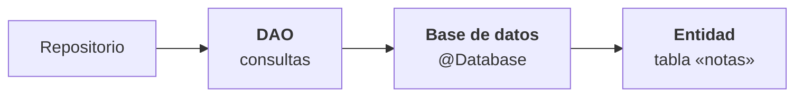
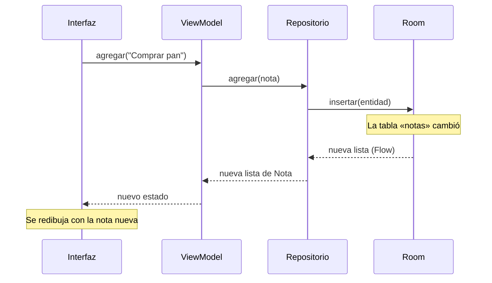

# Capítulo 47: Persistencia local con Room

## Introducción

Hasta ahora, los datos de tus apps vivían en memoria o en un servidor. Los de memoria se pierden cuando Android cierra la app; los del servidor necesitan conexión. Muchas apps necesitan una tercera opción: **guardar datos en el propio teléfono**, para que sigan ahí la próxima vez que se abra la app, con o sin internet.

Android trae de serie una base de datos, **SQLite**. Usarla directamente obliga a escribir mucho código repetitivo y propenso a errores. **Room** es la biblioteca oficial que la envuelve: tú describes tus datos con clases de Kotlin y anotaciones, y Room genera el código que habla con SQLite.

En este capítulo verás las tres piezas de Room (**entidad**, **DAO** y **base de datos**), cómo configurarlo en el proyecto y cómo conectarlo **detrás de un repositorio**, sin que el `ViewModel` ni la interfaz se enteren del cambio. Usaremos como ejemplo una pequeña app de **notas**.

## Las tres piezas de Room



- Una **entidad** (`@Entity`) es una `data class` que representa una **tabla**. Cada propiedad es una columna y cada objeto es una fila.
- Un **DAO** (*Data Access Object*, `@Dao`) es una **interfaz** con las operaciones sobre esa tabla: consultar, insertar, actualizar, eliminar.
- La **base de datos** (`@Database`) es la clase que reúne las entidades y da acceso a los DAO.

Tú escribes las tres con anotaciones; Room genera, al compilar, las clases que las implementan.

## Configurar el proyecto

Room genera código mediante **KSP** (*Kotlin Symbol Processing*), un procesador que lee tus anotaciones al compilar. Si usas Hilt, ya lo tienes configurado; si no, hay que agregarlo. Estos son los cambios, empezando por el catálogo de versiones `gradle/libs.versions.toml`:

```toml
[versions]
ksp = "2.3.12"
room = "2.8.5"

[libraries]
androidx-room-runtime = { group = "androidx.room", name = "room-runtime", version.ref = "room" }
androidx-room-ktx = { group = "androidx.room", name = "room-ktx", version.ref = "room" }
androidx-room-compiler = { group = "androidx.room", name = "room-compiler", version.ref = "room" }

[plugins]
ksp = { id = "com.google.devtools.ksp", version.ref = "ksp" }
room = { id = "androidx.room", version.ref = "room" }
```

En el `build.gradle.kts` de la **raíz** del proyecto, declara los plugins sin aplicarlos:

```kotlin
plugins {
    // ... los que ya tenías
    alias(libs.plugins.ksp) apply false
    alias(libs.plugins.room) apply false
}
```

Y en el `build.gradle.kts` del módulo **`app`**, aplícalos y agrega las dependencias:

```kotlin
plugins {
    // ... los que ya tenías
    alias(libs.plugins.ksp)
    alias(libs.plugins.room)
}

android {
    // ...
    room {
        schemaDirectory("$projectDir/schemas")
    }
}

dependencies {
    // ...
    implementation(libs.androidx.room.runtime)
    implementation(libs.androidx.room.ktx)
    ksp(libs.androidx.room.compiler)
}
```

Fíjate en que el compilador de Room se agrega con **`ksp(...)`**, no con `implementation(...)`: no forma parte de tu app, solo se usa al compilar. El bloque `room { schemaDirectory(...) }` le pide a Room que guarde una descripción de la estructura de la base de datos en la carpeta `schemas/`; la necesitarás el día que cambies esa estructura.

> [!WARNING]Advertencia
> Las versiones de KSP, Room y Kotlin deben ser compatibles entre sí. Si al sincronizar Gradle aparece un error de versiones, revisa la documentación de Room y usa las versiones que indique. Las de este capítulo son las que se usaron para probar los ejemplos del curso.

## La entidad: la tabla

Una nota tiene un identificador, un título, un contenido y la fecha en que se creó:

```kotlin
@Entity(tableName = "notas")
data class NotaEntity(
    @PrimaryKey val id: String,
    val titulo: String,
    val contenido: String,
    val creadaEn: Long
)
```

- `@Entity(tableName = "notas")` indica que esta clase es una tabla llamada `notas`.
- `@PrimaryKey` marca la **clave primaria**: la columna que identifica cada fila sin repetirse.
- Las demás propiedades son columnas. Room sabe guardar los tipos básicos (`String`, `Int`, `Long`, `Boolean`…). Para guardar una fecha, lo más simple es un `Long` con los milisegundos.

Igual que con los DTO del capítulo 44, la entidad es un modelo **de la capa de datos**: describe cómo se guarda, no cómo lo usa la app. Por eso conviene mantenerla separada del modelo de dominio y convertir entre ambos con funciones de extensión:

```kotlin
data class Nota(val id: String, val titulo: String, val contenido: String)

fun NotaEntity.aDominio(): Nota =
    Nota(id = id, titulo = titulo, contenido = contenido)

fun Nota.aEntity(creadaEn: Long = System.currentTimeMillis()): NotaEntity =
    NotaEntity(id = id, titulo = titulo, contenido = contenido, creadaEn = creadaEn)
```

Así, si mañana cambias cómo se guarda una nota, el resto de la app no se entera.

## El DAO: las operaciones

El DAO es una interfaz. Cada función declara **qué** hacer y Room genera **cómo**:

```kotlin
@Dao
interface NotaDao {

    @Query("SELECT * FROM notas ORDER BY creadaEn DESC")
    fun observarTodas(): Flow<List<NotaEntity>>

    @Query("SELECT * FROM notas WHERE id = :id")
    suspend fun buscarPorId(id: String): NotaEntity?

    @Insert(onConflict = OnConflictStrategy.REPLACE)
    suspend fun insertar(nota: NotaEntity)

    @Update
    suspend fun actualizar(nota: NotaEntity)

    @Query("DELETE FROM notas WHERE id = :id")
    suspend fun eliminar(id: String)
}
```

Hay dos tipos de funciones, y la diferencia es importante:

- **Las que devuelven un `Flow`** (como `observarTodas`) no son `suspend`. Devuelven un flujo que emite la lista actual **y vuelve a emitir cada vez que la tabla cambia**. Si insertas una nota, quien esté recolectando `observarTodas()` recibe la lista nueva automáticamente.
- **Las operaciones puntuales** (`buscarPorId`, `insertar`, `actualizar`, `eliminar`) son **`suspend`**. Room las ejecuta en un hilo de fondo, así que puedes llamarlas desde una coroutine del `ViewModel` sin bloquear la interfaz.

Sobre las anotaciones:

- `@Query` recibe una consulta **SQL**. Los parámetros de la función se usan en la consulta con dos puntos: `:id`. Room **comprueba la consulta al compilar**: si escribes mal el nombre de una columna, el proyecto no compila.
- `@Insert`, `@Update` y `@Delete` generan la operación sin que escribas SQL. `onConflict = OnConflictStrategy.REPLACE` indica qué hacer si ya existe una fila con la misma clave primaria: reemplazarla.

> [!NOTE]Nota
> No necesitas saber SQL a fondo para usar Room. Para la mayoría de las apps basta con `SELECT * FROM tabla`, un `WHERE` para filtrar y un `ORDER BY` para ordenar, como en el ejemplo.

## La base de datos

La clase de la base de datos es **abstracta** y hereda de `RoomDatabase`. Enumera sus entidades, declara su versión y expone sus DAO:

```kotlin
@Database(entities = [NotaEntity::class], version = 1)
abstract class NotasDatabase : RoomDatabase() {
    abstract fun notaDao(): NotaDao
}
```

No escribes la implementación: Room la genera. Para obtener una instancia se usa `Room.databaseBuilder`, indicando el nombre del archivo en el que se guardará:

```kotlin
val database = Room.databaseBuilder(
    context,
    NotasDatabase::class.java,
    "notas.db"
).build()
```

Abrir una base de datos es costoso, así que debe existir **una sola instancia** en toda la app. Es el caso perfecto para Hilt.

### Crear la base de datos con Hilt: `@Provides`

La base de datos no se crea con un constructor que Hilt pueda llamar: se crea con `Room.databaseBuilder`. Es el mismo caso que Retrofit en el capítulo 45, y se resuelve igual: con una función **`@Provides`** en un módulo, que le enseña a Hilt **cómo construir** el objeto.

```kotlin
@Module
@InstallIn(SingletonComponent::class)
object DatabaseModule {

    @Provides
    @Singleton
    fun provideDatabase(@ApplicationContext context: Context): NotasDatabase =
        Room.databaseBuilder(context, NotasDatabase::class.java, "notas.db").build()

    @Provides
    fun provideNotaDao(database: NotasDatabase): NotaDao = database.notaDao()
}
```

- El módulo es un `object` porque sus funciones no necesitan estado.
- `@Singleton` hace que Hilt cree la base de datos **una sola vez** y la reutilice.
- `@ApplicationContext` le pide a Hilt el `Context` de la aplicación, que Room necesita para ubicar el archivo.
- La segunda función le enseña a Hilt a obtener el DAO a partir de la base de datos. Así, cualquier clase puede pedir un `NotaDao` en su constructor.

## Room detrás del repositorio

Aquí está la recompensa de haber dependido de una abstracción en el capítulo 41. El `ViewModel` depende de una **interfaz** de repositorio:

```kotlin
interface NotasRepository {
    val notas: Flow<List<Nota>>
    suspend fun agregar(nota: Nota)
    suspend fun eliminar(id: String)
}
```

Guardar las notas en Room es solo **otra implementación** de esa interfaz:

```kotlin
class NotasRepositoryRoom @Inject constructor(
    private val dao: NotaDao
) : NotasRepository {

    override val notas: Flow<List<Nota>> =
        dao.observarTodas().map { entidades -> entidades.map { it.aDominio() } }

    override suspend fun agregar(nota: Nota) {
        dao.insertar(nota.aEntity())
    }

    override suspend fun eliminar(id: String) {
        dao.eliminar(id)
    }
}
```

El repositorio recibe el DAO por constructor (gracias al `@Provides` de antes), traduce entre entidades y modelos de dominio con `map` y delega cada operación en el DAO. Para empezar a usarlo, basta con cambiar una línea en el módulo de Hilt que asocia la interfaz con su implementación:

```kotlin
@Binds
abstract fun bindNotasRepository(impl: NotasRepositoryRoom): NotasRepository
```

El `ViewModel` no cambia: sigue pidiendo un `NotasRepository`, y sigue observando `notas` y llamando a `agregar` y `eliminar`. La interfaz tampoco cambia. Pero ahora las notas **sobreviven al cierre de la app**.

## Del disco a la pantalla

Como el DAO devuelve un `Flow`, la cadena completa es reactiva de punta a punta:



Fíjate en que el `ViewModel`, después de pedir que se agregue la nota, **no actualiza la lista a mano**. Room avisa del cambio a través del `Flow` y la nueva lista llega sola hasta la pantalla. La base de datos es la **única fuente de verdad**.

En el `ViewModel`, ese `Flow` se convierte en el estado de la pantalla con `stateIn`, que transforma un `Flow` en un `StateFlow`:

```kotlin
@HiltViewModel
class NotasViewModel @Inject constructor(
    private val repository: NotasRepository
) : ViewModel() {

    val uiState: StateFlow<List<Nota>> = repository.notas
        .stateIn(
            scope = viewModelScope,
            started = SharingStarted.WhileSubscribed(5_000),
            initialValue = emptyList()
        )

    fun agregar(titulo: String, contenido: String) {
        viewModelScope.launch {
            repository.agregar(
                Nota(id = UUID.randomUUID().toString(), titulo = titulo, contenido = contenido)
            )
        }
    }
}
```

- `scope = viewModelScope`: el flujo vive mientras viva el `ViewModel`.
- `started = SharingStarted.WhileSubscribed(5_000)`: la consulta a la base de datos se mantiene activa mientras la interfaz esté observando, y se detiene 5 segundos después de que deje de hacerlo. Esos segundos evitan reiniciar la consulta en una rotación.
- `initialValue`: el valor que se muestra antes de que llegue la primera lista desde Room.

## Cuando la estructura cambia

La anotación `@Database` declara `version = 1`. Si más adelante agregas una columna o una tabla, la estructura guardada en los teléfonos de tus usuarios ya no coincide con la nueva, y Room no abrirá la base de datos. Hay que subir la versión y decirle a Room cómo pasar de la estructura vieja a la nueva: una **migración**. Room puede generar las migraciones sencillas a partir de los esquemas que guarda en la carpeta `schemas/`.

Mientras desarrollas y los datos no importan, existe un atajo: `fallbackToDestructiveMigration(true)` en el `databaseBuilder` **borra** la base de datos y la crea de nuevo cuando cambia la versión.

> [!WARNING]Advertencia
> Nunca publiques una app con `fallbackToDestructiveMigration` si los datos del usuario importan: cada actualización de la estructura borraría todo lo que guardó.

## Resumen

- **Room** es la biblioteca oficial para guardar datos en una base de datos **SQLite** del teléfono. Genera el código a partir de tus anotaciones, mediante **KSP**.
- Una **entidad** (`@Entity`) es una tabla; su `@PrimaryKey` identifica cada fila. Mantenla separada del modelo de dominio y conviértela con funciones como `aDominio()`.
- Un **DAO** (`@Dao`) declara las operaciones. Las consultas que devuelven **`Flow`** emiten de nuevo cada vez que la tabla cambia; las operaciones puntuales son **`suspend`** y Room las ejecuta fuera del hilo principal. Las consultas `@Query` se comprueban al compilar.
- La **base de datos** (`@Database`) reúne entidades y DAO. Debe existir una sola instancia: con Hilt, se crea con una función **`@Provides`** y **`@Singleton`**.
- Room es solo **otra implementación del repositorio**: el `ViewModel` y la interfaz no cambian. Con `stateIn`, el `Flow` de Room se convierte en el estado de la pantalla, y la base de datos pasa a ser la única fuente de verdad.
- Si cambias la estructura, sube la `version` y define una **migración**.

En el tutorial que sigue aplicarás todo esto a **Mi lista de tareas**: sus tareas pasarán a guardarse con Room y sobrevivirán al cierre de la app.
