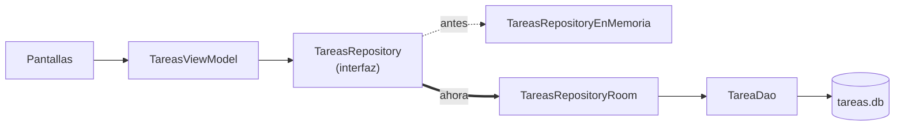

# Tutorial: Mi lista de tareas (parte 5)

## Qué vamos a construir

Al final de la cuarta parte, **Mi lista de tareas** tenía una arquitectura completa: interfaz, `ViewModel`, repositorio y Hilt conectándolo todo. Solo le faltaba una cosa: si cierras la app, las tareas se pierden, porque el repositorio las guarda en memoria.

En esta última parte vas a guardarlas en una base de datos del teléfono con **Room**, aplicando lo que viste en el capítulo 47. Al terminar:

- las tareas se guardarán en una tabla `tareas` de SQLite;
- **sobrevivirán al cierre de la app** y al reinicio del teléfono;
- el cambio se hará con una **segunda implementación** del repositorio, sin tocar el `ViewModel` ni las pantallas;
- las pruebas unitarias de la cuarta parte seguirán pasando sin cambios.

Es la prueba de fuego de la arquitectura que construiste: cambiar dónde se guardan los datos debería afectar solo a la capa de datos.



## Paso 1: Configurar Room

KSP ya está en tu proyecto desde la cuarta parte, porque lo usa Hilt. Solo falta Room. En `gradle/libs.versions.toml`, agrega:

```toml
[versions]
room = "2.8.5"

[libraries]
androidx-room-runtime = { group = "androidx.room", name = "room-runtime", version.ref = "room" }
androidx-room-ktx = { group = "androidx.room", name = "room-ktx", version.ref = "room" }
androidx-room-compiler = { group = "androidx.room", name = "room-compiler", version.ref = "room" }

[plugins]
room = { id = "androidx.room", version.ref = "room" }
```

En el `build.gradle.kts` de la raíz, declara el plugin:

```kotlin
plugins {
    // ... los que ya tenías
    alias(libs.plugins.room) apply false
}
```

Y en `build.gradle.kts (Module :app)`, aplícalo, indica dónde guardar los esquemas y agrega las dependencias:

```kotlin
plugins {
    // ... los que ya tenías
    alias(libs.plugins.room)
}

android {
    // ... lo que ya tenías
    room {
        schemaDirectory("$projectDir/schemas")
    }
}

dependencies {
    // ... las que ya tenías
    implementation(libs.androidx.room.runtime)
    implementation(libs.androidx.room.ktx)
    ksp(libs.androidx.room.compiler)
}
```

Como en el capítulo 47, el compilador de Room se agrega con `ksp(...)`, igual que el de Hilt. Pulsa **Sync Now**.

## Paso 2: La entidad

Dentro del paquete `data`, crea un subpaquete `local`: ahí vivirá todo lo que es propio de Room. Crea en él el archivo `TareaEntity.kt`:

```kotlin
package com.ejemplo.milistadetareas.data.local

import androidx.room.Entity
import androidx.room.PrimaryKey
import com.ejemplo.milistadetareas.Tarea

@Entity(tableName = "tareas")
data class TareaEntity(
    @PrimaryKey val id: String,
    val texto: String,
    val completada: Boolean,
    val creadaEn: Long
)

fun TareaEntity.aDominio(): Tarea =
    Tarea(id = id, texto = texto, completada = completada)

fun Tarea.aEntity(creadaEn: Long = System.currentTimeMillis()): TareaEntity =
    TareaEntity(id = id, texto = texto, completada = completada, creadaEn = creadaEn)
```

`TareaEntity` describe una fila de la tabla `tareas`. El `id` que ya generaba `Tarea` (un UUID) sirve como clave primaria.

La entidad tiene una columna que `Tarea` no tiene: **`creadaEn`**, el momento en que se guardó la tarea, en milisegundos. Una tabla SQL no garantiza ningún orden al leer sus filas; sin esta columna, la lista podría aparecer desordenada. La necesitas para guardar, pero la interfaz no la usa, así que se queda en la entidad y `Tarea` no cambia.

Las dos **funciones de extensión** (capítulo 20) traducen entre el modelo de dominio y la entidad. `aEntity` recibe `creadaEn` como parámetro con valor por defecto: la hora actual.

## Paso 3: El DAO

En el mismo paquete `local`, crea `TareaDao.kt`:

```kotlin
package com.ejemplo.milistadetareas.data.local

import androidx.room.Dao
import androidx.room.Insert
import androidx.room.OnConflictStrategy
import androidx.room.Query
import kotlinx.coroutines.flow.Flow

@Dao
interface TareaDao {

    @Query("SELECT * FROM tareas ORDER BY creadaEn")
    fun observarTodas(): Flow<List<TareaEntity>>

    @Insert(onConflict = OnConflictStrategy.REPLACE)
    suspend fun insertar(tarea: TareaEntity)

    @Query("UPDATE tareas SET texto = :texto, completada = :completada WHERE id = :id")
    suspend fun actualizar(id: String, texto: String, completada: Boolean)

    @Query("DELETE FROM tareas WHERE id = :id")
    suspend fun eliminar(id: String)
}
```

Cada función corresponde a una operación del repositorio:

- `observarTodas` devuelve un **`Flow`**, igual que `TareasRepository.tareas`. Room volverá a emitir la lista cada vez que la tabla cambie. `ORDER BY creadaEn` ordena de la más antigua a la más nueva, como aparecían en memoria.
- `insertar` usa `OnConflictStrategy.REPLACE`: si ya existe una fila con el mismo `id`, la reemplaza en lugar de fallar.
- `actualizar` es una `@Query` escrita a mano, y no un `@Update`, por un detalle: el repositorio recibe una `Tarea`, que no tiene `creadaEn`. Si la convirtieras con `aEntity()` para usar `@Update`, la tarea quedaría con la hora actual y saltaría al final de la lista cada vez que la marcaras como completada. La consulta cambia solo las columnas `texto` y `completada`, y deja `creadaEn` intacta.
- `eliminar` borra por `id`. Los parámetros de la función se usan en la consulta con dos puntos: `:id`.

Recuerda que Room revisa estas consultas **al compilar**: si escribes mal el nombre de una columna, el proyecto no compila y el error te dice cuál es.

## Paso 4: La base de datos

En el paquete `local`, crea `TareasDatabase.kt`:

```kotlin
package com.ejemplo.milistadetareas.data.local

import androidx.room.Database
import androidx.room.RoomDatabase

@Database(entities = [TareaEntity::class], version = 1)
abstract class TareasDatabase : RoomDatabase() {
    abstract fun tareaDao(): TareaDao
}
```

Room genera la implementación de esta clase y de `TareaDao` al compilar.

## Paso 5: Crear la base de datos con Hilt

La base de datos se crea con `Room.databaseBuilder`, no con un constructor que Hilt pueda llamar. Como viste en el capítulo 47, para eso se usa un módulo con funciones **`@Provides`**. En el paquete `di`, junto a `DataModule.kt`, crea `DatabaseModule.kt`:

```kotlin
package com.ejemplo.milistadetareas.di

import android.content.Context
import androidx.room.Room
import com.ejemplo.milistadetareas.data.local.TareaDao
import com.ejemplo.milistadetareas.data.local.TareasDatabase
import dagger.Module
import dagger.Provides
import dagger.hilt.InstallIn
import dagger.hilt.android.qualifiers.ApplicationContext
import dagger.hilt.components.SingletonComponent
import javax.inject.Singleton

@Module
@InstallIn(SingletonComponent::class)
object DatabaseModule {

    @Provides
    @Singleton
    fun provideDatabase(@ApplicationContext context: Context): TareasDatabase =
        Room.databaseBuilder(context, TareasDatabase::class.java, "tareas.db").build()

    @Provides
    fun provideTareaDao(database: TareasDatabase): TareaDao = database.tareaDao()
}
```

- `provideDatabase` crea la base de datos en el archivo `tareas.db`. Con `@Singleton`, Hilt la crea **una sola vez**.
- `provideTareaDao` le enseña a Hilt a obtener el DAO a partir de la base de datos. Hilt ya sabe crear la base de datos (con la función de arriba), así que puede llamarla sola.

Ahora cualquier clase puede pedir un `TareaDao` en su constructor.

## Paso 6: El repositorio con Room

En el paquete `data`, junto a `TareasRepositoryEnMemoria.kt`, crea `TareasRepositoryRoom.kt`:

```kotlin
package com.ejemplo.milistadetareas.data

import com.ejemplo.milistadetareas.Tarea
import com.ejemplo.milistadetareas.data.local.TareaDao
import com.ejemplo.milistadetareas.data.local.aDominio
import com.ejemplo.milistadetareas.data.local.aEntity
import javax.inject.Inject
import kotlinx.coroutines.flow.Flow
import kotlinx.coroutines.flow.map

class TareasRepositoryRoom @Inject constructor(
    private val dao: TareaDao
) : TareasRepository {

    override val tareas: Flow<List<Tarea>> =
        dao.observarTodas().map { entidades -> entidades.map { it.aDominio() } }

    override suspend fun agregar(tarea: Tarea) {
        dao.insertar(tarea.aEntity())
    }

    override suspend fun actualizar(tarea: Tarea) {
        dao.actualizar(id = tarea.id, texto = tarea.texto, completada = tarea.completada)
    }

    override suspend fun eliminar(id: String) {
        dao.eliminar(id)
    }
}
```

Implementa la misma interfaz que el repositorio en memoria, y cada operación delega en el DAO:

- `tareas` transforma el `Flow` de entidades en un `Flow` de tareas. Hay **dos** `map` distintos: el de afuera es el operador de `Flow` (se aplica a cada lista que emite Room) y el de adentro es el `map` de colecciones de la Parte III (convierte cada entidad de la lista).
- `agregar` convierte la tarea en entidad con la hora actual y la inserta.
- `actualizar` pasa solo los campos que pueden cambiar, por la razón que viste en el paso 3.

A diferencia de `TareasRepositoryEnMemoria`, esta clase no necesita `@Singleton`: no guarda nada. Los datos están en la base de datos, que sí es única.

## Paso 7: Cambiar una línea

Abre `di/DataModule.kt`. Ahí está la única línea del proyecto que decide qué implementación del repositorio se usa. Cámbiala:

```kotlin
@Binds
abstract fun bindTareasRepository(
    impl: TareasRepositoryRoom
): TareasRepository
```

Y actualiza el import:

```kotlin
import com.ejemplo.milistadetareas.data.TareasRepositoryRoom
```

Eso es todo. No borres `TareasRepositoryEnMemoria`: las pruebas unitarias lo siguen usando.

## Paso 8: Lo que no cambió

Antes de ejecutar, repasa lo que **no** tocaste:

- **`TareasViewModel`**. Sigue pidiendo un `TareasRepository`, observándolo en el `init` y llamando a `agregar`, `actualizar` y `eliminar`. Sigue sin actualizar la lista a mano: después de cada operación, Room vuelve a emitir desde el DAO, y la lista nueva llega por el mismo `Flow` que antes.
- **Las pantallas**, `App` y `MainActivity`.
- **Las pruebas unitarias**. Crean el `ViewModel` con `TareasRepositoryEnMemoria`, así que siguen sin necesitar emulador ni base de datos. Ejecútalas: deben pasar las tres.

> [!NOTE]Nota
> En el capítulo 47, el `ViewModel` de notas convertía el `Flow` en estado con `stateIn`. El de tareas recolecta el `Flow` en el `init` y lo copia a su `_uiState`. Las dos formas son correctas. Aquí se usa la segunda porque el estado no es solo la lista: también lleva el mensaje del Snackbar, que no viene del repositorio.

## Paso 9: Ejecutar y probar

Ejecuta la app y haz la prueba que antes fallaba:

1. Agrega tres tareas y marca una como completada.
2. Cierra la app desde la lista de apps recientes.
3. Ábrela de nuevo. **Las tareas siguen ahí**, en el mismo orden y con el mismo estado.
4. Marca como completada la primera tarea: no debe cambiar de posición.
5. Elimina una tarea, deshaz la eliminación y vuelve a cerrar y abrir la app: la tarea restaurada sigue en la lista.
6. Reinicia el emulador o el teléfono y abre la app: las tareas siguen ahí.

Para ver la base de datos por dentro, con la app en ejecución, abre en Android Studio **View > Tool Windows > App Inspection** y elige la pestaña **Database Inspector**. Verás `tareas.db` con su tabla `tareas`, y podrás ver cómo cambian sus filas mientras usas la app.

> [!TIP]Sugerencia
> Al compilar, Room creó el archivo `app/schemas/com.ejemplo.milistadetareas.data.local.TareasDatabase/1.json`, con la descripción de la versión 1 de la base de datos. Agrégalo al control de versiones junto con tu código: es lo que Room necesita para generar migraciones el día que cambies la estructura de la tabla.

## Resumen

En esta quinta parte, las tareas pasaron a guardarse en el teléfono:

- Configuraste **Room** sobre el KSP que ya usaba Hilt, con el directorio de esquemas.
- Creaste la entidad **`TareaEntity`**, con una columna `creadaEn` para ordenar que el modelo de dominio no necesita, y funciones de extensión para convertir entre ambos.
- Escribiste el **`TareaDao`**: un `Flow` que se vuelve a emitir con cada cambio, e inserción, actualización y eliminación `suspend`. La actualización es una `@Query` para no perder `creadaEn`.
- Declaraste **`TareasDatabase`** y la creaste con Hilt usando **`@Provides`** y `@Singleton`.
- Implementaste **`TareasRepositoryRoom`** con el mismo contrato que el repositorio en memoria.
- Cambiaste **una línea** de `DataModule`, y la app completa pasó de la memoria a la base de datos sin tocar el `ViewModel`, las pantallas ni las pruebas.

Con esto termina **Mi lista de tareas**. Empezó en la Parte VII como una sola pantalla con todo su estado en un composable, y hoy es una app con MVVM, un repositorio, inyección de dependencias, pruebas unitarias y persistencia local. Esa misma arquitectura es la que usarás en la Parte X para construir el proyecto final: una app de contactos que obtiene sus datos de una API REST con Retrofit y los guarda con Room.

El código completo de la app terminada está en `code/todo-list-app/`.
