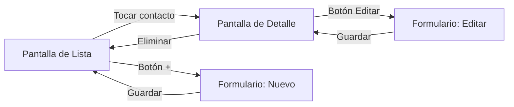

# Capítulo 48: Presentación y arquitectura de «Mis Contactos»

## Introducción

Has llegado a la última parte del curso. A lo largo de los capítulos anteriores fuiste aprendiendo cada pieza por separado: la sintaxis moderna de Kotlin, la asincronía con coroutines y flujos, el diseño de interfaces declarativas con Jetpack Compose, la arquitectura MVVM con `ViewModel` y `StateFlow`, la inyección de dependencias con Hilt, la comunicación de red con Retrofit y la serialización JSON, y la persistencia en base de datos local con Room.

Ahora unirás todas esas piezas en una **aplicación completa, profesional y real**: **«Mis Contactos»**. Esta app se conecta a la API REST que exploraste en el capítulo 43 (`code/contact-list-api/`), guarda una copia local en Room para funcionar sin conexión, permite gestionar contactos con validación estricta de formularios y ofrece una experiencia de usuario fluida con búsqueda en tiempo real, scroll infinito y soporte para favoritos.

En este capítulo conocerás la aplicación en detalle, su arquitectura general por capas, el modelo de dominio y la organización de paquetes del proyecto.

## ¿Qué hace la aplicación «Mis Contactos»?

«Mis Contactos» es un gestor de libreta de direcciones estructurado en tres pantallas principales:



1. **Pantalla de Lista (`ListaContactosScreen`)**:
   - Muestra los contactos ordenados alfabéticamente por nombre.
   - Permite **buscar en tiempo real** por nombre o apellido con filtrado reactivo.
   - Ofrece un filtro rápido para ver solo **favoritos**.
   - Carga contactos bajo demanda mediante **scroll infinito** (paginación).
   - Permite refrescar la lista deslizando hacia abajo (*pull-to-refresh*).
   - Muestra fotos de perfil con avatar dinámico (mediante la biblioteca Coil) e iniciales de respaldo.
   - Permite marcar o desmarcar favoritos con un solo toque.

2. **Pantalla de Detalle (`DetalleContactoScreen`)**:
   - Muestra la información completa del contacto (nombre, apellido, correo, teléfono, dirección, ciudad).
   - Permite cambiar el estado de favorito.
   - Incluye acceso directo para **editar** el contacto.
   - Permite **eliminar** el contacto con un diálogo de confirmación de seguridad.

3. **Pantalla de Formulario (`FormularioContactoScreen`)**:
   - Sirve tanto para **crear** un contacto nuevo como para **editar** uno existente.
   - Valida los campos localmente antes de enviar (correo válido, longitudes mínimas y obligatoriedad).
   - Configura el teclado virtual adecuado para cada campo (correo, teléfono, mayúsculas automáticas).
   - Recibe y muestra errores específicos del servidor (como formato no válido o correo duplicado).
   - Vuelve automáticamente a la pantalla anterior al guardar con éxito.

## La arquitectura general: MVVM y capas

La aplicación sigue estrictamente la arquitectura recomendada por Google para Android, estructurada en tres capas bien diferenciadas:

```mermaid
flowchart TD
    subgraph UI[Capa de Interfaz (UI)]
        Screen[Composables / Screens]
        VM[ViewModels]
    end

    subgraph Data[Capa de Datos (Data)]
        Repo[ContactosRepositoryImpl]
    end

    subgraph Sources[Fuentes de Datos]
        Remote[API REST / Retrofit]
        Local[Base de Datos / Room]
    end

    Screen -->|Eventos de usuario| VM
    VM -->|UiState (StateFlow)| Screen
    VM -->|Llamadas suspend / Flow| Repo
    Repo -->|ContactApi| Remote
    Repo -->|DAOs| Local
```

### 1. Capa de Interfaz (*UI Layer*)
- **Composables**: declaran cómo se ve la interfaz a partir de un estado inmutable (`UiState`). No toman decisiones de negocio ni hacen llamadas de red directamente.
- **ViewModels**: gestionan el estado de la pantalla (`StateFlow`), manejan la lógica de presentación y ejecutan coroutines en `viewModelScope`. Están anotados con `@HiltViewModel`.

### 2. Capa de Dominio / Modelo (*Domain Layer*)
- Define las estructuras de datos que representan el negocio de la app (`Contacto`, `DatosContacto`), limpias de anotaciones de bibliotecas externas (sin anotaciones de serialización ni de Room).
- Modela los posibles errores de la aplicación mediante la clase sellada `ErrorDatos`.

### 3. Capa de Datos (*Data Layer*)
- **Repositorio (`ContactosRepository`)**: es la única fuente de verdad para los ViewModels. Oculta la complejidad de sincronizar la API REST con la base de datos Room.
- **Fuente Remota**: cliente Retrofit (`ContactApi`), DTOs serializables con `kotlinx.serialization` y funciones de mapeo.
- **Fuente Local**: base de datos SQLite administrada por Room (`ContactosDatabase`, `ContactoEntity`, `FavoritoEntity`), que almacena en caché los contactos y guarda localmente los favoritos.

> [!NOTE]Nota
> El ViewModel solo conoce la interfaz `ContactosRepository`. No sabe ni le importa si los contactos provienen de una caché en memoria, de Room o de una llamada HTTP.

## El modelo de dominio

En `model/Contacto.kt` definimos las clases de datos puras que viajarán entre el repositorio, los ViewModels y la interfaz de usuario:

```kotlin
package com.ejemplo.miscontactos.model

data class Contacto(
    val id: Int,
    val nombre: String,
    val apellido: String,
    val email: String,
    val telefono: String? = null,
    val direccion: String? = null,
    val ciudad: String? = null
) {
    val nombreCompleto: String
        get() = "$nombre $apellido"

    val iniciales: String
        get() = "${nombre.firstOrNull() ?: ""}${apellido.firstOrNull() ?: ""}".uppercase()
}

/** Datos que el usuario escribe para crear o editar un contacto (todavía sin id). */
data class DatosContacto(
    val nombre: String,
    val apellido: String,
    val email: String,
    val telefono: String? = null,
    val direccion: String? = null,
    val ciudad: String? = null
)

/** Una página de resultados, tal como la necesita la app. */
data class PaginaContactos(
    val contactos: List<Contacto>,
    val pagina: Int,
    val totalPaginas: Int,
    val desdeCache: Boolean = false
) {
    val hayMas: Boolean
        get() = pagina + 1 < totalPaginas
}
```

Fíjate en varios detalles de diseño:

- **`Contacto`** incluye propiedades calculadas como `nombreCompleto` e `iniciales`. Al estar en el modelo de dominio, cualquier composable o ViewModel puede usarlas sin duplicar lógica de formato.
- **`DatosContacto`** representa solo la información editable. Al crear un nuevo contacto, la app aún no tiene un `id`, por lo que usar una clase separada evita tener propiedades anulables innecesarias como `id: Int?`.
- **`Contacto` no lleva un campo `esFavorito`.** Ser favorito no es un dato del contacto en sí, sino una preferencia del dispositivo: como verás en el capítulo 52, el repositorio expone los identificadores favoritos por separado, como `Flow<Set<Int>>`, y es la interfaz la que cruza esa información con la lista de contactos al momento de dibujarla.
- **`PaginaContactos`** incluye una propiedad calculada `hayMas`, que evita que cada pantalla tenga que comparar `pagina` con `totalPaginas` por su cuenta.

## Estructura de paquetes del proyecto

El código de la aplicación está organizado por responsabilidades y características dentro del paquete `com.ejemplo.miscontactos`:

```text
com.ejemplo.miscontactos/
├── data/
│   ├── local/               # Room: entidades, DAOs y Database
│   │   ├── ContactoDao.kt
│   │   ├── ContactoEntity.kt
│   │   ├── ContactosDatabase.kt
│   │   ├── FavoritoDao.kt
│   │   └── FavoritoEntity.kt
│   ├── remote/              # Retrofit: endpoints, DTOs y errores
│   │   ├── dto/
│   │   │   └── ContactDto.kt
│   │   ├── ContactApi.kt
│   │   ├── Errores.kt
│   │   └── Mappers.kt
│   ├── ContactosRepository.kt       # Interfaz del repositorio
│   └── ContactosRepositoryImpl.kt   # Implementación offline-first
├── di/                      # Módulos de inyección de dependencias con Hilt
│   ├── DataModule.kt
│   ├── DatabaseModule.kt
│   └── NetworkModule.kt
├── model/                   # Modelos puros de dominio
│   ├── Contacto.kt
│   └── ErrorDatos.kt
├── ui/                      # Interfaz de usuario con Jetpack Compose
│   ├── componentes/         # Composables reutilizables (Avatar, Estados, Permisos)
│   │   ├── AvatarContacto.kt
│   │   ├── Estados.kt
│   │   └── PermisoRedLocal.kt
│   ├── detalle/             # Pantalla de detalle de contacto
│   │   ├── DetalleContactoScreen.kt
│   │   ├── DetalleContactoUiState.kt
│   │   └── DetalleContactoViewModel.kt
│   ├── formulario/          # Pantalla de creación y edición
│   │   ├── ContactoForm.kt
│   │   ├── FormularioContactoScreen.kt
│   │   └── FormularioContactoViewModel.kt
│   ├── lista/               # Pantalla principal con lista y búsqueda
│   │   ├── ListaContactosScreen.kt
│   │   ├── ListaContactosUiState.kt
│   │   └── ListaContactosViewModel.kt
│   ├── navigation/          # Rutas tipadas y NavHost
│   │   ├── ContactosNavHost.kt
│   │   └── Rutas.kt
│   └── theme/               # Paleta de colores, tipografía y tema Material 3
│       ├── Color.kt
│       ├── Theme.kt
│       └── Type.kt
├── MainActivity.kt          # Activity única con edge-to-edge
└── MisContactosApp.kt       # Application class con @HiltAndroidApp
```

Esta organización agrupa la interfaz por pantalla (*feature-first* en `ui/lista`, `ui/detalle`, `ui/formulario`) y los datos por origen (`data/local`, `data/remote`), facilitando encontrar cualquier archivo rápidamente.

## Resumen

- «Mis Contactos» es una app completa que integra **Compose**, **MVVM**, **Hilt**, **Retrofit** y **Room**.
- Consta de tres pantallas: **Lista** (búsqueda, paginación, favoritos), **Detalle** (visualización y borrado seguro) y **Formulario** (creación y edición con validación).
- Sigue una arquitectura limpia por capas: la interfaz solo observa el `UiState` del `ViewModel`, el `ViewModel` consume el `ContactosRepository`, y el repositorio coordina la API remota y la base de datos local.
- El modelo de dominio (`Contacto`, `DatosContacto`) está completamente desacoplado de las bibliotecas de red y persistencia.

En el próximo capítulo configuraremos el proyecto, los permisos necesarios y el punto de entrada de la aplicación.
