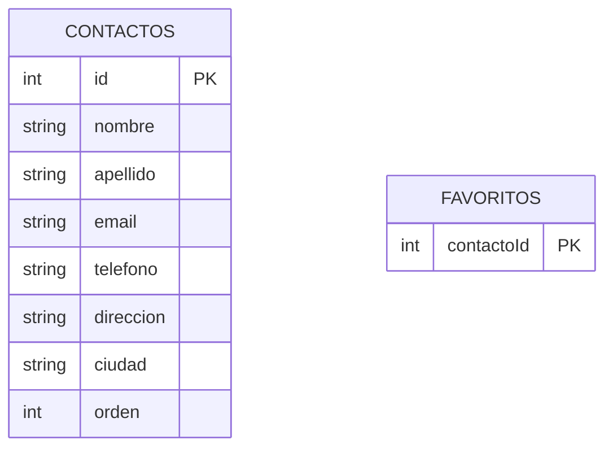

# Capítulo 51: La capa local: Room para caché y favoritos

## Introducción

Una aplicación móvil moderna debe ser resistente a la falta de conectividad. Si el usuario abre «Mis Contactos» en el metro o en un ascensor, no debería encontrarse con una pantalla en blanco o un error inmediato: la aplicación debe mostrar los últimos contactos descargados. Además, hay preferencias que pertenecen exclusivamente al usuario del teléfono y que la API compartida no almacena, como la lista de contactos marcados como **favoritos**.

Para resolver ambas necesidades, implementamos una capa de persistencia local utilizando **Room**. En este capítulo crearemos las entidades de base de datos, los DAOs, la base de datos `ContactosDatabase` y el módulo de inyección `DatabaseModule`.

## Por qué dos tablas separadas: caché y favoritos

Nuestra base de datos local SQLite maneja dos tipos de datos con ciclos de vida completamente diferentes:



1. **Tabla `contactos` (Caché)**: almacena una copia local de los contactos obtenidos desde la API. Si la app se sincroniza con el servidor, esta tabla se puede borrar y reconstruir por completo.
2. **Tabla `favoritos` (Persistencia propia)**: almacena únicamente los identificadores (`contactoId`) de los contactos que el usuario ha marcado con una estrella. Esta información **nunca se borra al refrescar la red**, conservando los favoritos del usuario independientemente de cuántas veces se descargue la lista del servidor.

## Las entidades de Room

En `data/local/ContactoEntity.kt` definimos las dos entidades y sus funciones de mapeo con el modelo de dominio:

```kotlin
package com.ejemplo.miscontactos.data.local

import androidx.room.Entity
import androidx.room.PrimaryKey
import com.ejemplo.miscontactos.model.Contacto

/** Copia local de un contacto, usada como caché para trabajar sin conexión. */
@Entity(tableName = "contactos")
data class ContactoEntity(
    @PrimaryKey val id: Int,
    val nombre: String,
    val apellido: String,
    val email: String,
    val telefono: String?,
    val direccion: String?,
    val ciudad: String?,
    val orden: Int
)

/** Un contacto marcado como favorito. Es un dato que solo existe en el dispositivo. */
@Entity(tableName = "favoritos")
data class FavoritoEntity(
    @PrimaryKey val contactoId: Int
)

fun ContactoEntity.aDominio(): Contacto = Contacto(
    id = id,
    nombre = nombre,
    apellido = apellido,
    email = email,
    telefono = telefono,
    direccion = direccion,
    ciudad = ciudad
)

fun Contacto.aEntity(orden: Int): ContactoEntity = ContactoEntity(
    id = id,
    nombre = nombre,
    apellido = apellido,
    email = email,
    telefono = telefono,
    direccion = direccion,
    ciudad = ciudad,
    orden = orden
)
```

Fíjate en el campo `orden: Int` en `ContactoEntity`. Cuando la API devuelve contactos paginados y ordenados, guardamos ese índice numérico para poder recuperarlos de SQLite exactamente en el mismo orden mediante `ORDER BY orden`.

## Los DAOs: operaciones locales

### 1. `ContactoDao` para gestionar la caché

En `data/local/ContactoDao.kt` definimos las operaciones de lectura y actualización masiva de contactos:

```kotlin
package com.ejemplo.miscontactos.data.local

import androidx.room.Dao
import androidx.room.Insert
import androidx.room.OnConflictStrategy
import androidx.room.Query
import androidx.room.Transaction

@Dao
interface ContactoDao {

    @Query("SELECT * FROM contactos ORDER BY orden")
    suspend fun obtenerTodos(): List<ContactoEntity>

    @Query("SELECT * FROM contactos WHERE id = :id")
    suspend fun obtenerPorId(id: Int): ContactoEntity?

    @Insert(onConflict = OnConflictStrategy.REPLACE)
    suspend fun insertarTodos(contactos: List<ContactoEntity>)

    @Query("DELETE FROM contactos")
    suspend fun borrarTodos()

    @Query("DELETE FROM contactos WHERE id = :id")
    suspend fun borrar(id: Int)

    /** Reemplaza la caché completa en una sola transacción atómica. */
    @Transaction
    suspend fun reemplazarTodos(contactos: List<ContactoEntity>) {
        borrarTodos()
        insertarTodos(contactos)
    }
}
```

- `@Transaction suspend fun reemplazarTodos(...)`: ejecuta `borrarTodos()` y `insertarTodos(...)` dentro de una misma transacción SQLite. Si la inserción fallara, la base de datos revierte los cambios automáticamente, evitando dejar la tabla vacía o inconsistente.

### 2. `FavoritoDao` para observar y alternar favoritos

En `data/local/FavoritoDao.kt` gestionamos los identificadores favoritos:

```kotlin
package com.ejemplo.miscontactos.data.local

import androidx.room.Dao
import androidx.room.Insert
import androidx.room.OnConflictStrategy
import androidx.room.Query
import kotlinx.coroutines.flow.Flow

@Dao
interface FavoritoDao {

    @Query("SELECT contactoId FROM favoritos")
    fun observarIds(): Flow<List<Int>>

    @Query("SELECT EXISTS(SELECT 1 FROM favoritos WHERE contactoId = :id)")
    suspend fun esFavorito(id: Int): Boolean

    @Insert(onConflict = OnConflictStrategy.IGNORE)
    suspend fun insertar(favorito: FavoritoEntity)

    @Query("DELETE FROM favoritos WHERE contactoId = :id")
    suspend fun borrar(id: Int)
}
```

- `observarIds(): Flow<List<Int>>`: devuelve un `Flow` reactivo. Cada vez que se agrega o elimina un favorito en la base de datos, Room emite automáticamente la nueva lista de IDs a todos los componentes suscritos.
- `SELECT EXISTS(...)`: comprueba eficientemente si un contacto específico es favorito devolviendo un booleano en una sola consulta.

## La base de datos: `ContactosDatabase`

En `data/local/ContactosDatabase.kt` declaramos la clase abstracta de Room:

```kotlin
package com.ejemplo.miscontactos.data.local

import androidx.room.Database
import androidx.room.RoomDatabase

@Database(
    entities = [ContactoEntity::class, FavoritoEntity::class],
    version = 1
)
abstract class ContactosDatabase : RoomDatabase() {
    abstract fun contactoDao(): ContactoDao
    abstract fun favoritoDao(): FavoritoDao
}
```

## El módulo de inyección: `DatabaseModule`

En `di/DatabaseModule.kt` le indicamos a Hilt cómo construir la base de datos Room y proveer cada DAO:

```kotlin
package com.ejemplo.miscontactos.di

import android.content.Context
import androidx.room.Room
import com.ejemplo.miscontactos.data.local.ContactoDao
import com.ejemplo.miscontactos.data.local.ContactosDatabase
import com.ejemplo.miscontactos.data.local.FavoritoDao
import dagger.Module
import dagger.Provides
import dagger.hilt.InstallIn
import dagger.hilt.android.qualifiers.ApplicationContext
import dagger.hilt.components.SingletonComponent
import javax.inject.Singleton

@Module
@InstallIn(SingletonComponent::class)
object DatabaseModule {

    @Provides
    @Singleton
    fun provideDatabase(@ApplicationContext context: Context): ContactosDatabase =
        Room.databaseBuilder(
            context,
            ContactosDatabase::class.java,
            "contactos.db"
        ).build()

    @Provides
    fun provideContactoDao(database: ContactosDatabase): ContactoDao =
        database.contactoDao()

    @Provides
    fun provideFavoritoDao(database: ContactosDatabase): FavoritoDao =
        database.favoritoDao()
}
```

- `@ApplicationContext`: Hilt inyecta el contexto de la aplicación para crear la base de datos sin riesgo de fugas de memoria (*memory leaks*).
- `provideDatabase` está marcado con `@Singleton` para garantizar una única conexión abierta al archivo `contactos.db`.
- Los métodos que devuelven DAOs no necesitan `@Singleton`, ya que Room reutiliza internamente las mismas instancias a través de `database`.

## Resumen

- Separamos el almacenamiento en dos tablas: `contactos` para la caché de red y `favoritos` para preferencias locales persistentes.
- `ContactoEntity` guarda los datos descargados e incluye una columna `orden` para conservar la posición alfabética devuelta por la API.
- `ContactoDao` ofrece `reemplazarTodos` anotado con `@Transaction` para actualizar la caché de forma segura.
- `FavoritoDao` expone un `Flow<List<Int>>` que notifica reactivamente cualquier cambio en los favoritos.
- `DatabaseModule` construye `ContactosDatabase` con Hilt como un `@Singleton`.

En el próximo capítulo implementaremos el **repositorio**, coordinando la API remota de Retrofit y la base de datos local de Room bajo una estrategia *offline-first*.
