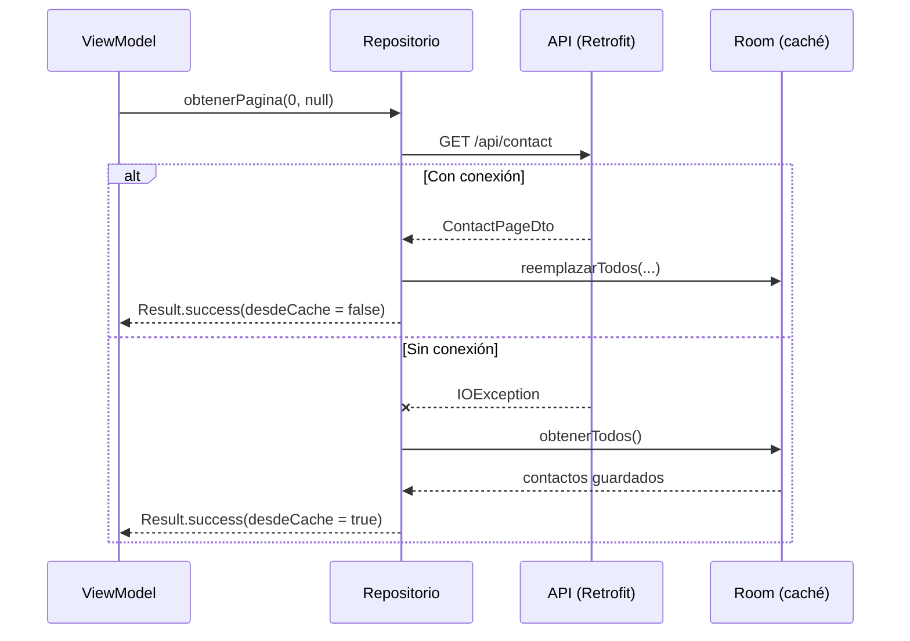

# Capítulo 52: El repositorio: estrategia *offline-first*

## Introducción

Ya tienes las dos fuentes de datos por separado: la API remota (capítulo 50) y la base de datos local (capítulo 51). Ahora las uniremos en una sola pieza: el **repositorio**. Su trabajo es decidir, ante cada operación, si conviene usar la red, la caché local, o ambas, sin que el resto de la aplicación tenga que preocuparse por esa decisión.

En este capítulo implementaremos `ContactosRepositoryImpl`, que sigue una estrategia ***offline-first***: intenta primero la red, pero si no hay conexión, recurre a los datos guardados en Room en lugar de simplemente mostrar un error.

## La interfaz del repositorio

En `data/ContactosRepository.kt` definimos el contrato que el resto de la app conocerá, sin exponer detalles de Retrofit ni de Room:

```kotlin
package com.ejemplo.miscontactos.data

import com.ejemplo.miscontactos.model.Contacto
import com.ejemplo.miscontactos.model.DatosContacto
import com.ejemplo.miscontactos.model.PaginaContactos
import kotlinx.coroutines.flow.Flow

/**
 * Punto único de acceso a los contactos. Quien lo usa no sabe si los datos
 * vienen de la API (Retrofit) o de la base de datos local (Room).
 */
interface ContactosRepository {

    /** Emite un valor cada vez que se crea, edita o elimina un contacto. */
    val cambios: Flow<Unit>

    /** Ids de los contactos marcados como favoritos (dato solo local). */
    val favoritos: Flow<Set<Int>>

    suspend fun obtenerPagina(pagina: Int, busqueda: String? = null): Result<PaginaContactos>
    suspend fun obtenerContacto(id: Int): Result<Contacto>
    suspend fun crear(datos: DatosContacto): Result<Contacto>
    suspend fun actualizar(id: Int, datos: DatosContacto): Result<Contacto>
    suspend fun eliminar(id: Int): Result<Unit>
    suspend fun alternarFavorito(id: Int)
}
```

Dos propiedades merecen atención antes de ver la implementación:

- **`cambios: Flow<Unit>`**: no lleva información, solo **avisa**. Cuando se crea, edita o elimina un contacto en cualquier parte de la app, cualquier pantalla suscrita a este flujo sabe que debe refrescar sus datos. Es el mecanismo que usaremos para que, por ejemplo, la lista se actualice sola después de guardar un formulario, sin acoplar directamente esas dos pantallas.
- **`favoritos: Flow<Set<Int>>`**: como viste en el capítulo 48, ser favorito no es parte del modelo `Contacto`; es una lista de identificadores que cualquier pantalla puede cruzar con los contactos que ya tiene cargados.

## La implementación: `ContactosRepositoryImpl`

```kotlin
package com.ejemplo.miscontactos.data

import com.ejemplo.miscontactos.data.local.ContactoDao
import com.ejemplo.miscontactos.data.local.FavoritoDao
import com.ejemplo.miscontactos.data.local.FavoritoEntity
import com.ejemplo.miscontactos.data.local.aDominio
import com.ejemplo.miscontactos.data.local.aEntity
import com.ejemplo.miscontactos.data.remote.ContactApi
import com.ejemplo.miscontactos.data.remote.aDominio
import com.ejemplo.miscontactos.data.remote.aErrorDatos
import com.ejemplo.miscontactos.data.remote.aRequest
import com.ejemplo.miscontactos.model.Contacto
import com.ejemplo.miscontactos.model.DatosContacto
import com.ejemplo.miscontactos.model.ErrorDatos
import com.ejemplo.miscontactos.model.PaginaContactos
import javax.inject.Inject
import javax.inject.Singleton
import kotlin.coroutines.cancellation.CancellationException
import kotlinx.coroutines.flow.Flow
import kotlinx.coroutines.flow.MutableSharedFlow
import kotlinx.coroutines.flow.asSharedFlow
import kotlinx.coroutines.flow.map
import kotlinx.serialization.json.Json

@Singleton
class ContactosRepositoryImpl @Inject constructor(
    private val api: ContactApi,
    private val contactoDao: ContactoDao,
    private val favoritoDao: FavoritoDao,
    private val json: Json
) : ContactosRepository {

    private val _cambios = MutableSharedFlow<Unit>(extraBufferCapacity = 1)
    override val cambios: Flow<Unit> = _cambios.asSharedFlow()

    override val favoritos: Flow<Set<Int>> =
        favoritoDao.observarIds().map { ids -> ids.toSet() }

    // ... (obtenerPagina, obtenerContacto, crear, actualizar, eliminar, alternarFavorito)

    companion object {
        const val TAMANO_PAGINA = 20
    }
}
```

- El repositorio recibe **las cuatro dependencias** por su constructor: el cliente de red, los dos DAOs y el `Json` compartido. Gracias a Hilt (capítulos 45, 50 y 51), no tenemos que construir nada de esto manualmente.
- `_cambios` es un `SharedFlow` mutable y privado, expuesto como un `Flow` de solo lectura, siguiendo el mismo patrón de encapsulación que ya usaste con `StateFlow` en el capítulo 39.
- `favoritos` **transforma** el `Flow<List<Int>>` del DAO en un `Flow<Set<Int>>` con el operador `map` (capítulo 24), porque a la interfaz le conviene comprobar pertenencia (`id in favoritos`) con un `Set`, que es más eficiente que buscar en una `List`.

## Obtener una página: la lógica *offline-first*

Esta es la operación más interesante del repositorio, porque combina red, caché y manejo de errores:

```kotlin
override suspend fun obtenerPagina(pagina: Int, busqueda: String?): Result<PaginaContactos> {
    val esPrimeraPaginaSinFiltro = pagina == 0 && busqueda.isNullOrBlank()

    val resultado = llamarApi {
        api.obtenerContactos(pagina = pagina, tamano = TAMANO_PAGINA, busqueda = busqueda).aDominio()
    }

    resultado.onSuccess { paginaContactos ->
        if (esPrimeraPaginaSinFiltro) {
            contactoDao.reemplazarTodos(
                paginaContactos.contactos.mapIndexed { indice, contacto -> contacto.aEntity(indice) }
            )
        }
    }

    // Sin conexión: si pedíamos la primera página sin filtro, usamos la copia local.
    val error = resultado.exceptionOrNull()
    if (error is ErrorDatos.SinConexion && esPrimeraPaginaSinFiltro) {
        val guardados = contactoDao.obtenerTodos()
        if (guardados.isNotEmpty()) {
            return Result.success(
                PaginaContactos(
                    contactos = guardados.map { it.aDominio() },
                    pagina = 0,
                    totalPaginas = 1,
                    desdeCache = true
                )
            )
        }
    }
    return resultado
}
```

Analicemos la decisión paso a paso:

1. **`esPrimeraPaginaSinFiltro`**: solo actualizamos la caché completa cuando pedimos la primera página **sin ningún término de búsqueda**. No tendría sentido, por ejemplo, que una búsqueda de "Ana" reemplazara la caché con solo los contactos que coinciden con ese filtro.
2. **Éxito de red**: si la llamada a la API funciona y estamos en ese caso especial, `contactoDao.reemplazarTodos(...)` guarda una copia fresca en Room, usando el índice de la lista como `orden` (capítulo 51).
3. **Fallo por falta de conexión**: revisamos si el error es específicamente `ErrorDatos.SinConexion` (capítulo 46) **y** si estábamos pidiendo esa primera página sin filtro. Si ambas condiciones se cumplen, en lugar de propagar el error, leemos `contactoDao.obtenerTodos()` y devolvemos un `Result.success` con esos datos, marcado con `desdeCache = true`.
4. **Cualquier otro caso** (un error distinto, o una búsqueda que falló sin red): se devuelve el `resultado` original, con su error, ya que no tenemos una copia local relevante que ofrecer.

> [!NOTE]Nota
> Fíjate en que el repositorio **nunca oculta** que los datos vienen de la caché: lo señala explícitamente con `desdeCache = true`, para que la interfaz pueda avisarle al usuario, como verás en el próximo capítulo.

## Obtener un contacto: el mismo patrón, más simple

```kotlin
override suspend fun obtenerContacto(id: Int): Result<Contacto> {
    val resultado = llamarApi { api.obtenerContacto(id).aDominio() }
    if (resultado.exceptionOrNull() is ErrorDatos.SinConexion) {
        contactoDao.obtenerPorId(id)?.let { return Result.success(it.aDominio()) }
    }
    return resultado
}
```

Aquí no hace falta distinguir "primera página sin filtro": simplemente, si falla por falta de conexión, buscamos ese contacto específico en la caché por su `id`. Si no está guardado (por ejemplo, porque nunca se cargó esa página), se propaga el error original.

## Crear, actualizar y eliminar: siempre contra la red

A diferencia de la lectura, las operaciones que **modifican** datos no tienen sentido sin conexión (no construimos una cola de sincronización en esta versión de la app). Cada una llama a la API y, si tiene éxito, avisa a través de `_cambios`:

```kotlin
override suspend fun crear(datos: DatosContacto): Result<Contacto> =
    llamarApi { api.crearContacto(datos.aRequest()).aDominio() }
        .onSuccess { _cambios.tryEmit(Unit) }

override suspend fun actualizar(id: Int, datos: DatosContacto): Result<Contacto> =
    llamarApi { api.actualizarContacto(id, datos.aRequest()).aDominio() }
        .onSuccess { _cambios.tryEmit(Unit) }

override suspend fun eliminar(id: Int): Result<Unit> =
    llamarApi { api.eliminarContacto(id) }
        .onSuccess {
            contactoDao.borrar(id)
            favoritoDao.borrar(id)
            _cambios.tryEmit(Unit)
        }
```

Al eliminar, además de emitir el aviso de cambio, limpiamos ese contacto de **ambas** tablas locales: ya no debería aparecer en la caché ni seguir marcado como favorito.

## Alternar favorito: una operación puramente local

```kotlin
override suspend fun alternarFavorito(id: Int) {
    if (favoritoDao.esFavorito(id)) {
        favoritoDao.borrar(id)
    } else {
        favoritoDao.insertar(FavoritoEntity(contactoId = id))
    }
}
```

Esta operación nunca toca la red: solo lee y escribe en la tabla `favoritos` de Room. Como `favoritos` es un `Flow`, cualquier pantalla suscrita se entera del cambio automáticamente, sin que `alternarFavorito` tenga que emitir nada explícitamente.

## El ayudante `llamarApi`

Igual que viste en el capítulo 46, centralizamos la conversión de excepciones en una función privada:

```kotlin
private suspend fun <T> llamarApi(bloque: suspend () -> T): Result<T> =
    try {
        Result.success(bloque())
    } catch (e: CancellationException) {
        throw e
    } catch (e: Exception) {
        Result.failure(e.aErrorDatos(json))
    }
```

`llamarApi` es genérica (capítulo 20): funciona igual para `List<Contacto>`, `Contacto` o `Unit`. Vuelve a lanzar `CancellationException` sin atraparla, por la misma razón que se explicó en el capítulo 46: no es un error de la aplicación, es la señal de que la coroutine debe detenerse.

## El flujo completo: red, caché y notificación



## Resumen

- `ContactosRepository` expone dos flujos de aviso: `cambios` (para refrescar tras crear/editar/eliminar) y `favoritos` (los identificadores marcados localmente).
- `obtenerPagina` sigue una estrategia *offline-first*: solo cuando la petición de la primera página sin filtro falla por falta de conexión, recurre a la caché de Room y lo señala con `desdeCache = true`.
- `obtenerContacto` aplica el mismo respaldo, pero buscando un único contacto por `id`.
- Crear, actualizar y eliminar dependen siempre de la red, y notifican el cambio mediante `_cambios.tryEmit(Unit)`.
- `alternarFavorito` es una operación puramente local, sin llamadas HTTP.
- El ayudante genérico `llamarApi` centraliza la traducción de excepciones a `ErrorDatos`, sin atrapar nunca `CancellationException`.

Con el repositorio terminado, ya tenemos toda la capa de datos. En el próximo capítulo construiremos la primera pantalla: la lista de contactos, con búsqueda, scroll infinito y favoritos.
