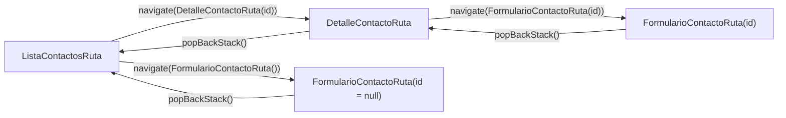

# Capítulo 56: Navegación con rutas tipadas

## Introducción

En el capítulo 35 aprendiste Navigation Compose con **rutas de texto**: cada pantalla se identificaba con una cadena como `"detalle/{id}"`, y para navegar armabas otra cadena a mano, como `"detalle/42"`. Funciona, pero tiene un problema que probablemente ya intuiste: el compilador no puede verificar que `"detalle/{id}"` y `"detalle/42"` sean, en efecto, compatibles. Un error de tipeo en cualquiera de las dos cadenas —o un argumento del tipo equivocado— **solo se revela en tiempo de ejecución**, a veces con un `crash`.

«Mis Contactos» usa un enfoque más moderno y seguro: **rutas tipadas** (*type-safe navigation*), donde cada ruta es una clase de Kotlin serializable en lugar de una cadena de texto. En este capítulo veremos `Rutas.kt` y `ContactosNavHost.kt`, y compararemos ambos enfoques directamente.

## De cadenas a clases: `Rutas.kt`

```kotlin
package com.ejemplo.miscontactos.ui.navigation

import kotlinx.serialization.Serializable

@Serializable
data object ListaContactosRuta

@Serializable
data class DetalleContactoRuta(val id: Int)

@Serializable
data class FormularioContactoRuta(val id: Int? = null)
```

Cada pantalla de la app tiene su propia clase de ruta, anotada con `@Serializable` (la misma anotación de `kotlinx.serialization` que usaste con los DTOs en el capítulo 44):

- **`ListaContactosRuta`** es un `data object` (capítulo 18): no necesita ningún argumento, así que un único objeto la representa por completo, igual que harías con cualquier `object` sin estado.
- **`DetalleContactoRuta`** es una `data class` con un `id: Int` **obligatorio**: no tiene sentido abrir el detalle sin saber de qué contacto se trata.
- **`FormularioContactoRuta`** es una `data class` con un `id: Int? = null` **opcional**: la misma pantalla sirve para crear (sin `id`) y editar (con `id`), como viste en el capítulo 55.

> [!NOTE]Nota
> Compara esto con el capítulo 35: allí, la ruta `"detalle/{id}"` codificaba el argumento *dentro de la cadena*, y tenías que declarar por separado el `navArgument` con su tipo. Aquí, el argumento simplemente **es una propiedad de la clase**, con su tipo declarado una sola vez.

## El grafo de navegación: `ContactosNavHost.kt`

```kotlin
package com.ejemplo.miscontactos.ui.navigation

import androidx.compose.runtime.Composable
import androidx.navigation.compose.NavHost
import androidx.navigation.compose.composable
import androidx.navigation.compose.rememberNavController
import com.ejemplo.miscontactos.ui.detalle.DetalleContactoScreen
import com.ejemplo.miscontactos.ui.formulario.FormularioContactoScreen
import com.ejemplo.miscontactos.ui.lista.ListaContactosScreen

@Composable
fun ContactosNavHost() {
    val navController = rememberNavController()

    NavHost(navController = navController, startDestination = ListaContactosRuta) {
        composable<ListaContactosRuta> {
            ListaContactosScreen(
                onVerContacto = { id -> navController.navigate(DetalleContactoRuta(id)) },
                onNuevoContacto = { navController.navigate(FormularioContactoRuta()) }
            )
        }
        composable<DetalleContactoRuta> {
            DetalleContactoScreen(
                onEditar = { id -> navController.navigate(FormularioContactoRuta(id)) },
                onVolver = { navController.popBackStack() }
            )
        }
        composable<FormularioContactoRuta> {
            FormularioContactoScreen(onVolver = { navController.popBackStack() })
        }
    }
}
```

La estructura general —`rememberNavController()`, `NavHost`, `composable { }`, `popBackStack()`— es la misma que ya conoces del capítulo 35. Lo que cambia es la forma de declarar cada destino y de navegar hacia él:

| | Rutas de texto (cap. 35) | Rutas tipadas (esta app) |
|---|---|---|
| Declarar un destino | `composable("detalle/{id}") { ... }` | `composable<DetalleContactoRuta> { ... }` |
| Navegar | `navController.navigate("detalle/$id")` | `navController.navigate(DetalleContactoRuta(id))` |
| Leer el argumento | `backStackEntry.arguments?.getInt("id")` | `savedStateHandle.toRoute<DetalleContactoRuta>().id` |
| Argumento con tipo incorrecto | Falla en tiempo de ejecución | No compila |
| Ruta mal escrita | Falla en tiempo de ejecución (o navega a nada) | No compila |

Con `navController.navigate(DetalleContactoRuta(id))`, el compilador exige que `id` sea un `Int` — si intentaras pasar un `String` o simplemente olvidaras el argumento, el proyecto no compilaría. Con la cadena `"detalle/$id"` del capítulo 35, en cambio, cualquier valor se puede interpolar sin que el compilador detecte el error.

`composable<DetalleContactoRuta>` usa un **parámetro de tipo reificado** (capítulo 20) para asociar ese bloque de composición con la clase `DetalleContactoRuta`, en lugar de compararla con un patrón de texto como `"detalle/{id}"`.

## Leer argumentos: `SavedStateHandle.toRoute<>()`

Ya viste esta función en los capítulos 54 y 55, pero conviene detenerse en cómo funciona. Dentro de un `ViewModel`, Hilt inyecta automáticamente un `SavedStateHandle` (capítulo 39) que contiene los argumentos con los que se navegó a esa pantalla:

```kotlin
@HiltViewModel
class DetalleContactoViewModel @Inject constructor(
    private val repository: ContactosRepository,
    savedStateHandle: SavedStateHandle
) : ViewModel() {

    private val id: Int = savedStateHandle.toRoute<DetalleContactoRuta>().id

    // ...
}
```

`savedStateHandle.toRoute<DetalleContactoRuta>()` **reconstruye la instancia completa** de `DetalleContactoRuta` a partir de lo que guardó `NavHost`, usando la misma serialización con la que se navegó. Como `DetalleContactoRuta` es una `data class` con un único `Int`, el resultado es equivalente a leer ese entero directamente, pero **con el tipo verificado en tiempo de compilación**: si `DetalleContactoRuta` tuviera dos o tres campos, `toRoute<DetalleContactoRuta>()` te devolvería los tres ya tipados, sin tener que leer cada uno por separado con `getInt`/`getString` como en el capítulo 35.

En `FormularioContactoViewModel`, el mismo mecanismo lee el `id` **opcional**:

```kotlin
private val id: Int? = savedStateHandle.toRoute<FormularioContactoRuta>().id
```

Como `FormularioContactoRuta.id` es `Int?`, `toRoute()` simplemente propaga esa nulabilidad: si se navegó con `FormularioContactoRuta()` (sin argumento, para crear), `id` es `null`; si se navegó con `FormularioContactoRuta(id = 42)` (para editar), `id` es `42`.

## El flujo de navegación completo



Nota que ni `DetalleContactoScreen` ni `FormularioContactoScreen` reciben el `NavController` directamente: reciben funciones simples como `onVolver: () -> Unit` u `onEditar: (Int) -> Unit`, que `ContactosNavHost` conecta con `navController.navigate(...)` o `navController.popBackStack()`. Esto sigue el mismo principio de la versión "con estado"/"sin estado" que aplicaste en cada pantalla: las Screens no conocen los detalles de cómo se navega, solo declaran **qué evento ocurrió**.

## ¿Cuándo usar cada enfoque?

Ambos estilos coexisten en el ecosistema de Compose, y es útil saber cuándo preferir cada uno:

- **Rutas tipadas** (esta app): la opción recomendada por Google para proyectos nuevos. Detecta errores en tiempo de compilación, evita construir cadenas a mano, y hace explícitos los argumentos de cada pantalla como propiedades de una clase.
- **Rutas de texto** (capítulo 35): sigue siendo válida y útil para entender los fundamentos de cómo funciona un grafo de navegación —el `NavHost`, la pila de destinos, `popBackStack()`— sin la capa adicional de serialización. También es la única opción si necesitas interoperar con código que ya define rutas como cadenas (por ejemplo, *deep links* heredados de una app antigua).

## Resumen

- Las rutas tipadas reemplazan las cadenas de texto del capítulo 35 por clases `@Serializable`: `ListaContactosRuta` (`data object`, sin argumentos), `DetalleContactoRuta` (`id: Int` obligatorio), `FormularioContactoRuta` (`id: Int? = null` opcional).
- `composable<Ruta> { ... }` declara un destino asociado a una clase; `navController.navigate(Ruta(argumentos))` navega pasando una instancia real, no una cadena armada a mano.
- `savedStateHandle.toRoute<Ruta>()` reconstruye la instancia completa dentro del `ViewModel`, con cada argumento ya tipado, sin `getInt`/`getString` manuales.
- La ventaja central sobre el capítulo 35: los errores de ruta o de tipo de argumento se detectan **en tiempo de compilación**, no en tiempo de ejecución.
- Las Screens siguen sin conocer el `NavController`: reciben funciones simples (`onVolver`, `onEditar`) que `ContactosNavHost` conecta con la navegación real.

En el próximo capítulo revisaremos los componentes compartidos entre pantallas —`AvatarContacto`, los estados reutilizables de carga/error/vacío— y el tema visual de la aplicación.
