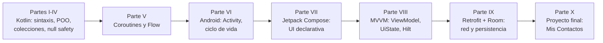

# Capítulo 58: Cierre del proyecto y próximos pasos

## Introducción

Has terminado «Mis Contactos»: una aplicación Android completa, con arquitectura MVVM, persistencia offline-first, navegación tipada y una interfaz construida enteramente con Jetpack Compose. En este último capítulo repasamos cómo probarla manualmente antes de darla por terminada, revisamos el mapa completo de lo que aprendiste a lo largo del curso, y sugerimos hacia dónde seguir.

## Pruebas manuales sugeridas

Antes de considerar cualquier funcionalidad "terminada", conviene recorrerla a mano al menos una vez, verificando tanto el camino feliz como los casos límite. Esta lista te sirve como *checklist* final para «Mis Contactos» — ejecútala con la API (`code/contact-list-api/`) corriendo en `http://localhost:8080` y la app instalada en un dispositivo o emulador con suficiente memoria disponible:

**Lista de contactos**

- [ ] Al abrir la app, se ve un indicador de carga y luego la primera página de contactos.
- [ ] Escribir en el buscador no dispara una petición por cada letra (revisa el *log* de la API): solo una, unos 400 ms después de dejar de escribir.
- [ ] Bajar hasta el final de la lista carga automáticamente la página siguiente, sin necesidad de un botón.
- [ ] Deslizar hacia abajo desde arriba de la lista (*pull-to-refresh*) vuelve a traer la primera página.
- [ ] Tocar el ícono de favorito en un contacto lo marca de inmediato, sin esperar respuesta de red (es una operación local).
- [ ] Activar el filtro de "solo favoritos" oculta el resto sin volver a pedir datos al servidor.
- [ ] Detener el servidor de la API y recargar (deslizando hacia abajo): la lista muestra los contactos guardados en caché con el aviso de "datos guardados localmente".

**Detalle de contacto**

- [ ] Tocar un contacto abre su ficha completa, con los campos opcionales mostrando "sin información" cuando corresponde.
- [ ] Marcar o desmarcar favorito desde el detalle se refleja también en la lista al volver atrás.
- [ ] Tocar eliminar muestra un diálogo de confirmación; cancelar no borra nada.
- [ ] Confirmar la eliminación borra el contacto y vuelve automáticamente a la lista, que ya no lo muestra.

**Formulario**

- [ ] Crear un contacto dejando el nombre vacío muestra el error "obligatorio" sin llegar a llamar a la API.
- [ ] Escribir un correo sin `@` muestra "correo inválido" apenas se intenta guardar.
- [ ] Crear un contacto con un correo que ya existe en la API muestra el error de conflicto en el campo de correo.
- [ ] Guardar con éxito vuelve automáticamente a la pantalla anterior (a la lista si era nuevo, al detalle si era una edición).
- [ ] Editar un contacto precarga sus datos actuales en el formulario.

**Generales**

- [ ] Rotar la pantalla en cualquier momento (formulario a medio llenar, diálogo de confirmación abierto) no pierde el estado en curso.
- [ ] Sin permiso de red local concedido (Android 17+), la app pide el permiso antes de mostrar cualquier pantalla.

> [!TIP]Sugerencia
> Cada ítem de esta lista corresponde a una decisión de diseño que tomamos en algún capítulo de esta parte: el *debounce* del capítulo 53, el evento-como-estado de los capítulos 54 y 55, la estrategia *offline-first* del capítulo 52, la validación en dos niveles del capítulo 55. Si alguno falla, ese es el capítulo al que conviene volver.

## El mapa completo del curso

Estas fueron las grandes etapas que recorriste:

Cada parte no fue un tema aislado: la **Parte X** es, literalmente, la combinación de todas las anteriores en una sola aplicación real. Repasa esta correspondencia:

| En «Mis Contactos»... | ...se apoya en |
|---|---|
| `sealed interface`/`sealed class` para `UiState` y `ErrorDatos` | Parte IV (cap. 19) |
| `suspend`, `viewModelScope.launch`, `Job`, cancelación | Parte V (cap. 22–23) |
| `StateFlow`, `SharedFlow`, `.update {}` | Parte V (cap. 24) |
| Composables con y sin estado, `LazyColumn`, `Scaffold` | Parte VII (cap. 28–33) |
| `LaunchedEffect` y el patrón evento-como-estado | Parte VIII (cap. 40) |
| `ViewModel` + `UiState` + `Repository` + Hilt | Parte VIII (cap. 38–42) |
| DTOs, Retrofit, serialización JSON, estados de red | Parte IX (cap. 43–46) |
| Room, entidades, DAOs, caché offline | Parte IX (cap. 47) |

Si alguna fila te resulta borrosa, es una señal legítima de que vale la pena repasar ese capítulo antes de construir tu propio proyecto — no hace falta que domines todo perfectamente antes de seguir, pero sí que sepas *dónde volver a buscarlo* cuando lo necesites.

## Qué no cubrimos (a propósito)

«Mis Contactos» es una aplicación completa, pero deliberadamente **acotada**, para mantener el foco en los conceptos centrales del curso. Quedaron fuera del alcance, a propósito:

- **Pruebas automatizadas** (unitarias de ViewModels con `Turbine`/`kotlinx-coroutines-test`, de UI con `ComposeTestRule`): son el siguiente paso natural una vez que te sientes cómodo con la arquitectura, pero introducir *testing* junto con MVVM, coroutines y Compose de una sola vez habría sido demasiado para un curso desde cero.
- **Sincronización en segundo plano** (`WorkManager`) para reintentar operaciones creadas sin conexión: la estrategia *offline-first* de este curso solo cubre **lectura** offline (capítulo 52); escribir sin conexión y sincronizar después es un problema considerablemente más complejo.
- **Módulos de Gradle múltiples** (separar `:data`, `:domain`, `:ui` en módulos independientes): útil en proyectos grandes de equipo, pero innecesario en una app de este tamaño, y habría añadido complejidad de configuración sin aportar a los conceptos centrales.
- **Inyección de dependencias sin Hilt** (Koin u otras alternativas): el curso eligió Hilt por ser la recomendación oficial de Google para Android, pero los principios de inyección de dependencias del capítulo 42 aplican igual con cualquier framework.

## Próximos pasos sugeridos

Con esta base, algunas direcciones razonables para seguir creciendo como desarrollador Android:

1. **Agrega pruebas automatizadas** a `ListaContactosViewModel` o `FormularioContactoViewModel`: son los más ricos en lógica (debounce, validación, paginación) y los que más se benefician de una red de seguridad ante futuros cambios.
2. **Extiende «Mis Contactos»** con una funcionalidad nueva de punta a punta: por ejemplo, ordenar la lista por distintos criterios, o agrupar contactos por la primera letra del apellido (algo similar a lo que ya viste con `LazyColumn` en el capítulo 33). Repetir el ciclo completo (`UiState` → `ViewModel` → `Repository` → capa remota/local si aplica) sobre un caso nuevo es la mejor forma de consolidar la arquitectura.
3. **Explora Compose Multiplatform** si te interesa compartir lógica de negocio (ViewModels, repositorios) entre Android, iOS y escritorio; los conceptos de `StateFlow` y `UiState` de este curso se trasladan casi sin cambios.
4. **Revisa la documentación oficial de Android** (developer.android.com) sobre los temas que quedaron fuera de alcance: es el lugar correcto para profundizar en `WorkManager`, módulos multi-Gradle o testing avanzado, ahora que ya tienes el vocabulario y los conceptos de este curso como base.

## Resumen

- Antes de dar por terminada una funcionalidad, recórrela manualmente cubriendo tanto el camino feliz como los casos límite (validación, sin conexión, rotación de pantalla).
- «Mis Contactos» integra, en una sola app, todo lo enseñado en las Partes I a IX: Kotlin, coroutines, Compose, MVVM y la capa de datos con Retrofit y Room.
- El curso dejó fuera, a propósito, pruebas automatizadas, sincronización en segundo plano y módulos múltiples de Gradle, para mantener el foco en los fundamentos.
- El camino natural desde aquí es agregar pruebas, extender la app con una funcionalidad propia, y profundizar en la documentación oficial de Android para los temas avanzados que quedaron pendientes.

Gracias por recorrer este curso completo, desde tu primera línea de Kotlin hasta una aplicación Android real y funcional. El código de «Mis Contactos» queda en `code/contact-list-app/` como referencia para revisar, modificar y seguir aprendiendo.
